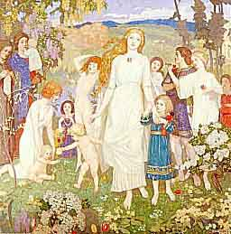

  
[Intangible Textual Heritage](../../../index.md)  [Legends &
Sagas](../../index)  [Celtic](../index.md) 

------------------------------------------------------------------------

<table width="75%">
<colgroup>
<col style="width: 50%" />
<col style="width: 50%" />
</colgroup>
<tbody>
<tr class="odd">
<td width="50%" data-valign="TOP"> 
</td>
<td width="50%" data-valign="TOP"><h1 id="wonder-tales-from-scottish-myth-and-legend" data-align="CENTER">Wonder Tales from Scottish Myth and Legend</h1>
<h2 id="by-donald-alexander-mackenzie" data-align="CENTER">By Donald Alexander Mackenzie</h2>
<h4 id="section" data-align="CENTER">[1917]</h4></td>
</tr>
</tbody>
</table>

------------------------------------------------------------------------

|                                                                                                                           |
|---------------------------------------------------------------------------------------------------------------------------|
|  |

 [Title Page](tsm00.md)  
[Contents](tsm01.md)  
[Illustrations](tsm02.md)  
[Introduction](tsm03.md)  
[Chapter I](tsm04.md)  
[Chapter II. The Coming of Angus and Bride](tsm05.md)  
[Chapter III. Combats that Never End](tsm06.md)  
[Chapter IV. The Princess of Land-under-Waves](tsm07.md)  
[Chapter V. Nimble Men, Blue Men, and Green Ladies](tsm08.md)  
[Chapter VI. Conall and the Thunder Hag](tsm09.md)  
[Chapter VII. Story of Finlay and the Giants](tsm10.md)  
[Chapter VIII. Heroes on the Green Isle](tsm11.md)  
[Chapter IX. A Vision of the Dead](tsm12.md)  
[Chapter X. The Story of Michael Scott](tsm13.md)  
[Chapter XI. In the Kingdom of Seals](tsm14.md)  
[Chapter XII. Story of Thomas the Rhymer](tsm15.md)  
[Chapter XIII. The Maid-of-the-Wave](tsm16.md)  
[Chapter XIV. Exiles from Fairyland](tsm17.md)  
[Chapter XV. Friends and Foes of Man](tsm18.md)  
[Chapter XVI. The Land of Green Mountains](tsm19.md)  
