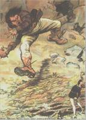

  
[Intangible Textual Heritage](../../../index)  [Sagas and
Legends](../../index)  [Celtic](../index) 

------------------------------------------------------------------------

<table width="75%">
<colgroup>
<col style="width: 50%" />
<col style="width: 50%" />
</colgroup>
<tbody>
<tr class="odd">
<td width="50%" data-valign="TOP"> 
</td>
<td width="50%" data-valign="TOP"><h1 id="tom-tit-tot" data-align="CENTER">Tom Tit Tot</h1>
<h3 id="an-essay-on-savage-philosophy-in-folk-tale" data-align="CENTER">An Essay on Savage Philosophy in Folk-Tale</h3>
<h2 id="by-edward-clodd" data-align="CENTER">by Edward Clodd</h2>
<h4 id="section" data-align="CENTER">[1898]</h4></td>
</tr>
</tbody>
</table>

------------------------------------------------------------------------

[Title Page](ttt00)  
[Preface](ttt01)  
[Introduction](ttt02)  
[The Story of Tom Tit Tot](ttt03)  
[Variations of Tom Tit Tot](ttt04)  
[On the Diffusion of Stories](ttt05)  
[Incidental features of Stories](ttt06)  
[Barbaric Ideas about Names](ttt07)  
[Magic through Tangible Things](ttt08)  
[Magic through Intangible Things](ttt09)  
[Taboo](ttt10)  
[Words of Power](ttt11)  
[The Name and the Soul](ttt12)  
