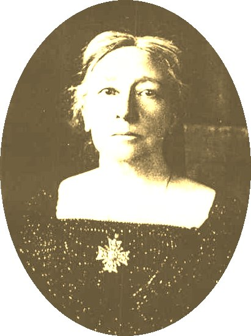

  
[Intangible Textual Heritage](../../../index)  [Sagas and
Legends](../../index)  [Celtic](../index) 

------------------------------------------------------------------------

<table width="75%">
<colgroup>
<col style="width: 50%" />
<col style="width: 50%" />
</colgroup>
<tbody>
<tr class="odd">
<td width="50%" data-valign="TOP"> 
Lady Gregory</td>
<td width="50%" data-valign="TOP"><h1 id="visions-and-beliefs-in-the-west-of-ireland" data-align="CENTER">Visions and Beliefs in the West of Ireland</h1>
<h2 id="by-lady-augusta-gregory" data-align="CENTER">by Lady Augusta Gregory</h2>
<h4 id="section" data-align="CENTER">[1920]</h4></td>
</tr>
</tbody>
</table>

------------------------------------------------------------------------

[Title Page](vbwi00)  
[Preface](vbwi01)  
[Sea Stories](vbwi02)  
[Seers and Healers](vbwi03)  
[The Evil Eye--The Touch--The Penalty](vbwi04)  
[Away](vbwi05)  
[Herbs, Charms and Wise Women](vbwi06)  
[Astray and Treasure](vbwi07)  
[Banshees and Warnings](vbwi08)  
[In the Way](vbwi09)  
[The Fighting of the Friends](vbwi10)  
[The Unquiet Dead](vbwi11)  
[Appearances](vbwi12)  
[Butter](vbwi13)  
[The Fool of the Forth](vbwi14)  
[Forths and Sheoguey Places](vbwi15)  
[Blacksmiths](vbwi16)  
[Monsters and Sheoguey Beasts](vbwi17)  
[Friars and Priest Cures](vbwi18)  
[Notes (W.B. Yeats)](vbwi19)  
[Witches and Wizards and Irish Folk-Lore (W.B. Yeats)](vbwi20)  
[Swedenborg, Mediums and the Desolate Places (W.B. Yeats)](vbwi21)  
