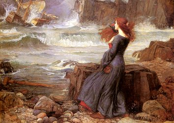

  
[Intangible Textual Heritage](../../../index) 
[Myths/Sagas](../../index)  [Celtic](../index) 

------------------------------------------------------------------------

<table width="75%">
<colgroup>
<col style="width: 50%" />
<col style="width: 50%" />
</colgroup>
<tbody>
<tr class="odd">
<td width="50%" data-valign="TOP"> 
</td>
<td width="50%" data-valign="TOP"><h1 id="the-voyage-of-bran" data-align="CENTER">The Voyage of Bran</h1>
<h2 id="by-kuno-meyer" data-align="CENTER">by Kuno Meyer</h2>
<h4 id="section" data-align="CENTER">[1895]</h4></td>
</tr>
</tbody>
</table>

------------------------------------------------------------------------

This is Kuno Meyer's translation of the old Irish saga, the Voyage of
Bran. In this magical odyssey to the limits of reality, Bran takes a
characteristically time-dilated journey to a distant isle of luxury. On
return, he learns that ages have passed and he and his expedition have
already passed into myth. He can never again touch the soil of his
homeland and sails off again. The text references ancient Celtic gods
and also contains quasi-prophetic passages added at a later date by
Christian scribes.

The appendices contain extracts from other Irish texts about Mongan, who
is mentioned in the Bran saga, the son of Manannan mac Lir, the Celtic
sea-god. This is of interest because of the descriptions of the training
of bards, and lore of human visits to the *Sídhe*, the fairies.

Production notes: due to the limits of current OCR technology, we had to
omit critical footnotes to the Irish text, several extended Gaelic
passages from the appendices, and the index section. Large lacunae of
this nature are noted in green text. The edition we used also omitted a
long essay by Alfred Nutt, which we will transcribe at some point in the
future if we can locate a first edition. We did manage to include the
entire Gaelic text of the Voyage of Bran in parallel with the English
translation, as well as all footnotes relevant to the English
translations. Because we were unable to spellcheck this document (MS
Word's spellchecker broke down on it repeatedly), it may contain typos
in both the English and Gaelic. However, we did several careful passes
on each page. We welcome any notice of errors in this document from
readers.

------------------------------------------------------------------------

[Title Page](vob00)  
[Introduction](vob01)  
[The Voyage of Bran](vob02)  
[Notes](vob03)  

### Appendix

[I. The Conception of Mongán](vob04)  
[II. A Story from which it is inferred that Mongán was Find mac Cumaill,
and the cause of the death of Fothad Airgdech](vob05)  
[III. A Story of Mongán](vob06)  
[IV. These are the events that brought about the telling of 'Mongán's
Frenzy.'](vob07)  
[V. The Conception of Mongán and Dub-Lacha's Love for Mongán](vob08)  
[VI. From the Annals](vob09)  
[VII. Irische Texte iii. page 8](vob10)  
[VIII. Irische Texte iii. p. 87](vob11)  
[IX. From Gilla Modutu's poem Senchas Ban...](vob12)  
[X. From Ms. Laud 613, p. 21](vob13)  
[XI. From MS. Laud 615, p. 18.](vob14)  
