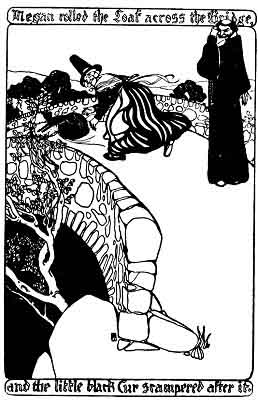

  
[Intangible Textual Heritage](../../../index)  [Sagas and
Legends](../../index)  [Celtic](../index)  [Index](index) 
[Previous](wfb77)  [Next](wfb79) 

------------------------------------------------------------------------

The Devil's Bridge

 

ONE day in the olden time old Megan of Llandunach stood by the side of
the river Mynach feeling very sorry for herself.

The Mynach was in flood, and roared down the wooded dingle in five
successive falls, tumbling over three hundred feet in less than no time.
Just below the place where Megan was standing, there was a great
cauldron in which the water whirled, boiled and hissed as if troubled by
some evil spirit: from the cauldron the river rushed and swirled down a
narrow, deep ravine, and if the old woman had had an eye for the
beauties of nature, the sight of the seething pot and the long shadowy
cleft would have made her feel joyous rather than sorrowful.

But Megan at this time cared for none of these things, because her one
and only cow was on the wrong side of the ravine, and her thoughts were
centred on the horned beast which was cropping the green grass
carelessly just as if it made no difference what side of the river it
was on. How the wrong-headed animal had got there Megan could not guess,
and still less did she know how to get it back. As there was no one else
to talk to, she talked to herself. "Oh, dear, oh, dear, what shall I
do?" she said.

"What is the matter, Megan?" said a voice behind her. She turned round
and saw a man cowled like a monk and with a rosary at his belt. She had
not heard anyone coming, but the noise of the waters boiling over and
through the rocks, she reflected, might easily have drowned the sound of
any footsteps. And in any case she was so troubled about her cow that
she could not stop to wonder how the stranger had come up.

"I am ruined," said Megan. "There is my one and only cow, the sole
support of my old age, on the other side of the river, and I don't know
how to get her back again. Oh, dear, oh, dear, I am ruined."

"Don't you worry about that," said the monk, "I'll get her back for
you."

"How can you?" asked Megan, greatly surprised.

"I'll tell you," answered the stranger. "It is one of my amusements to
build bridges, and if you like I'll throw a bridge across this chasm for
you."

"Well, indeed," said the old woman, "nothing would please me better. But
how am I to pay you? I am sure you will want a great deal for a job like
this, and I am so poor that I have no money to spare, look you, no,
indeed."

"I am very easily satisfied," said the monk. "Just let me have the first
living thing that crosses the bridge after I have finished it, and I
shall be content."

Megan agreed to this, and the monk told her to go back to her cottage
and wait there until he should call for her.

Now, Megan was not half such a fool as she looked, and she had noticed,
while talking to the kind and obliging stranger, that there was
something rather peculiar about his foot. She had a suspicion, too, that
his knees were behind instead of being in front, and while she was
waiting for the summons she thought so hard that it made, her head ache.
By the time she was haloed for, she had hit upon a plan. She threw some
crusts to her little dog to make him follow her, and took a loaf of
bread under her shawl to the river-side.

"There's a bridge for you," said the monk, pointing proudly to a fine
span bestriding the yawning chasm. And it really was something to be
proud of.

"H'm, yes," said Megan, looking doubtfully at it; "yes, it is a bridge.
But is it strong?

"Strong?" said the builder, indignantly. "Of course it is strong."

"Will it hold the weight of this loaf?" asked Megan, bringing the bread
out from underneath her shawl.

The monk laughed scornfully. "Hold the weight of this loaf? Throw it on
and see. Ha, ha!"

So Megan rolled the loaf right across the bridge, and the little black
cur scampered after it.

"Yes, it will do," said Megan, "and, kind sir, my little dog is the
first live thing to cross the bridge. You are welcome to him, and I
thank you very much for all the trouble you have taken."

"Tut, the silly dog is no good to me," said the stranger, very crossly,
and with that he vanished into space. From the smell of brimstone which
he had left behind him Megan knew that, as she had suspected, it was the
Devil whom she had outwitted.

And this is how the Bad Man's Bridge came to be built.

 

------------------------------------------------------------------------

[Next: The Martyred Hound](wfb79)
