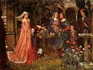

  
[Intangible Textual Heritage](../../../index.md)  [Legends and
Sagas](../../index)  [Dunsany](../index)  [Index](index.md) 
[Previous](doro09)  [Next](doro11.md) 

------------------------------------------------------------------------

[Buy this Book on
Kindle](https://www.amazon.com/exec/obidos/ASIN/B002M3SU1O/internetsacredte.md)

------------------------------------------------------------------------

  
*Don Rodriguez*, by Lord Dunsany, \[1922\], at Intangible Textual
Heritage

------------------------------------------------------------------------

THE EIGHTH CHRONICLE

HOW HE TRAVELLED FAR

One blackbird on a twig near Rodriguez' window sang, then there were
fifty singing, and morning arose over Spain all golden and wonderful.

Rodriguez descended and found mine host rubbing his hands by his good
table, with a look on his face that seemed to welcome the day and to
find good auguries concerning it. But Morano looked as one that, having
fallen from some far better place, is ill-content with earth and the
mundane way.

He had scorned breakfast; but Rodriguez breakfasted. And soon the two
were bidding mine host farewell. They found their horses saddled, they
mounted at once, and rode off slowly in the early day. The horses were
tired and, slowly trotting and walking, and sometimes dismounting and
dragging the horses on, it was nearly two hours before they had done ten
miles and come to the house of the smith in a rocky village: the street
was cobbled and the houses were all of stone.

The early sparkle had gone from the dew, but it was still morning, and
many a man but now sat down to his breakfast, as they arrived and beat
on the door.

Gonzalez the smith opened it, a round and ruddy man past fifty, a
citizen following a reputable trade, but once, ah once, a bowman.

"Senor," said Rodriguez, "our horses are weary. We have been told you
will change them for us."

"Who told you that?" said Gonzalez.

"The green bowmen in Shadow Valley," the young man answered.

As a meteor at night lights up with its greenish glare flowers and
blades of grass, twisting long shadows behind them, lights up lawns and
bushes and the deep places of woods, scattering quiet night for a
moment, so the unexpected answer of Rodriguez lit memories in the mind
of the smith all down the long years; and a twinkle and a sparkle of
those memories dancing in woods long forsaken flashed from his eyes.

"The green bowmen, senor," said Gonzalez. "Ah, Shadow Valley!"

"We left it yesterday," said Rodriguez.

When Gonzalez heard this he poured forth questions. "The forest, senor;
how is it now with the forest? Do the boars still drink at Heather Pool?
Do the geese go still to Greatmarsh? They should have come early this
year. How is it with Larios, Raphael, Migada? Who shoots woodcock now?"

The questions flowed on past answering, past remembering: he had not
spoken of the forest for years. And Rodriguez answered as such questions
are always answered, saying that all was well, and giving Gonzalez some
little detail of some trifling affair of the forest, which he treasured
as small shells are treasured in inland places when travellers bring
them from the sea; but all that he heard of the forest seemed to the
smith like something gathered on a far shore of time. Yes, he had been a
bowman once.

But he had no horses. One horse that drew a cart, but no horses for
riding at all. And Rodriguez thought of the immense miles lying between
him and the foreign land, keeping him back from his ambition; they all
pressed on his mind at once. The smith was sorry, but he could not make
horses.

"Show him your coin, master," said Morano.

"Ah, a small token," said Rodriguez, drawing it forth still on its green
ribbon under his clothing. "The bowman's badge, is it not?"

Gonzalez looked at it, then looked at Rodriguez.

"Master," he said, "you shall have your horses. Give me time: you shall
have them. Enter, master." And he bowed and widely opened the door. "If
you will breakfast in my house while I go to the neighbours you shall
have some horses, master."

So they entered the house, and the smith with many bows gave the
travellers over to the care of his wife, who saw from her husband's
manner that these were persons of importance and as such she treated
them both, and as such entertained them to their second breakfast. And
this meant they ate heartily, as travellers can, who can go without a
breakfast or eat two; and those who dwell in cities can do neither.

And while the plump dame did them honour they spoke no word of the
forest, for they knew not what place her husband's early years had in
her imagination.

They had barely finished their meal when the sound of hooves on cobbles
was heard and Gonzalez beat on the door. They all went to the door and
found him there with two horses. The horses were saddled and bridled.
They fixed the stirrups to please them, then the travellers mounted at
once. Rodriguez made his grateful farewell to the wife of the smith:
then, turning to Gonzalez, he pointed to the two tired horses which had
waited all the while with their reins thrown over a hook on the wall.

"Let the owner of these have them till his own come back," he said, and
added: "How far may I take these?"

"They are good horses," said the smith.

"Yes," said Rodriguez.

"They could do fifty miles to-day," Gonzalez continued, "and to- morrow,
why, forty, or a little more."

"And where will that bring me?" said Rodriguez, pointing to the straight
road which was going his way, north-eastward.

"That," said Gonzalez, "that should bring you some ten or twenty miles
short of Saspe."

"And where shall I leave the horses?" Rodriguez asked.

"Master," Gonzalez said, "in any village where there be a smith, if you
say 'these are the horses of the smith Gonzalez, who will come for them
one day from here,' they will take them in for you, master."

"But," and Gonzalez walked a little away from his wife, and the horses
walked and he went beside them, "north of here none knows the bowmen.
You will get no fresh horses, master. What will you do?"

"Walk," said Rodriguez.

Then they said farewell, and there was a look on the face of the smith
almost such as the sons of men might have worn in Genesis when angels
visited them briefly.

They settled down into a steady trot and trotted thus for three hours.
Noon came, and still there was no rest for Morano, but only dust and the
monotonous sight of the road, on which his eyes were fixed: nearly an
hour more passed, and at last he saw his master halt and turn round in
his saddle.

"Dinner," Rodriguez said.

All Morano's weariness vanished: it was the hour of the frying-pan once
more.

They had done more than twenty-one miles from the house of Gonzalez.
Nimbly enough, in his joy at feeling the ground again, Morano ran and
gathered sticks from the bushes. And soon he had a fire, and a thin
column of grey smoke going up from it that to him was always home.

When the frying-pan warmed and lard sizzled, when the smell of bacon
mingled with the smoke, then Morano was where all wise men and all
unwise try to be, and where some of one or the other some times come for
awhile, by unthought paths and are gone again; for that smoky, mixed
odour was happiness.

Not for long men and horses rested, for soon Rodriguez' ambition was
drawing him down the road again, of which he knew that there remained to
be travelled over two hundred miles in Spain, and how much beyond that
he knew not, nor greatly cared, for beyond the frontier of Spain he
believed there lay the dim, desired country of romance where roads were
long no more and no rain fell. They mounted again and pushed on for this
country. Not a village they saw but that Morano hoped that here his
affliction would end and that he would dismount and rest; and always
Rodriguez rode on and Morano followed, and with a barking of dogs they
were gone and the village rested behind them. For many an hour their
slow trot carried them on; and Morano, clutching the saddle with worn
arms, already was close to despair, when Rodriguez halted in a little
village at evening before an inn. They had done their fifty miles from
the house of Gonzalez, and even a little more.

Morano rolled from his horse and beat on the small green door. Mine host
came out and eyed them, preening the point of his beard; and Rodriguez
sat his horse and looked at him. They had not the welcome here that
Gonzalez gave them; but there was a room to spare for Rodriguez, and
Morano was promised what he asked for, straw; and there was shelter to
be had for the horses. It was all the travellers needed.

Children peered at the strangers, gossips peeped out of doors to gather
material concerning them, dogs noted their coming, the eyes of the
little village watched them curiously, but Rodriguez and Morano passed
into the house unheeding; and past those two tired men the mellow
evening glided by like a dream. Tired though Rodriguez was he noticed a
certain politeness in mine host while he waited at supper, which had not
been noticeable when he had first received him, and rightly put this
down to some talk of Morano's; but he did not guess that Morano had
opened wide blue eyes and, babbling to his host, had guilelessly told
him that his master a week ago had killed an uncivil inn-keeper.

Scarcely were late birds home before Rodriguez sought his bed, and not
all of them were sleeping before he slept.

Another morning shone, and appeared to Spain, and all at once Rodriguez
was wide awake. It was the eighth day of his wanderings.

When he had breakfasted and paid his due in silver he and Morano
departed, leaving mine host upon his doorstep bowing with an almost
perplexed look on his shrewd face as he took the points of moustachios
and beard lightly in turn between finger and thumb: for we of our day
enter vague details about ourselves in the book downstairs when we stay
at inns, but it was mine host's custom to gather all that with his sharp
eyes. Whatever he gathered, Rodriguez and Morano were gone.

But soon their pace dwindled, the trot slackening and falling to a walk;
soon Rodriguez learned what it is to travel with tired horses. To Morano
riding was merely riding, and the discomforts of that were so great that
he noticed no difference. But to Rodriguez, his continual hitting and
kicking his horse's sides, his dislike of doing it, the uselessness of
it when done, his ambition before and the tired beast underneath, the
body always some yards behind the beckoning spirit, were as great
vexation as a traveller knows. It came to dismounting and walking miles
on foot; even then the horses hung back. They halted an hour over dinner
while the horses grazed and rested, and they returned to their road
refreshed by the magic that was in the frying-pan, but the horses were
no fresher.

When our bodies are slothful and lie heavy, never responding to the
spirit's bright promptings, then we know dullness: and the burden of it
is the graver for hearing our spirits call faintly, as the chains of a
buccaneer in some deep prison, who hears a snatch of his comrades'
singing as they ride free by the coast, would grow more unbearable than
ever before. But the weight of his tired horse seemed to hang heavier on
the fanciful hopes that Rodriguez' dreams had made. Farther than ever
seemed the Pyrenees, huger than ever their barrier, dimmer and dimmer
grew the lands of romance.

If the hopes of Rodriguez were low, if his fancies were faint, what
material have I left with which to make a story with glitter enough to
hold my readers' eyes to the page: for know that mere dreams and idle
fancies, and all amorous, lyrical, unsubstantial things, are all that we
writers have of which to make a tale, as they are all that the Dim Ones
have to make the story of man.

Sometimes riding, sometimes going on foot, with the thought of the long,
long miles always crowding upon Rodriguez, overwhelming his hopes; till
even the castle he was to win in the wars grew too pale for his fancy to
see, tired and without illusions, they came at last by starlight to the
glow of a smith's forge. He must have done forty-five miles and he knew
they were near Caspe.

The smith was working late, and looked up when Rodriguez halted. Yes, he
knew Gonzalez, a master in the trade: there was a welcome for his
horses.

But for the two human travellers there were excuses, even apologies, but
no spare beds. It was the same in the next three or four houses that
stood together by the road. And the fever of Rodriguez' ambition drove
him on, though Morano would have lain down and slept where they stood,
though he himself was weary. The smith had received his horses; after
that he cared not whether they gave him shelter or not, the alternative
being the road, and that bringing nearer his wars and the castle he was
to win. And that fancy that led his master Morano allowed always to lead
him too, though a few more miles and he would have fallen asleep as he
walked and dropped by the roadside and slept on. Luckily they had gone
barely two miles from the forge where the horses rested, when they saw a
high, dark house by the road and knocked on the door and found shelter.
It was an old woman who let them in, a farmer's wife, and she had room
for them and one mattress, but no bed. They were too tired to eat and
did not ask for food, but at once followed her up the booming stairs of
her house, which were all dark but for her candle, and so came among
huge minuetting shadows to the long loft at the top. There was a
mattress there which the old woman laid out for Rodriguez, and a heap of
hay for Morano. Just for a moment, as Rodriguez climbed the last step of
the stair and entered the loft where the huge shadows twirled between
the one candle's light and the unbeaten darkness in corners, just for a
moment romance seemed to beckon to him; for a moment, in spite of his
fatigue and dejection, in spite of the possibility of his quest being
crazy, for a moment he felt that great shadows and echoing boards, the
very cobwebs even that hung from the black rafters, were all romantic
things; he felt that his was a glorious adventure and that all these
things that filled the loft in the night were such as should fitly
attend on youth and glory. In a moment that feeling was gone he knew not
why it had come. And though he remembered it till grey old age, when he
came to know the causes of many things, he never knew what romance might
have to do with shadows or echoes at night in an empty room, and only
knew of such fancies that they came from beyond his understanding,
whether from wisdom or folly.

Morano was first asleep, as enormous snores testified, almost before the
echoes had died away of the footsteps of the old woman descending the
stairs; but soon Rodriguez followed him into the region of dreams, where
fantastic ambitions can live with less of a struggle than in the broad
light of day: he dreamed he walked at night down a street of castles
strangely colossal in an awful starlight, with doors too vast for any
human need, whose battlements were far in the heights of night; and
chose, it being in time of war, the one that should be his; but the
gargoyles on it were angry and spoiled the dream.

Dream followed dream with furious rapidity, as the dreams of tired men
do, racing each other, jostling and mingling and dancing, an
ill-assorted company: myriads went by, a wild, grey, cloudy multitude;
and with the last walked dawn.

Rodriguez rose more relieved to quit so tumultuous a rest than refreshed
by having had it.

He descended, leaving Morano to sleep on, and not till the old dame had
made a breakfast ready did he return to interrupt his snores.

Even as he awoke upon his heap of hay Morano remained as true to his
master's fantastic quest as the camel is true to the pilgrimage to
Mecca. He awoke grumbling, as the camel grumbles at dawn when the packs
are put on him where he lies, but never did he doubt that they went to
victorious wars where his master would win a castle splendid with
towers.

Breakfast cheered both the travellers. And then the old lady told
Rodriguez that Caspe was but a three hours' walk, and that cheered them
even more, for Caspe is on the Ebro, which seemed to mark for Rodriguez
a stage in his journey, being carried easily in his imagination, like
the Pyrenees. What road he would take when he reached Caspe he had not
planned. And soon Rodriguez expressed his gratitude, full of fervour,
with many a flowery phrase which lived long in the old dame's mind; and
the visit of those two travellers became one of the strange events of
that house and was chief of the memories that faintly haunted the
rafters of the loft for years.

They did not reach Caspe in three hours, but went lazily, being weary;
for however long a man defies fatigue the hour comes when it claims him.
The knowledge that Caspe lay near with sure lodging for the night,
soothed Rodriguez' impatience. And as they loitered they talked, and
they decided that la Garda must now be too far behind to pursue any
longer. They came in four hours to the bank of the Ebro and there saw
Caspe near them; but they dined once more on the grass, sitting beside
the river, rather than enter the town at once, for there had grown in
both travellers a liking for the wanderers' green table of earth.

It was a time to make plans. The country of romance was far away and
they were without horses.

"Will you buy horses, master?" said Morano.

"We might not get them over the Pyrenees," said Rodriguez, though he had
a better reason, which was that three gold pieces did not buy two
saddled horses. There were no more friends to hire from. Morano grew
thoughtful. He sat with his feet dangling over the bank of the Ebro.

"Master," he said after a while, "this river goes our way. Let us come
by boat, master, and drift down to France at our ease."

To get a river over a range of mountains is harder than to get horses.
Some such difficulty Rodriguez implied to him; but Morano, having come
slowly by an idea, parted not so easily with it.

"It goes our way, master," he repeated, and pointed a finger at the
Ebro.

At this moment a certain song that boatmen sing on that river, when the
current is with them and they have nothing to do but be idle and their
lazy thoughts run to lascivious things, came to the ears of Rodriguez
and Morano; and a man with a bright blue sash steered down the Ebro. He
had been fishing and was returning home.

"Master," Morano said, "that knave shall row us there."

Rodriguez seeing that the idea was fixed in Morano's mind determined
that events would move it sooner than argument, and so made no reply.

"Shall I tell him, master?" asked Morano.

"Yes," said Rodriguez, "if he can row us over the Pyrenees."

This was the permission that Morano sought, and a hideous yell broke
from his throat hailing the boatman. The boatman looked up lazily, a
young man with strong brown arms, turning black moustaches towards
Morano. Again Morano hailed him and ran along the bank, while the boat
drifted down and the boatman steered in towards Morano. Somehow Morano
persuaded him to come in to see what he wanted; and in a creek he ran
his boat aground, and there he and Morano argued and bargained. But
Rodriguez remained where he was, wondering why it took so long to turn
his servant's mind from that curious fancy. At last Morano returned.

"Well?" said Rodriguez.

"Master," said Morano, "he will row us to the Pyrenees."

"The Pyrenees!" said Rodriguez. "The Ebro runs into the sea." For they
had taught him this at the college of San Josephus.

"He will row us there," said Morano, "for a gold piece a day, rowing
five hours each day."

Now between them they had but four gold pieces; but that did not make
the Ebro run northward. It seemed that the Ebro, after going their way,
as Morano had said, for twenty or thirty miles, was joined by the river
Segre, and that where the Ebro left them, turning eastwards, the course
of the Segre took them on their way: but it would be rowing against the
current.

"How far is it?" said Rodriguez.

"A hundred miles, he says," answered Morano. "He knows it well."

Rodriguez calculated swiftly. First he added thirty miles; for he knew
that his countrymen took a cheerful view of distance, seldom allowing
any distance to oppress them under its true name at the out set of a
journey; then he guessed that the boatman might row five miles an hour
for the first thirty miles with the stream of the Ebro, and he hoped
that he might row three against the Segre until they came near the
mountains, where the current might grow too strong.

"Morano," he said, "we shall have to row too."

"Row, master?" said Morano.

"We can pay him for four days," said Rodriguez. "If we all row we may go
far on our way."

"It is better than riding," replied Morano with entire resignation.

And so they walked to the creek and Rodriguez greeted the boatman, whose
name was Perez; and they entered the boat and he rowed them down to
Caspe. And, in the house of Perez, Rodriguez slept that night in a large
dim room, untidy with diverse wares: they slept on heaps of things that
pertained to the river and fishing. Yet it was late before Rodriguez
slept, for in sight of his mind came glimpses at last of the end of his
journey; and, when he slept at last, he saw the Pyrenees. Through the
long night their mighty heads rejected him, staring immeasurably beyond
him in silence, and then in happier dreams they beckoned him for a
moment. Till at last a bird that had entered the city of Caspe sang
clear and it was dawn. With that first light Rodriguez arose and awoke
Morano. Together they left that long haven of lumber and found Perez
already stirring. They ate hastily and all went down to the boat, the
unknown that waits at the end of all strange journeys quickening their
steps as they went through the early light.

Perez rowed first and the others took their turns and so they went all
the morning down the broad flood of the Ebro, and came in the afternoon
to its meeting place with the Segre. And there they landed and stretched
their limbs on shore and lit a fire and feasted, before they faced the
current that would be henceforth against them. Then they rowed on.

When they landed by starlight and unrolled a sheet of canvas that Perez
had put in the boat, and found what a bad time starlight is for pitching
a tent, Rodriguez and Morano had rowed for four hours each and Perez had
rowed for five. They carried no timber in the boat but used the oars for
tent-poles and cut tent-pegs with a small hatchet that Perez had
brought.

They stumbled on rocks, tore the canvas on bushes, lost the same thing
over and over again; in fact they were learning the craft of wandering.
Yet at last their tent was up and a good fire comforting them outside,
and Morano had cooked the food and they had supped and talked, and after
that they slept. And over them sleeping the starlight faded away, and in
the greyness that none of them dreamed was dawn five clear notes were
heard so shrill in the night that Rodriguez half waking wondered what
bird of the darkness called, and learned from the answering chorus that
it was day.

He woke Morano who rose in that chilly hour and, striking sparks among
last night's embers, soon had a fire: they hastily made a meal and
wrapped up their tent and soon they were going onward against the tide
of the Segre. And that day Morano rowed more skilfully; and Rodriguez
unwrapped his mandolin and played, reclining in the boat while he rested
from rowing. And the mandolin told them all, what the words of none
could say, that they fared to adventure in the land of Romance, to the
overthrow of dullness and the sameness of all drear schemes and the
conquest of discontent in the spirit of man; and perhaps it sang of a
time that has not yet come, or the mandolin lied.

That evening three wiser men made their camp before starlight. They were
now far up the Segre.

For thirteen hours next day they toiled at the oars or lay languid. And
while Rodriguez rested he played on his mandolin. The Segre slipped by
them.

They seemed like no men on their way to war, but seemed to loiter as the
bright river loitered, which slid seaward in careless ease and was
wholly freed from time.

On this day they heard men speak of the Pyrenees, two men and a woman
walking by the river; their voices came to the boat across the water,
and they spoke of the Pyrenees. And on the next day they heard men speak
of war. War that some farmers had fled from on the other side of the
mountain. When Rodriguez heard these chance words his dreams came nearer
till they almost touched the edges of reality.

It was the last day of Perez' rowing. He rowed well although they neared
the cradle of the Segre and he struggled against them in his youth. Grey
peaks began to peer that had nursed that river. Grey faces of stone
began to look over green hills. They were the Pyrenees.

When Rodriguez saw at last the Pyrenees he drew a breath and was unable
to speak. Soon they were gone again below the hills: they had but peered
for a moment to see who troubled the Segre.

And the sun set and still they did not camp, but Perez rowed on into the
starlight. That day he rowed six hours.

They pitched their tent as well as they could in the darkness; and,
breathing a clear new air all crisp from the Pyrenees, they slept
outside the threshold of adventure.

Rodriguez awoke cold. Once more he heard the first blackbird who sings
clear at the edge of night all alone in the greyness, the nightingale's
only rival; a rival like some unknown in the midst of a crowd who for a
moment leads some well-loved song, in notes more liquid than a
master-singer's; and all the crowd joins in and his voice is lost, and
no one learns his name. At once a host of birds answered him out of dim
bushes, whose shapes had barely as yet emerged from night. And in this
chorus Perez awoke, and even Morano.

They all three breakfasted together, and then the wanderers said
good-bye to Perez. And soon he was gone with his bright blue sash,
drifting homewards with the Segre, well paid yet singing a little sadly
as he drifted; for he had been one of a quest, and now he left it at the
edge of adventure, near solemn mountains and, beyond them, romantic,
near-unknown lands. So Perez left and Rodriguez and Morano turned again
to the road, all the more lightly because they had not done a full day's
march for so long, and now a great one unrolled its leagues before them.

The heads of the mountains showed themselves again. They tramped as in
the early days of their quest. And as they went the mountains, unveiling
themselves slowly, dropping film after film of distance that hid their
mighty forms, gradually revealed to the wanderers the magnificence of
their beauty. Till at evening Rodriguez and Morano stood on a low hill,
looking at that tremendous range, which lifted far above the fields of
Earth, as though its mountains were no earthly things but sat with Fate
and watched us and did not care.

Rodriguez and Morano stood and gazed in silence. They had come twenty
miles since morning, they were tired and hungry, but the mountains held
them: they stood there looking neither for rest nor food. Beyond them,
sheltering under the low hills, they saw a little village. Smoke
straggled up from it high into the evening: beyond the village woods
sloped away upwards. But far above smoke or woods the bare peaks
brooded. Rodriguez gazed on their austere solemnity, wondering what
secret they guarded there for so long, guessing what message they held
and hid from man; until he learned that the mystery they guarded among
them was of things that he knew not and could never know.

Tinkle-ting said the bells of a church, invisible among the houses of
that far village. Tinkle-ting said the crescent of hills that sheltered
it. And after a while, speaking out of their grim and enormous silences
with all the gravity of their hundred ages, Tinkle-ting said the
mountains. With this trivial message Echo returned from among the homes
of the mighty, where she had run with the small bell's tiny cry to
trouble their crowned aloofness.

Rodriguez and Morano pressed on, and the mountains cloaked themselves as
they went, in air of many colours; till the stars came out and the
lights of the village gleamed. In darkness, with surprise in the tones
of the barking dogs, the two wanderers came to the village where so few
ever came, for it lay at the end of Spain, cut off by those mighty
rocks, and they knew not much of what lands lay beyond.

They beat on a door below a hanging board, on which was written "The Inn
of the World's End": a wandering scholar had written it and had been
well paid for his work, for in those days writing was rare. The door was
opened for them by the host of the inn, and they entered a room in which
men who had supped were sitting at a table. They were all of them men
from the Spanish side of the mountains, farmers come into the village on
the affairs of Mother Earth; next day they would be back at their farms
again; and of the land the other side of the mountains that was so near
now they knew nothing, so that it still remained for the wanderers a
thing of mystery wherein romance could dwell: and because they knew
nothing of that land the men at the inn treasured all the more the
rumours that sometimes came from it, and of these they talked, and mine
host listened eagerly, to whom all tales were brought soon or late; and
most he loved to hear tales from beyond the mountains.

Rodriguez and Morano sat still and listened, and the talk was all of
war. It was faint and vague like fable, but rumour clearly said War, and
the other side of the mountains. It may be that no man has a crazy
ambition without at moments suspecting it; but prove it by the
touchstone of fact and he becomes at once as a woman whose invalid son,
after years of seclusion indoors, wins unexpectedly some athletic prize.
When Rodriguez heard all this talk of wars quite near he thought of his
castle as already won; his thoughts went further even, floating through
Lowlight in the glowing evening, and drifting up and down past
Serafina's house below the balcony where she sat for ever.

Some said the Duke would never attack the Prince because the Duke's aunt
was a princess from the Troubadour's country. Another said that there
would surely be war. Others said that there was war already, and too
late for man to stop it. All said it would soon be over.

And one man said that it was the last war that would come, because
gunpowder made fighting impossible. It could smite a man down, he said,
at two hundred paces, and a man be slain not knowing whom he fought.
Some loved fighting and some loved peace, he said, but gunpowder suited
none.

"I like not the sound of that gunpowder, master," said Morano to
Rodriguez.

"Nobody likes it," said the man at the table. "It is the end of war."
And some sighed and some were glad. But Rodriguez determined to push on
before the last war was over.

Next morning Rodriguez paid the last of his silver pieces and set off
with Morano before any but mine host were astir. There was nothing but
the mountains in front of them.

They climbed all the morning and they came to the fir woods. There they
lit a good fire and Morano brought out his frying-pan. Over the meal
they took stock of their provisions and found that, for all the store
Morano had brought from the forest, they had now only food for three
days; and they were quite without money. Money in those uplifted wastes
seemed trivial, but the dwindling food told Rodriguez that he must press
on; for man came among those rocky monsters supplied with all his needs,
or perished unnoticed before their stony faces. All the afternoon they
passed through the fir woods, and as shadows began to grow long they
passed the last tree. The village and all the fields about it and the
road by which they had come were all spread out below them like little
trivial things dimly remembered from very long ago by one whose memory
weakens. Distance had dwarfed them, and the cold regard of those mighty
peaks ignored them. And then a shadow fell on the village, then tiny
lights shone out. It was night down there. Still the two wanderers
climbed on in the daylight. With their faces to the rocks they scarce
saw night climb up behind them. But when Rodriguez looked up at the sky
to see how much light was left, and met the calm gaze of the evening
star, he saw that Night and the peaks were met together, and understood
all at once how puny an intruder is man.

"Morano," said Rodriguez, "we must rest here for the night."

Morano looked round him with an air of discontent, not with his master's
words but with the rocks' angular hardness. There was scarce a plant of
any kind near them now. They were near the snow, which had flushed like
a wild rose at sunset but was now all grey. Grey cliffs seemed to be
gazing sheer at eternity; and here was man, the creature of a moment,
who had strayed in the cold all homeless among his betters. There was no
welcome for them there: whatever feeling great mountains evoke, THAT
feeling was clear in Rodriguez and Morano. They were all amongst those
that have other aims, other ends, and know naught of man. A bitter chill
from the snow and from starry space drove this thought home.

They walked on looking for a better place, as men will, but found none.
And at last they lay down on the cold earth under a rock that seemed to
give shelter from the wind, and there sought sleep; but cold came
instead, and sleep kept far from the tremendous presences of the peaks
of the Pyrenees that gazed on things far from here.

An ageing moon arose, and Rodriguez touched Morano and rose up; and the
two went slowly on, tired though they were. Picture the two tiny
figures, bent, shivering and weary, walking with clumsy sticks cut in
the wood, amongst the scorn of those tremendous peaks, which the moon
showed all too clearly.

They got little warmth from walking, they were too weary to run; and
after a while they halted and burned their sticks, and got a little
warmth for some moments from their fire, which burned feebly and
strangely in those inhuman solitudes.

Then they went on again and their track grew steeper. They rested again
for fatigue, and rose and climbed again because of the cold; and all the
while the peaks stared over them to spaces far beyond the thought of
man.

Long before Spain knew anything of dawn a monster high in heaven smiled
at the sun, a peak out-towering all its aged children. It greeted the
sun as though this lonely thing, that scorned the race of man since ever
it came, had met a mighty equal out in Space. The vast peak glowed, and
the rest of its grey race took up the greeting leisurely one by one.
Still it was night in all Spanish houses.

Rodriguez and Morano were warmed by that cold peak's glow, though no
warmth came from it at all; but the sight of it cheered them and their
pulses rallied, and so they grew warmer in that bitter hour.

And then dawn came, and showed them that they were near the top of the
pass. They had come to the snow that gleams there everlastingly.

There was no material for a fire but they ate cold meats, and went
wearily on. They passed through that awful assemblage of peaks. By noon
they were walking upon level ground.

In the afternoon Rodriguez, tired with the journey and with the heat of
the sun, decided that it was possible to sleep, and, wrapping his cloak
around him, he lay down, doing what Morano would have done, by instinct.
Morano was asleep at once and Rodriguez soon after. They awoke with the
cold at sunset.

Refreshed amazingly they ate some food and started their walk again to
keep themselves warm for the night. They were still on level ground and
set out with a good stride in their relief at being done with climbing.
Later they slowed down and wandered just to keep warm. And some time in
the starlight they felt their path dip, and knew that they were going
downward now to the land of Rodriguez' dreams.

When the peaks glowed again, first meeting day in her earliest
dancing-grounds of filmy air, they stood now behind the wanderers. Below
them still in darkness lay the land of their dream, but hitherto it had
always faded at dawn. Now hills put up their heads one by one through
films of mist; woods showed, then hedges, and afterwards fields, greyly
at first and then, in the cold hard light of morning, becoming more and
more real. The sight of the land so long sought, at moments believed by
Morano not to exist on earth, perhaps to have faded away when fables
died, swept their fatigue from the wanderers, and they stepped out
helped by the slope of the Pyrenees and cheered by the rising sun. They
came at last to things that welcome man, little shrubs flowering, and—at
noon—to the edge of a fir wood. They entered the wood and lit a merry
fire, and heard birds singing, at which they both rejoiced, for the
great peaks had said nothing.

They ate the food that Morano cooked, and drew warmth and cheer from the
fire, and then they slept a little: and, rising from sleep, they pushed
on through the wood, downward and downward toward the land of their
dreams, to see if it was true.

They passed the wood and came to curious paths, and little hills, and
heath, and rocky places, and wandering vales that twisted all awry. They
passed through them all with the slope of the mountain behind them. When
level rays from the sunset mellowed the fields of France the wanderers
were walking still, but the peaks were far behind them, austerely gazing
on the remotest things, forgetting the footsteps of man. And walking on
past soft fields in the evening, all tilted a little about the
mountain's feet, they had scarcely welcomed the sight of the evening
star, when they saw before them the mild glow of a window and knew they
were come again to the earth that is mother to man. In their cold
savagery the inhuman mountains decked themselves out like gods with
colours they took from the sunset; then darkened, all those peaks, in
brooding conclave and disappeared in the night. And the hushed night
heard the tiny rap of Morano's hands on the door of the house that had
the glowing window.

 

------------------------------------------------------------------------

[Next: The Ninth Chronicle: How he Won a Castle in Spain](doro11.md)

