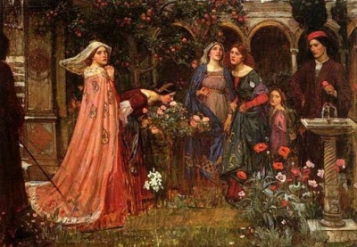

  
[Intangible Textual Heritage](../../../index.md)  [Legends and
Sagas](../../index)  [Dunsany](../index.md) 

------------------------------------------------------------------------

[Buy this Book on
Kindle](https://www.amazon.com/exec/obidos/ASIN/B002M3SU1O/internetsacredte.md)

------------------------------------------------------------------------

<table width="75%">
<colgroup>
<col style="width: 50%" />
<col style="width: 50%" />
</colgroup>
<tbody>
<tr class="odd">
<td width="50%" data-valign="TOP"></td>
<td width="50%" data-valign="CENTER"><h1 id="don-rodriguez" data-align="CENTER">Don Rodriguez</h1>
<h2 id="by-lord-dunsany" data-align="CENTER">by Lord Dunsany</h2>
<h4 id="section" data-align="CENTER">[1922]</h4></td>
</tr>
</tbody>
</table>

------------------------------------------------------------------------

[Contents](#contents)    [Start Reading](doro00.md)    [Text
\[Zipped\]](doro.txt.gz.md)

------------------------------------------------------------------------

|                                                                                                                           |
|---------------------------------------------------------------------------------------------------------------------------|
|  |

 [Title Page](doro00.md)  
[Chronology](doro01.md)  
[Contents](doro02.md)  
[The First Chronicle: How He Met and Said Farewell to Mine Host of the
Dragon and Knight](doro03.md)  
[The Second Chronicle: How He Hired a Memorable Servant](doro04.md)  
[The Third Chronicle: How He Came to the House of Wonder](doro05.md)  
[The Fourth Chronicle: How He Came to the Mountains of the
Sun](doro06.md)  
[The Fifth Chronicle: How He Rode in the Twilight and Saw
Serafina](doro07.md)  
[The Sixth Chronicle: How He Sang to his Mandolin and What Came of His
Singing](doro08.md)  
[The Seventh Chronicle: How he Came to Shadow Valley](doro09.md)  
[The Eighth Chronicle: How he Travelled Far](doro10.md)  
[The Ninth Chronicle: How he Won a Castle in Spain](doro11.md)  
[The Tenth Chronicle: How he Came Back to Lowlight](doro12.md)  
[The Eleventh Chronicle: How he Turned to Gardening and his Sword
Rested](doro13.md)  
[The Twelfth Chronicle: The Building of Castle Rodriguez and the Ending
of These Chronicle](doro14.md)  
