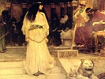

  
[Intangible Textual Heritage](../../../index)  [Legends and
Sagas](../../index)  [Lord Dunsany](../index)  [Index](index) 
[Previous](fotd51) 

------------------------------------------------------------------------

[Buy this Book on
Kindle](https://www.amazon.com/exec/obidos/ASIN/B002M3SWBC/internetsacredte)

------------------------------------------------------------------------

  
*Fifty-one Tales*, by Lord Dunsany, \[1915\], at Intangible Textual
Heritage

------------------------------------------------------------------------

THE TOMB OF PAN

"Seeing," they said, "that old-time Pan is dead, let us now make a tomb
for him and a monument, that the dreadful worship of long ago may be
remembered and avoided by all."

So said the people of the enlightened lands. And they built a white and
mighty tomb of marble. Slowly it rose under the hands of the builders
and longer every evening after sunset it gleamed with rays of the
departed sun.

And many mourned for Pan while the builders built; many reviled him.
Some called the builders to cease and to weep for Pan and others called
them to leave no memorial at all of so infamous a god. But the builders
built on steadily.

And one day all was finished, and the tomb stood there like a steep
sea-cliff. And Pan was carved thereon with humbled head and the feet of
angels pressed upon his neck. And when the tomb was finished the sun had
already set, but the afterglow was rosy on the huge bulk of Pan.

And presently all the enlightened people came, and saw the tomb and
remembered Pan who was dead, and all deplored him and his wicked age.
But a few wept apart because of the death of Pan.

But at evening as he stole out of the forest, and slipped like a shadow
softly along the hills, Pan saw the tomb and laughed.

 

 

 
