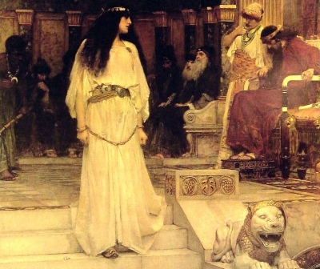

  
[Intangible Textual Heritage](../../../index.md)  [Legends and
Sagas](../../index)  [Lord Dunsany](../index.md) 

------------------------------------------------------------------------

[Buy this Book on
Kindle](https://www.amazon.com/exec/obidos/ASIN/B002M3SWBC/internetsacredte.md)

------------------------------------------------------------------------

<table width="75%">
<colgroup>
<col style="width: 50%" />
<col style="width: 50%" />
</colgroup>
<tbody>
<tr class="odd">
<td width="50%" data-valign="TOP"></td>
<td width="50%" data-valign="CENTER"><h1 id="fifty-one-tales" data-align="CENTER">Fifty-one Tales</h1>
<h2 id="by-lord-dunsany" data-align="CENTER">by Lord Dunsany</h2>
<h4 id="section" data-align="CENTER">[1915]</h4></td>
</tr>
</tbody>
</table>

------------------------------------------------------------------------

[Contents](#contents)    [Start Reading](fotd00.md)    [Text
\[Zipped\]](fotd.txt.gz.md)

------------------------------------------------------------------------

|                                                                                                                           |
|---------------------------------------------------------------------------------------------------------------------------|
|  |

 [Title Page](fotd00.md)  
[Contents](fotd01.md)  
[The Assignation](fotd02.md)  
[Charon](fotd03.md)  
[The Death of Pan](fotd04.md)  
[The Sphinx at Gizeh](fotd05.md)  
[The Hen](fotd06.md)  
[Wind and Fog](fotd07.md)  
[The Raft-Builders](fotd08.md)  
[The Workman](fotd09.md)  
[The Guest](fotd10.md)  
[Death and Odysseus](fotd11.md)  
[Death and the Orange](fotd12.md)  
[The Prayer of the Flowers](fotd13.md)  
[Time and the Tradesman](fotd14.md)  
[The Little City](fotd15.md)  
[The Unpasturable Fields](fotd16.md)  
[The Worm and the Angel](fotd17.md)  
[The Songless Country](fotd18.md)  
[The Latest Thing](fotd19.md)  
[The Demagogue and the Demi-Monde](fotd20.md)  
[The Giant Poppy](fotd21.md)  
[Roses](fotd22.md)  
[The Man with the Golden Ear-Rings](fotd23.md)  
[The Dream of King Karna-Vootra](fotd24.md)  
[The Storm](fotd25.md)  
[A Mistaken Identity](fotd26.md)  
[The True History of the Hare and the Tortoise](fotd27.md)  
[Alone the Immortals](fotd28.md)  
[A Moral Little Tale](fotd29.md)  
[The Return of Song](fotd30.md)  
[Spring in Town](fotd31.md)  
[How the Enemy Came to Thlunrana](fotd32.md)  
[A Losing Game](fotd33.md)  
[Taking Up Picadilly](fotd34.md)  
[After the Fire](fotd35.md)  
[The City](fotd36.md)  
[The Food of Death](fotd37.md)  
[The Lonely Idol](fotd38.md)  
[The Sphinx in Thebes (Massachusetts)](fotd39.md)  
[The Reward](fotd40.md)  
[The Trouble In Leafy Green Street](fotd41.md)  
[The Mist](fotd42.md)  
[Furrow-Maker](fotd43.md)  
[Lobster Salad](fotd44.md)  
[The Return of the Exiles](fotd45.md)  
[Nature and Time](fotd46.md)  
[The Song of the Blackbird](fotd47.md)  
[The Messengers](fotd48.md)  
[The Three Tall Sons](fotd49.md)  
[Compromise](fotd50.md)  
[What We Have Come To](fotd51.md)  
[The Tomb of Pan](fotd52.md)  
