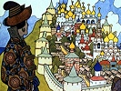

  
[Intangible Textual Heritage](../../../index.md)  [Legends and
Sagas](../../index)  [Dunsany](../index)  [Index](index.md) 
[Previous](gope13)  [Next](gope15.md) 

------------------------------------------------------------------------

[Buy this Book on
Kindle](https://www.amazon.com/exec/obidos/ASIN/B002M3SXVG/internetsacredte.md)

------------------------------------------------------------------------

  
*The Gods of Pegana*, by Lord Dunsany, \[1905\], at Intangible Textual
Heritage

------------------------------------------------------------------------

OF YOHARNETH-LAHAI

(The God of Little Dreams and Fancies)

Yaoharneth-Lahai is the god of little dreams and fancies.

All night he sendeth little dreams out of Pegana to please the people of
Earth.

He sendeth little dreams to the poor man and to The King.

He is so busy to send his dreams to all before the night be ended that
oft he forgetteth which be the poor man and which be The King.

To whom Yoharneth-Lahai cometh not with little dreams and sleep he must
endure all night the laughter of the gods, with highest mockery, in
Pegana.

All night long Yoharneth-Lahai giveth peace to cities until the dawn
hour and the departing of Yoharneth-Lahai, when it is time for the gods
to play with men again.

Whether the dreams and the fancies of Yoharneth-Lahai be false and the
Things that are done in the Day be real, or the Things that are done in
the Day be false and the dreams and the fancies of Yoharneth-Lahai be
true, none knoweth saving only MANA-YOOD-SUSHAI, who hath not spoken.

------------------------------------------------------------------------

[Next: Of Roon, the God of Going, and the Thousand Home Gods](gope15.md)

