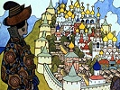

  
[Intangible Textual Heritage](../../../index)  [Legends and
Sagas](../../index)  [Dunsany](../index)  [Index](index) 
[Previous](gope20)  [Next](gope22) 

------------------------------------------------------------------------

[Buy this Book on
Kindle](https://www.amazon.com/exec/obidos/ASIN/B002M3SXVG/internetsacredte)

------------------------------------------------------------------------

  
*The Gods of Pegana*, by Lord Dunsany, \[1905\], at Intangible Textual
Heritage

------------------------------------------------------------------------

YUG THE PROPHET

When the Years had carries away Yonath, and Yonath was dead, there was
no longer a prophet among men.

And still men sought to know.

Therefore they said unto Yug: "Be thou our prophet, and know all things,
and tell us concerning the wherefore of It All."

And Yug said: "I know all things." And men were pleased.

And Yug said of the Beginning that it was in Yug's own garden, and of
the End that it was in the sight of Yug.

And men forgot Yug.

One day Yug saw Mung behind the hills making the sign of Mung. And Yug
was Yug no more.

------------------------------------------------------------------------

[Next: Alhireth-Hotep the Prophet](gope22)

