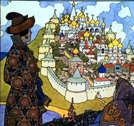

  
[Intangible Textual Heritage](../../../index.md)  [Legends and
Sagas](../../index)  [Dunsany](../index.md) 

------------------------------------------------------------------------

[Buy this Book on
Kindle](https://www.amazon.com/exec/obidos/ASIN/B002M3SXVG/internetsacredte.md)

------------------------------------------------------------------------

<table width="75%">
<colgroup>
<col style="width: 50%" />
<col style="width: 50%" />
</colgroup>
<tbody>
<tr class="odd">
<td width="50%" data-valign="TOP"></td>
<td width="50%" data-valign="CENTER"><h1 id="the-gods-of-pegana" data-align="CENTER">The Gods of Pegana</h1>
<h2 id="by-lord-dunsany" data-align="CENTER">by Lord Dunsany</h2>
<h4 id="section" data-align="CENTER">[1905]</h4></td>
</tr>
</tbody>
</table>

------------------------------------------------------------------------

[Contents](#contents)    [Start Reading](gope00.md)    [Text
\[Zipped\]](gope.txt.gz.md)

------------------------------------------------------------------------

|                                                                                                                           |
|---------------------------------------------------------------------------------------------------------------------------|
|  |

 [Title Page](gope00.md)  
[Contents](gope01.md)  
[Preface](gope02.md)  
[Introduction](gope03.md)  
[Of Skarl the Drummer](gope04.md)  
[Of the Making of the Worlds](gope05.md)  
[Of the Game of the Gods](gope06.md)  
[The Chaunt of the Gods](gope07.md)  
[The Sayings of Kib](gope08.md)  
[Concerning Sish](gope09.md)  
[The Sayings of Slid](gope10.md)  
[The Deeds of Mung](gope11.md)  
[The Chaunt of the Priests](gope12.md)  
[The Sayings of Limpang-Tung](gope13.md)  
[Of Yoharneth-Lahai](gope14.md)  
[Of Roon, the God of Going, and the Thousand Home Gods](gope15.md)  
[The Revolt of the Home Gods](gope16.md)  
[Of Dorozhand](gope17.md)  
[The Eye in the Waste](gope18.md)  
[Of The Thing That Is Neither God Nor Beast](gope19.md)  
[Yonath the Prophet](gope20.md)  
[Yug the Prophet](gope21.md)  
[Alhireth-Hotep the Prophet](gope22.md)  
[Kabok the Prophet](gope23.md)  
[Of the Calamity that Befel Yun-Ilara by the Sea, and of the Building of
the Tower of the Ending of Days](gope24.md)  
[Of How the Gods Whelmed Sidith](gope25.md)  
[Of How Imbaun Became High Prophet in Aradec of All the Gods Save
One](gope26.md)  
[Of How Imbaun Met Zodrak](gope27.md)  
[Pegana](gope28.md)  
[The Sayings of Imbaun](gope29.md)  
[Of How Imbaun Spake of Death to the King](gope30.md)  
[Of Ood](gope31.md)  
[The River](gope32.md)  
[The Bird of Doom and the End](gope33.md)  
