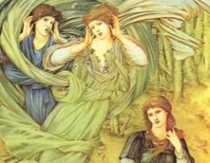

  
[Intangible Textual Heritage](../../../index)  [Legends and
Sagas](../../index)  [Dunsany](../index) 

------------------------------------------------------------------------

[Buy this Book on
Kindle](https://www.amazon.com/exec/obidos/ASIN/B002M3SZSM/internetsacredte)

------------------------------------------------------------------------

<table width="75%">
<colgroup>
<col style="width: 50%" />
<col style="width: 50%" />
</colgroup>
<tbody>
<tr class="odd">
<td width="50%" data-valign="TOP"> 
Edward Burne-Jones [1891] (Public Domain Image)</td>
<td width="50%" data-valign="CENTER"><h1 id="plays-of-gods-and-men" data-align="CENTER">Plays of Gods and Men</h1>
<h2 id="by-lord-dunsany" data-align="CENTER">by Lord Dunsany</h2>
<h4 id="section" data-align="CENTER">[1917]</h4></td>
</tr>
</tbody>
</table>

------------------------------------------------------------------------

[Contents](#contents)    [Start Reading](pgam00)    [Text
\[Zipped\]](pgam.txt.gz)

------------------------------------------------------------------------

|                                                                                                                           |
|---------------------------------------------------------------------------------------------------------------------------|
|  |

 [Title Page](pgam00)  
[Preface](pgam01)  
[Contents](pgam02)  
[The Laughter of the Gods](pgam03)  
[The Queen's Enemies](pgam04)  
[The Tents of the Arabs](pgam05)  
[A Night at an Inn](pgam06)  
