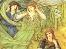

  
[Intangible Textual Heritage](../../../index)  [Legends and
Sagas](../../index)  [Dunsany](../index)  [Index](index) 
[Previous](pgam01)  [Next](pgam03) 

------------------------------------------------------------------------

[Buy this Book on
Kindle](https://www.amazon.com/exec/obidos/ASIN/B002M3SZSM/internetsacredte)

------------------------------------------------------------------------

  
*Plays of Gods and Men*, by Lord Dunsany, \[1917\], at Intangible
Textual Heritage

------------------------------------------------------------------------

CONTENTS

[Preface](pgam01.htm#an_f00)

[The Laughter of the Gods](pgam03.htm#an_f01)

[The Queen's Enemies](pgam04.htm#an_f02)

[The Tents of the Arabs](pgam05.htm#an_f03)

[A Night at an Inn](pgam06.htm#an_f04)

------------------------------------------------------------------------

[Next: The Laughter of the Gods](pgam03)

