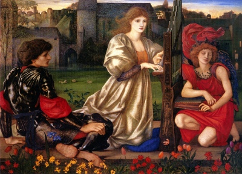

  
[Intangible Textual Heritage](../../../index.md)  [Legends and
Sagas](../../index)  [Dunsany](../index.md) 

------------------------------------------------------------------------

<table width="75%">
<colgroup>
<col style="width: 50%" />
<col style="width: 50%" />
</colgroup>
<tbody>
<tr class="odd">
<td width="50%" data-valign="TOP"></td>
<td width="50%" data-valign="CENTER"><h1 id="the-sword-of-welleran-and-other-stories" data-align="CENTER">The Sword of Welleran and Other Stories</h1>
<h2 id="by-lord-dunsany" data-align="CENTER">by Lord Dunsany</h2>
<h4 id="section" data-align="CENTER">[1908]</h4></td>
</tr>
</tbody>
</table>

------------------------------------------------------------------------

[Contents](#contents)    [Start Reading](swos00.md)    [Text
\[Zipped\]](swos.txt.gz.md)

------------------------------------------------------------------------

 [Title Page](swos00.md)  
[Contents](swos01.md)  
[The Sword of Welleran](swos02.md)  
[The Fall of Babbulkund](swos03.md)  
[The Kith of the Elf Folk](swos04.md)  
[The Highwaymen](swos05.md)  
[In The Twilight](swos06.md)  
[The Ghosts](swos07.md)  
[The Whirlpool](swos08.md)  
[The Hurricane](swos09.md)  
[The Fortress Unvanquishable, Save For Sacnoth](swos10.md)  
[The Lord of Cities](swos11.md)  
[The Doom of La Traviata](swos12.md)  
[On The Dry Land](swos13.md)  
