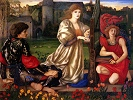

  
[Intangible Textual Heritage](../../../index)  [Legends and
Sagas](../../index)  [Dunsany](../index)  [Index](index) 
[Previous](swos08)  [Next](swos10) 

------------------------------------------------------------------------

  
*The Sword of Welleran and Other Stories*, by Lord Dunsany, \[1908\], at
Intangible Textual Heritage

------------------------------------------------------------------------

The Hurricane

One night I sat alone on the great down, looking over the edge of it at
a murky, sullen city. All day long with its smoke it had troubled the
holy sky, and now it sat there roaring in the distance and glared at me
with its furnaces and lighted factory windows. Suddenly I became aware
that I was not the only enemy of that city, for I perceived the colossal
form of the Hurricane walking over the down towards me, playing idly
with the flowers as he passed, and near me he stopped and spake to the
Earthquake, who had come up mole-like but vast out of a cleft in the
earth.

'Old friend,' said the Hurricane, 'rememberest when we wrecked the
nations and drave the herds of the sea into new pasturage?'

'Yes,' said the Earthquake, drowsily; 'Yes, yes.'

'Old friend,' said the Hurricane, 'there are cities everywhere. Over thy
head while thou didst sleep they have built them constantly. My four
children the Winds suffocate with the fumes of them, the valleys are
desolate of flowers, and the lovely forests are cut down since last we
went abroad together.'

The Earthquake lay there, with his snout towards the city, blinking at
the lights, while the tall Hurricane stood beside him pointing fiercely
at it.

'Come,' said the Hurricane, 'let us fare forth again and destroy them,
that all the lovely forests may come back and the furry creeping things.
Thou shalt whelm these cities utterly and drive the people forth, and I
will smite them in the shelterless places and sweep their desecrations
from the sea. Wilt thou come forth with me and do this thing for the
glory of it? Wilt thou wreck the world again as we did, thou and I, or
ever Man had come? Wilt thou come forth to this place at this hour
tomorrow night?'

'Yes,' said the Earthquake, 'Yes,' and he crept to his cleft again, and
head foremost waddled down into the abysses.

When the Hurricane strode away, I got up quietly and departed, but at
that hour of the next night I came up cautiously to the same spot. There
I found the huge grey form of the Hurricane alone, with his head bowed
in his hands, weeping; for the Earthquake sleeps long and heavily in the
abysses, and he would not wake.

------------------------------------------------------------------------

[Next: The Fortress Unvanquishable, Save For Sacnoth](swos10)

