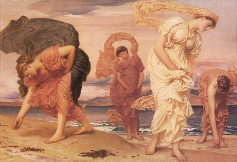

  
[Intangible Textual Heritage](../../../index)  [Legends and
Sagas](../../index)  [Dunsany](../index) 

------------------------------------------------------------------------

[Buy this Book on
Kindle](https://www.amazon.com/exec/obidos/ASIN/B002M3T6JE/internetsacredte)

------------------------------------------------------------------------

<table width="75%">
<colgroup>
<col style="width: 50%" />
<col style="width: 50%" />
</colgroup>
<tbody>
<tr class="odd">
<td width="50%" data-valign="TOP"></td>
<td width="50%" data-valign="CENTER"><h1 id="time-and-the-gods" data-align="CENTER">Time and the Gods</h1>
<h2 id="by-lord-dunsany" data-align="CENTER">by Lord Dunsany</h2>
<h4 id="section" data-align="CENTER">[1905]</h4></td>
</tr>
</tbody>
</table>

------------------------------------------------------------------------

[Contents](#contents)    [Start Reading](tago00)    [Text
\[Zipped\]](tago.txt.gz)

------------------------------------------------------------------------

|                                                                                                                           |
|---------------------------------------------------------------------------------------------------------------------------|
|  |

 [Title Page](tago00)  
[Contents](tago01)  
[Preface](tago02)  

### Part I. Time and the Gods

[Time and the Gods](tago03)  
[The Coming of the Sea](tago04)  
[A Legend of the Dawn](tago05)  
[The Vengeance of Men](tago06)  
[When The Gods Slept](tago07)  
[The King that Was Not](tago08)  
[The Cave of Kai](tago09)  
[The Sorrow of Search](tago10)  
[The Men of Yarnith](tago11)  
[For the Honour of the Gods](tago12)  
[Night and Morning](tago13)  
[Usury](tago14)  
[Mlideen](tago15)  
[The Secret of the Gods](tago16)  
[The South Wind](tago17)  
[In The Land of Time](tago18)  
[The Relenting of Sarnidac](tago19)  
[The Jest of the Gods](tago20)  
[The Dreams of the Prophet](tago21)  

### Part II. The Journey of the King

[I](tago22)  
[II](tago23)  
[III](tago24)  
[IV](tago25)  
[V](tago26)  
[VI](tago27)  
[VII](tago28)  
[VIII](tago29)  
[IX](tago30)  
[X](tago31)  
[XI](tago32)  
