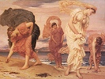

  
[Intangible Textual Heritage](../../../index)  [Legends and
Sagas](../../index)  [Dunsany](../index)  [Index](index) 
[Previous](tago17)  [Next](tago19) 

------------------------------------------------------------------------

[Buy this Book on
Kindle](https://www.amazon.com/exec/obidos/ASIN/B002M3T6JE/internetsacredte)

------------------------------------------------------------------------

  
*Time and the Gods*, by Lord Dunsany, \[1905\], at Intangible Textual
Heritage

------------------------------------------------------------------------

IN THE LAND OF TIME

Thus Karnith, King of Alatta, spake to his eldest son: "I bequeath to
thee my city of Zoon, with its golden eaves, whereunder hum the bees.
And I bequeath to thee also the land of Alatta, and all such other lands
as thou art worthy to possess, for my three strong armies which I leave
thee may well take Zindara and over-run Istahn, and drive back Onin from
his frontier, and leaguer the walls of Yan, and beyond that spread
conquest over the lesser lands of Hebith, Ebnon, and Karida. Only lead
not thine armies against Zeenar, nor ever cross the Eidis."

Thereat in the city of Zoon in the land of Alatta, under his golden
eaves, died King Karnith, and his soul went whither had gone the souls
of his sires the elder Kings, and the souls of their slaves.

Then Karnith Zo, the new King, took the iron crown of Alatta and
afterwards went down to the plains that encircle Zoon and found his
three strong armies clamouring to be led against Zeenar, over the river
Eidis.

But the new King came back from his armies, and all one night in the
great palace alone with his iron crown, pondered long upon war; and a
little before dawn he saw dimly through his palace window, facing east
over the city of Zoon and across the fields of Alatta, to far off where
a valley opened on Istahn. There, as he pondered, he saw the smoke
arising tall and straight over small houses in the plain and the fields
where the sheep fed. Later the sun rose shining over Alatta as it shone
over Istahn, and there arose a stir about the houses both in Alatta and
Istahn, and cocks crowded in the city and men went out into the fields
among the bleating sheep; and the King wondered if men did otherwise in
Istahn. And men and women met as they went out to work and the sound of
laughter arose from streets and fields; the King's eyes gazed into the
distance toward Istahn and still the smoke went upward tall and straight
from the small houses. And the sun rose higher that shone upon Alatta
and Istahn, causing the flowers to open wide in each, and the birds to
sing and the voices of men and women to arise. And in the market place
of Zoon caravans were astir that set out to carry merchandise to Istahn,
and afterwards passed camels coming to Alatta with many tinkling bells.
All this the King saw as he pondered much, who had not pondered before.
Westward the Agnid mountains frowned in the distance guarding the river
Eidis; behind them the fierce people of Zeenar lived in a bleak land.

Later the King, going abroad through his new kingdom, came on the Temple
of the gods of Old. There he found the roof shattered and the marble
columns broken and tall weeds met together in the inner shrine, and the
gods of Old, bereft of worship or sacrifice, neglected and forgotten.
And the King asked of his councillors who it was that had overturned
this temple of the gods or caused the gods Themselves to be thus
forsaken. And they answered him:

"Time has done this."

Next the King came upon a man bent and crippled, whose face was furrowed
and worn, and the King having seen no such sight within the court of his
father said to the man:

"Who hath done this thing to you?"

And the old man answered:

"Time hath ruthlessly done it."

But the King and his councillors went on, and next they came upon a body
of men carrying among them a hearse. And the King asked his councillors
closely concerning death, for these things had not before been expounded
to the King. And the oldest of the councillors answered:

"Death, O King, is a gift sent by the gods by the hand of their servant
Time, and some receive it gladly, and some are forced reluctantly to
take it, and before others it is suddenly flung in the middle of the
day. And with this gift that Time hath brought him from the gods a man
must go forth into the dark to possess no other thing for so long as the
gods are willing."

But the King went back to his palace and gathered the greatest of his
prophets and his councillors and asked them more particularly concerning
Time. And they told the King how that Time was a great figure standing
like a tall shadow in the dusk or striding, unseen, across the world,
and how that he was the slave of the gods and did Their bidding, but
ever chose new masters, and how all the former masters of Time were dead
and Their shrines forgotten. And one said:

"I have seen him once when I went down to play again in the garden of my
childhood because of certain memories. And it was towards evening and
the light was pale, and I saw Time standing over the little gate, pale
like the light, and he stood between me and that garden and had stolen
my memories because he was mightier than I."

And another said:

"I, too, have seen the Enemy of my House. For I saw him when he strode
over the fields that I knew well and led a stranger by the hand to place
him in my home to sit where my forefathers sat. And I saw him afterwards
walk thrice round the house and stoop and gather up the glamour from the
lawns and brush aside the tall poppies in the garden and spread weeds in
his pathway where he strode through the remembered nooks."

And another said:

"He went one day into the desert and brought up life out of the waste
places, and made it cry bitterly and covered it with the desert again."

And another said:

"I too saw him once seated in the garden of a child tearing the flowers,
and afterwards he went away through many woodlands and stooped down as
he went, and picked the leaves one by one from the trees."

And another said:

"I saw him once by moonlight standing tall and black amidst the ruins of
a shrine in the old kingdom of Amarna, doing a deed by night. And he
wore a look on his face such as murderers wear as he busied himself to
cover over something with weeds and dust. Thereafter in Amarna the
people of that old Kingdom missed their god, in whose shrine I saw Time
crouching in the night, and they have not since beheld him."

And all the while from the distance at the city's edge rose a hum from
the three armies of the King clamouring to be led against Zeenar.
Thereat the King went down to his three armies and speaking to their
chiefs said:

"I will not go down clad with murder to be King over other lands. I have
seen the same morning arising on Istahn that also gladdened Alatta, and
have heard Peace lowing among the flowers. I will not desolate homes to
rule over an orphaned land and a land widowed. But I will lead you
against the pledged enemy of Alatta who shall crumble the towers of Zoon
and hath gone far to overthrow our gods. He is the foe of Zindara and
Istahn and many-citadeled Yan, Hebith and Ebnon may not overcome him nor
Karida be safe against him among her bleakest mountains. He is a foe
mightier than Zeenar with frontiers stronger than Eidis; he leers at all
the peoples of the earth and mocks their gods and covets their builded
cities. Therefore we will go forth and conquer Time and save the gods of
Alatta from his clutch, and coming back victorious shall find that Death
is gone and age and illness departed, and here we shall live for ever by
the golden eaves of Zoon, while the bees hum among unrusted gables and
never crumbling towers. There shall be neither fading nor forgetting,
nor ever dying nor sorrow, when we shall have freed the people and
pleasant fields of the earth from inexorable Time."

And the armies swore that they would follow the King to save the world
and the gods.

So the next day the King set forth with his three armies and crossed
many rivers and marched through many lands, and wherever they went they
asked for news of Time.

And the first day they met a woman with her face furrowed and lined, who
told them that she had been beautiful and that Time had smitten her in
the face with his five claws.

Many an old man they met as they marched in search of Time. All had seen
him but none could tell them more, except that some said he went that
way and pointed to a ruined tower or to an old and broken tree.

And day after day and month by month the King pushed on with his armies,
hoping to come at last on Time. Sometimes they encamped at night near
palaces of beautiful design or beside gardens of flowers, hoping to find
their enemy when he came to desecrate in the dark. Sometimes they came
on cobwebs, sometimes on rusted chains and houses with broken roofs or
crumbling walls. Then the armies would push on apace thinking that they
were closer upon the track of Time.

As the weeks passed by and weeks grew to months, and always they heard
reports and rumours of Time, but never found him, the armies grew weary
of the great march, but the King pushed on and would let none turn back,
saying always that the enemy was near at hand.

Month in, month out, the King led on his now unwilling armies, till at
last they had marched for close upon a year and came to the village of
Astarma very far to the north. There many of the King's weary soldiers
deserted from his armies and settled down in Astarma and married
Astarmian girls. By these soldiers we have the march of the armies
clearly chronicled to the time when they came to Astarma, having been
nigh a year upon the march. And the army left that village and the
children cheered them as they went up the street, and five miles distant
they passed over a ridge of hills and out of sight. Beyond this less is
known, but the rest of this chronicle is gathered from the tales that
the veterans of the King's armies used to tell in the evenings about the
fires in Zoon and remembered afterwards by the men of Zeenar.

It is mostly credited in these days that such of the King's armies as
went on past Astarma came at last (it is not known after how long a
time) over a crest of a slope where the whole earth slanted green to the
north. Below it lay green fields and beyond them moaned the sea with
never shore nor island so far as the eye could reach. Among the green
fields lay a village, and on this village the eyes of the King and his
armies were turned as they came down the slope. It lay beneath them,
grave with seared antiquity, with old-world gables stained and bent by
the lapse of frequent years, with all its chimneys awry. Its roofs were
tiled with antique stones covered over deep with moss, each little
window looked with a myriad strange cut panes on the gardens shaped with
quaint devices and overrun with weeds. On rusted hinges the doors sung
to and fro and were fashioned of planks of immemorial oak with black
knots gaping from their sockets. Against it all there beat the
thistle-down, about it clambered the ivy or swayed the weeds; tall and
straight out of the twisted chimneys arose blue columns of smoke, and
blades of grass peeped upward between the huge cobbles of the unmolested
street. Between the gardens and the cobbled streets stood hedges higher
than a horseman might look, of stalwart thorn, and upward through it
clambered the convolvulus to peer into the garden from the top. Before
each house there was cut a gap in the hedge, and in it swung a wicket
gate of timber soft with the rain and years, and green like the moss.
Over all of it there brooded age and the full hush of things bygone and
forgotten. Upon this derelict that the years had cast up out of
antiquity the King and his armies gazed long. Then on the hill slope the
King made his armies halt, and went down alone with one of his chiefs
into the village.

Presently there was a stir in one of the houses, and a bat flew out of
the door into the daylight, and three mice came running out of the
doorway down the step, an old stone cracked in two and held together by
moss; and there followed an old man bending on a stick with a white
beard coming to the ground, wearing clothes that were glossed with use,
and presently there came others out of the other houses, all of them as
old, and all hobbling on sticks. These were the oldest people that the
King had ever beheld, and he asked them the name of the village and who
they were; and one of them answered, "This is the City of the Aged in
the Territory of Time."

And the King said, "Is Time then here?"

And one of the old men pointed to a great castle standing on a steep
hill and said: "Therein dwells Time, and we are his people;" and they
all looked curiously at King Karnith Zo, and the eldest of the villagers
spoke again and said: "Whence do you come, you that are so young?" and
Karnith Zo told him how he had come to conquer Time to save the world
and the gods, and asked them whence they came.

And the villagers said:

"We are older than always, and know not whence we came, but we are the
people of Time, and here from the Edge of Everything he sends out his
hours to assail the world, and you may never conquer Time." But the King
went back to his armies, and pointed towards the castle on the hill and
told them that at last they had found the Enemy of the Earth; and they
that were older than always went back slowly into their houses with the
creaking of olden doors. And there they went across the fields and
passed the village. From one of his towers Time eyed them all the while,
and in battle order they closed in on the steep hill as Time sat still
in his great tower and watched.

But as the feet of the foremost touched the edge of the hill Time hurled
five years against them, and the years passed over their heads and the
army still came on, an army of older men. But the slope seemed steeper
to the King and to every man in his army, and they breathed more
heavily. And Time summoned up more years, and one by one he hurled them
at Karnith Zo and at all his men. And the knees of the army stiffened,
and their beards grew and turned grey, and the hours and days and the
months went singing over their heads, and their hair turned whiter and
whiter, and the conquering hours bore down, and the years rushed on and
swept the youth of that army clear away till they came face to face
under the walls of the castle of Time with a mass of howling years, and
found the top of the slope too steep for aged men. Slowly and painfully,
harassed with agues and chills, the King rallied his aged army that
tottered down the slope.

Slowly the King led back his warriors over whose heads had shrieked the
triumphant years. Year in, year out, they straggled southwards, always
towards Zoon; they came, with rust upon their spears and long beards
flowing, again into Astarma, and none knew them there. They passed again
by towns and villages where once they had inquired curiously concerning
Time, and none knew them there either. They came again to the palaces
and gardens where they had waited for Time in the night, and found that
Time had been there. And all the while they set a hope before them that
they should come on Zoon again and see its golden eaves. And no one knew
that unperceived behind them there lurked and followed the gaunt figure
of Time cutting off stragglers one by one and overwhelming them with his
hours, only men were missed from the army every day, and fewer and fewer
grew the veterans of Karnith Zo.

But at last after many a month, one night as they marched in the dusk
before the morning, dawn suddenly ascending shone on the eaves of Zoon,
and a great cry ran through the army:

"Alatta, Alatta!"

But drawing nearer they found that the gates were rusted and weeds grew
tall along the outer walls, many a roof had fallen, gables were
blackened and bent, and the golden eaves shone not as heretofore. And
the soldiers entering the city expecting to find their sisters and
sweethearts of a few years ago saw only old women wrinkled with great
age and knew not who they were.

Suddenly someone said:

"He has been here too."

And then they knew that while they searched for Time, Time had gone
forth against their city and leaguered it with the years, and had taken
it while they were far away and enslaved their women and children with
the yoke of age. So all that remained of the three armies of Karnith Zo
settled in the conquered city. And presently the men of Zeenar crossed
over the river Eidis and easily conquering an army of aged men took all
Alatta for themselves, and their kings reigned thereafter in the city of
Zoon. And sometimes the men of Zeenar listened to the strange tales that
the old Alattans told of the years when they made battle against Time.
Such of these tales as the men of Zeenar remembered they afterwards set
forth, and this is all that may be told of those adventurous armies that
went to war with Time to save the world and the gods, and were
overwhelmed by the hours and the years.

------------------------------------------------------------------------

[Next: The Relenting of Sarnidac](tago19)

