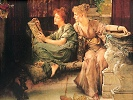

  
[Intangible Textual Heritage](../../../index)  [Legends and
Sagas](../../index)  [Dunsany](../index)  [Index](index) 
[Previous](tbow01)  [Next](tbow03) 

------------------------------------------------------------------------

[Buy this Book on
Kindle](https://www.amazon.com/exec/obidos/ASIN/B002M3TLAI/internetsacredte)

------------------------------------------------------------------------

  
*The Book of Wonder*, by Lord Dunsany, \[1912\], at Intangible Textual
Heritage

------------------------------------------------------------------------

PREFACE

Come with me, ladies and gentlemen who are in any wise weary of London:
come with me: and those that tire at all of the world we know: for we
have new worlds here.

------------------------------------------------------------------------

[Next: The Bride of the Man-Horse](tbow03)

