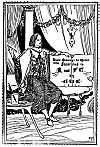
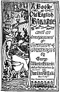
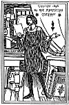

  
[Intangible Textual Heritage](../../../index.md)  [Sagas &
Legends](../../index)  [England](../index)  [Index](index.md) 
[Next](boeb01.md) 

------------------------------------------------------------------------

# A Book of Old English Ballads

###### with an

##### Accompaniment of Decorative Drawings

###### by

## George Wharton Edwards

##### And an Introduction by

## Hamilton W. Mabie

#### New York,

#### The Macmillan Company

#### \[1896\]

###### Scanned at Intangible Textual Heritage, August 2003. J. B. Hare, redactor. This text is in the public domain. These files may be used for any non-commercial purpose, provided this notice of attribution is left intact.

 [  
Click to enlarge](img/coloph.jpg.md)

 [  
Click to enlarge](img/title.jpg.md)

 [  
Click to enlarge](img/verso.jpg.md)

------------------------------------------------------------------------

[Next: Contents](boeb01.md)
