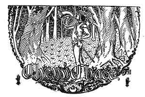
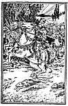
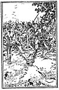
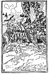

  
[Intangible Textual Heritage](../../../index)  [Sagas &
Legends](../../index)  [England](../index)  [Index](index) 
[Previous](boeb02)  [Next](boeb04) 

------------------------------------------------------------------------

p. 29

 

# Chevy Chace

GOD prosper long our noble king,  
  Our liffes and safetyes all;  
A woefull hunting once there did  
  In Chevy-Chace befall.

To drive the deere with hound and horne,  
  Erle Percy took his way;  
The child may rue that is unborne  
  The hunting of that day.

The stout Erle of Northumberland  
  A vow to God did make,  
His pleasure in the Scottish woods  
  Three summers days to take;

p. 30

The cheefest harts in Chevy-Chace  
  To kill and beare away:  
These tydings to Erle Douglas came,  
  In Scotland where he lay.

Who sent Erie Percy present word,  
  He wold prevent his sport;  
The English Erle not fearing that,  
  Did to the woods resort,

With fifteen hundred bow-men bold,  
  All chosen men of might,  
Who knew full well in time of neede  
  To ayme their shafts arright.

The gallant greyhounds swiftly ran,  
  To chase the fallow deere;  
On Munday they began to hunt,  
  Ere day-light did appeare;

And long before high noone they had  
  An hundred fat buckes slaine;  
Then having din'd, the drovyers went  
  To rouze the deare againe.

p. 31

The bow-men mustered on the hills,  
  Well able to endure;  
Theire backsides all, with speciall care,  
  That day were guarded sure.

The hounds ran swiftly through the woods,  
  The nimble deere to take,  
That with their cryes the hills and dales  
  An eccho shrill did make.

Lord Percy to the quarry went,  
  To view the tender deere;  
Quoth he, "Erle Douglas promised  
  This day to meet me heere;

"But if I thought he wold not come,  
  Noe longer wold I stay."  
With that, a brave younge gentleman  
  Thus to the Erle did say:

"Loe, yonder doth Erle Douglas come,  
  His men in armour bright;  
Full twenty hundred Scottish speres,  
  All marching in our sight.

p. 32

"All men of pleasant Tivydale,  
  Fast by the river Tweede:"  
"O cease your sport," Erle Percy said,  
  "And take your bowes with speede.

"And now with me, my countrymen,  
  Your courage forth advance;  
For never was there champion yett  
  In Scotland or in France,

"That ever did on horsebacke come,  
  But, if my hap it were,  
I durst encounter man for man,  
  With him to breake a spere."

Erle Douglas on his milke-white steede,  
  Most like a baron bold,  
Rode formost of his company,  
  Whose armour shone like gold.

"Show me," sayd hee, "whose men you bee,  
  That hunt soe boldly heere,  
That, without my consent, doe chase  
  And kill my fallow-deere."

 

 [  
Click to enlarge](img/03200.jpg)

 

p. 33

The man that first did answer make  
  Was noble Percy hee;  
Who sayd, "Wee list not to declare,  
  Nor shew whose men wee bee.

"Yet will wee spend our deerest blood,  
  Thy cheefest harts to slay;"  
Then Douglas swore a solempne oathe,  
  And thus in rage did say;

"Ere thus I will out-braved bee,  
  One of us two shall dye:  
I know thee well, an erle thou art;  
  Lord Percy, soe am I.

"But trust me, Percy, pittye it were,  
  And great offence, to kill  
Any of these our guiltlesse men,  
  For they have done no ill.

"Let thou and I the battell trye,  
  And set our men aside."  
"Accurst bee he," Erle Percy sayd,  
  By whome this is denyed."

p. 36

Then stept a gallant squier forth,  
  Witherington was his name,  
Who said, "I wold not have it told  
  To Henry our king for shame,

"That ere my captaine fought on foote,  
  And I stood looking on:  
You bee two erles," sayd Witherington,  
  "And I a squier alone.

"Ile doe the best that doe I may,  
  While I have power to stand;  
While I have power to weeld my sword,  
  Ile fight with hart and hand."

Our English archers bent their bowes,  
  Their harts were good and trew;  
Att the first flight of arrowes sent,  
  Full four-score Scots they slew.

\[Yet bides Earl Douglas on the bent,  
  As Chieftain stout and good,  
As valiant Captain, all unmov'd  
  The shock he firmly stood.

p. 35

His host he parted had in three,  
  As Leader ware and try'd,  
And soon his spearmen on their foes  
  Bare down on every side.

Throughout the English archery  
  They dealt full many a wound;  
But still our valiant Englishmen  
  All firmly kept their ground.

And throwing strait their bows away,  
  They grasp'd their swords so bright:  
And now sharp blows, a heavy shower,  
  On shields and helmets light.\]

They clos'd full fast on everye side,  
  Noe slacknes there was found;  
And many a gallant gentleman  
  Lay gasping on the ground.

O Christ! it was a griefe to see,  
  And likewise for to heare,  
The cries of men lying in their gore,  
  And scattered here and there.

p. 36

At last these two stout erles did meet,  
  Like captaines of great might;  
Like lyons wood they layd on lode,  
  And made a cruell fight.

They fought, untill they both did sweat,  
  With swords of tempered steele;  
Until the blood, like drops of rain,  
  They trickling downe did feele.

"Yeeld thee, Lord Percy," Douglas sayd  
  "In faith I will thee bringe,  
Where thou shalt high advancèd bee  
  By James our Scottish king.

"Thy ransom I will freely give,  
  And thus report of thee,  
Thou art the most couragious knight  
  That ever I did see."

"Noe, Douglas," quoth Erle Percy then,  
  "Thy proffer I doe scorne  
I will not yeelde to any Scott,  
  That ever yett was borne."

 

 [  
Click to enlarge](img/03600.jpg)

 

p. 37

With that, there came an arrow keene  
  Out of an English bow,  
Which struck Erle Douglas to the heart,  
  A deepe and deadlye blow:

Who never spake more words than these,  
  "Fight on, my merry men all;  
For why, my life is at an end:  
  Lord Percy sees my fall."

Then leaving liffe, Erle Percy tooke  
  The dead man by the hand;  
And said, "Erle Douglas, for thy life  
  Wold I had lost my land!

"O Christ! my verry hart doth bleed  
  With sorrow for thy sake;  
For sure, a more renownèd knight  
  Mischance cold never take."

A knight amongst the Scotts there was,  
  Which saw Erle Douglas dye,  
Who streight in wrath did vow revenge  
  Upon the Lord Percye;

p. 38

Sir Hugh Mountgomerye was he call'd,  
  Who, with a spere most bright,  
Well-mounted on a gallant steed,  
  Ran fiercely through the fight;

And past the English archers all,  
  Without all dread or feare,  
And through Earl Percyes body then  
  He thrust his hatefull spere

With such a vehement force and might  
  He did his body gore,  
The speare ran through the other side  
  A large cloth-yard, and more.

So thus did both these nobles dye,  
  Whose courage none could staine;  
An English archer then perceiv'd  
  The noble erle was slaine.

He had a bow bent in his hand,  
  Made of a trusty tree;  
An arrow of a cloth-yard long  
  Up to the head drew hee.

 

 [  
Click to enlarge](img/03800.jpg)

 

p. 39

Against Sir Hugh Mountgomerye,  
  So right the shaft he sett,  
The grey goose-wing that was thereon  
  In his harts bloode was wett.

This fight did last from breake of day  
  Till setting of the sun;  
For when they rung the evening bell,  
  The battel scarce was done.

With stout Erle Percy, there was slaine,  
  Sir John of Egerton,  
Sir Robert Ratcliff, and Sir John,  
  Sir James, that bold Baròn.

And with Sir George and stout Sir James,  
  Both knights of good account,  
Good Sir Ralph Rabby there was slaine,  
  Whose prowesse did surmount.

For Witherington needs must I wayle,  
  As one in doleful dumpes;  
For when his legs were smitten off,  
  He fought upon his stumpes.

p. 40

And with Erle Douglas, there was slaine  
  Sir Hugh Mountgomerye,  
Sir Charles Murray, that from the feeld  
  One foote wold never flee.

Sir Charles Murray of Ratcliff, too,  
  His sisters sonne was hee;  
Sir David Lamb, so well esteem'd,  
  Yet savèd cold not bee.

And the Lord Maxwell in like case  
  Did with Erle Douglas dye;  
Of twenty hundred Scottish speres,  
  Scarce fifty-five did flye.

Of fifteen hundred Englishmen,  
  Went home but fifty-three;  
The rest were slaine in Chevy-Chace,  
  Under the greene wood tree.

Next day did many widowes come,  
  Their husbands to bewayle;  
They washt their wounds in brinish teares,  
  But all wold not prevayle.

p. 41

Theyr bodyes, bathed in purple blood,  
  They bore with them away:  
They kist them dead a thousand times,  
  Ere they were cladd in clay.

This newes was brought to Eddenborrow,  
  Where Scotlands king did raigne,  
That brave Erle Douglas suddenlye  
  Was with an arrow slaine.

"O heavy newes," King James did say;  
  "Scottland can witnesse bee,  
I have not any captaine more  
  Of such account as hee."

Like tydings to King Henry came,  
  Within as short a space,  
That Percy of Northumberland  
  Was slaine in Chevy-Chace.

"Now God be with him," said our king,  
  "Sith it will noe better bee;  
I trust I have, within my realme,  
  Five hundred as good as hee.

p. 42

"Yett shall not Scotts nor Scotland say,  
  But I will vengeance take,  
I'll be revengèd on them all,  
  For brave Erle Percyes sake."

This vow full well the king perform'd  
  After, at Humbledowne;  
In one day, fifty knights were slayne,  
  With lordes of great renowne.

And of the rest, of small account,  
  Did many thousands dye:  
Thus endeth the hunting in Chevy-Chace,  
  Made by the Erle Percy.

God save our king, and bless this land  
  In plentye, joy, and peace;  
And grant henceforth, that foule debate  
  'Twixt noblemen may cease!

------------------------------------------------------------------------

[Next: King Cophetua and the Beggar-Maid](boeb04)
