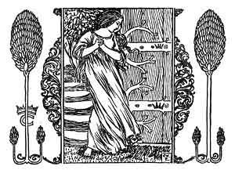

  
[Intangible Textual Heritage](../../../index.md)  [Sagas &
Legends](../../index)  [England](../index)  [Index](index.md) 
[Previous](boeb03)  [Next](boeb05.md) 

------------------------------------------------------------------------

p. 43

 [  
Click to enlarge](img/04300.jpg.md)

 

# King Cophetua and the Beggar-Maid

I READ that once in Affrica  
  A princely wight did raine,  
Who had to name Cophetua,  
  As poets they did faine.  
From natures lawes he did decline,  
For sure he was not of my minde,  
He cared not for women-kind  
  But did them all disdaine.  
But marke what hapned on a day;  
As he out of his window lay,  
He saw a beggar all in gray.  
  The which did cause his paine.

p. 44

The blinded boy that shootes so trim  
  From heaven downe did hie,  
He drew a dart and shot at him,  
  In place where he did lye:  
Which soone did pierse him to the quicke,  
And when he felt the arrow pricke,  
Which in his tender heart did sticke,  
  He looketh as he would dye.  
What sudden chance is this," quoth he,  
"That I to love must subject be,  
Which never thereto would agree,  
  But still did it defie?"

Then from the window he did come,  
  And laid him on his bed;  
A thousand heapes of care did runne  
  Within his troubled head.  
For now he meanes to crave her love,  
And now he seekes which way to proove  
How he his fancie might remoove,  
  And not this beggar wed.  
But Cupid had him so in snare,  
That this poor begger must prepare p. 45  
A salve to cure him of his care,  
  Or els he would be dead.

And as he musing thus did lye,  
  He thought for to devise  
How he might have her companye,  
  That so did 'maze his eyes.  
"In thee," quoth he, "doth rest my life;  
For surely thou shalt be my wife,  
Or else this hand with bloody knife,  
  The Gods shall sure suffice."  
Then from his bed he soon arose,  
And to his pallace gate he goes;  
Full little then this begger knowes  
  When she the king espies.

"The gods preserve your majesty,"  
  The beggers all gan cry;  
"Vouchsafe to give your charity,  
  Our childrens food to buy."  
The king to them his purse did cast,  
And they to part it made great haste;

p. 46

This silly woman was the last  
  That after them did hye.  
The king he cal'd her back againe,  
And unto her he gave his chaine;  
And said, "With us you shal remaine  
  Till such time as we dye.

"For thou," quoth he, "shalt be my wife,  
  And honoured for my queene;  
With thee I meane to lead my life,  
  As shortly shall be seene:  
Our wedding shall appointed be,  
And every thing in its degree;  
"Come on," quoth he, "and follow me,  
  Thou shalt go shift thee cleane.  
What is thy name, faire maid?" quoth he.  
"Penelophon, O King," quoth she;  
With that she made a lowe courtsèy;  
  A trim one as I weene.

Thus hand in hand along they walke  
  Unto the king's pallàce:  
The king with courteous, comly talke  
  This begger doth embrace.

p. 47

The begger blusheth scarlet red,  
And straight againe as pale as lead,  
But not a word at all she said,  
  She was in such amaze.  
At last she spake with trembling voyce,  
And said, "O King, I doe rejoyce  
That you wil take me for your choyce,  
  And my degree so base."

And when the wedding day was come,  
  The king commanded strait  
The noblemen, both all and some,  
  Upon the queene to wait.  
And she behaved herself that day  
As if she had never walkt the way;  
She had forgot her gowne of gray,  
  Which she did weare of late.  
The proverbe old is come to passe,  
The priest, when he begins his masse,  
Forgets that ever clerke he was  
  He knowth not his estate.

Here you may read Cophetua,  
  Through long time fancie-fed, p. 48  
Compelled by the blinded boy  
  The begger for to wed:  
He that did lovers lookes disdaine,  
To do the same was glad and faine,  
Or else he would himselfe have slaine,  
  In storie, as we read.  
Disdaine no whit, O lady deere,  
But pitty now thy servant heere,  
Least that it hap to thee this yeare,  
  As to that king it did.

And thus they led a quiet life  
  During their princely raine,  
And in a tombe were buried both,  
  As writers sheweth plaine.  
The lords they tooke it grievously,  
The ladies tooke it heavily,  
The commons cryed pitiously,  
  Their death to them was paine.  
Their fame did sound so passingly,  
That it did pierce the starry sky,  
And throughout all the world did flye  
  To every princes realme.

------------------------------------------------------------------------

[Next: King Leir and his Three Daughters](boeb05.md)
