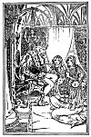
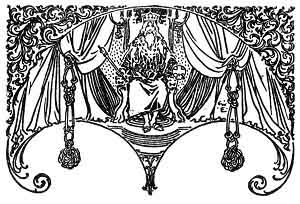
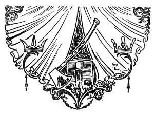

  
[Intangible Textual Heritage](../../../index.md)  [Sagas &
Legends](../../index)  [England](../index)  [Index](index.md) 
[Previous](boeb04)  [Next](boeb06.md) 

------------------------------------------------------------------------

p. 49

 [  
Click to enlarge](img/04900.jpg.md)

 

# King Leir and his Three Daughters

KING LEIR once rulèd in this land  
  With princely power and peace,  
And had all things with hearts content,  
  That might his joys increase.  
Amongst those things that nature gave,  
  Three daughters fair had he,  
So princely seeming beautiful,  
  As fairer could not be.

So on a time it pleas'd the king  
  A question thus to move,  
Which of his daughters to his grace  
  Could shew the dearest love: p. 50  
"For to my age you bring content,"  
  Quoth he, "then let me hear,  
Which of you three in plighted troth  
  The kindest will appear."

To whom the eldest thus began:  
  "Dear father, mind," quoth she,  
"Before your face, to do you good,  
  My blood shall render'd be.  
And for your sake my bleeding heart  
  Shall here be cut in twain,  
Ere that I see your reverend age  
  The smallest grief sustain."

"And so will I," the second said;  
  "Dear father, for your sake,  
The worst of all extremities  
  I'll gently undertake:  
And serve your highness night and day  
  With diligence and love;  
That sweet content and quietness  
  Discomforts may remove."

p. 51

"In doing so, you glad my soul,"  
  The aged king reply'd;  
But what sayst thou, my youngest girl,  
  How is thy love ally'd?"  
"My love" (quoth young Cordelia then),  
  "Which to your grace I owe,  
Shall be the duty of a child,  
  And that is all I'll show."

"And wilt thou shew no more," quoth he,  
  "Than doth thy duty bind?  
I well perceive thy love is small,  
  When as no more I find.  
Henceforth I banish thee my court;  
  Thou art no child of mine;  
Nor any part of this my realm  
  By favour shall be thine.

"Thy elder sisters' loves are more  
  Than well I can demand;  
To whom I equally bestow  
  My kingdome and my land, p. 52  
My pompal state and all my goods,  
  That lovingly I may  
With those thy sisters be maintain'd  
  Until my dying day."

Thus flattering speeches won renown,  
  By these two sisters here;  
The third had causeless banishment,  
  Yet was her love more dear.  
For poor Cordelia patiently  
  Went wandring up and down,  
Unhelp'd, unpity'd, gentle maid,  
  Through many an English town:

Untill at last in famous France  
  She gentler fortunes found;  
Though poor and bare, yet she was deem'd  
  The fairest on the ground:  
Where when the king her virtues heard,  
  And this fair lady seen,  
With full consent of all his court  
  He made his wife and queen.

p. 53

Her father, old King Leir, this while  
  With his two daughters staid;  
Forgetful of their promis'd loves,  
  Full soon the same decay'd;  
And living in Queen Ragan's court,  
  The eldest of the twain,  
She took from him his chiefest means,  
  And most of all his train.

For whereas twenty men were wont  
  To wait with bended knee,  
She gave allowance but to ten,  
  And after scarce to three,  
Nay, one she thought too much for him;  
  So took she all away,  
In hope that in her court, good king,  
  He would no longer stay.

"Am I rewarded thus," quoth he,  
"  In giving all I have  
Unto my children, and to beg  
  For what I lately gave? p. 54  
I'll go unto my Gonorell:  
  My second child, I know,  
Will be more kind and pitiful,  
  And will relieve my woe."

Full fast he hies then to her court;  
  Where when she heard his moan,  
Return'd him answer, that she griev'd  
  That all his means were gone,  
But no way could relieve his wants;  
  Yet if that he would stay  
Within her kitchen, he should have  
  What scullions gave away.

When he had heard, with bitter tears,  
  He made his answer then;  
In what I did, let me be made  
  Example to all men.  
I will return again," quoth he,  
  "Unto my Ragan's court;  
She will not use me thus, I hope,  
  But in a kinder sort."

p. 55

Where when he came, she gave command  
  To drive him thence away:  
When he was well within her court,  
  (She said) he would not stay.  
Then back again to Gonorel  
  The woeful king did hie,  
That in her kitchen he might have  
  What scullion boys set by.

But there of that he was deny'd  
  Which she had promis'd late  
For once refusing, he should not,  
  Come after to her gate.  
Thus twixt his daughters for relief  
  He wandred up and down,  
Being glad to feed on beggars' food  
  That lately wore a crown.

And calling to remembrance then  
  His youngest daughters words,  
That said, the duty of a child  
  Was all that love affords--p. 56  
But doubting to repair to her,  
  Whom he had ban'sh'd so,  
Grew frantic mad; for in his mind  
  He bore the wounds of woe.

Which made him rend his milk-white locks  
  And tresses from his head,  
And all with blood bestain his cheeks,  
  With age and honour spread.  
To hills and woods and watry founts,  
  He made his hourly moan,  
Till hills and woods and senseless things  
  Did seem to sigh and groan.

Even thus possest with discontents,  
  He passed o'er to France,  
In hopes from fair Cordelia there  
  To find some gentler chance.  
Most virtuous dame! which, when she heard  
  Of this her father's grief,  
As duty bound, she quickly sent  
  Him comfort and relief.

 

 [  
Click to enlarge](img/05600.jpg.md)

 

p. 57

And by a train of noble peers,  
  In brave and gallant sort,  
She gave in charge he should be brought  
  To Aganippus' court;  
Whose royal king, with noble mind,  
  So freely gave consent  
To muster up his knights at arms,  
  To fame and courage bent.

And so to England came with speed,  
  To repossesse King Leir,  
And drive his daughters from their thrones  
  By his Cordelia dear.  
Where she, true-hearted, noble queen,  
  Was in the battel stain;  
Yet he, good king, in his old days,  
  Possest his crown again.

But when he heard Cordelia's death,  
  Who died indeed for love  
Of her dear father, in whose cause  
  She did this battle move, p. 58  
He swooning fell upon her breast,  
  From whence he never parted;  
But on her bosom left his life  
  That was so truly hearted.

The lords and nobles, when they saw  
  The end of these events,  
The other sisters unto death  
  They doomèd by consents;  
And being dead, their crowns they left  
  Unto the next of kin:  
Thus have you seen the fall of pride,  
  And disobedient sin.

 

 

------------------------------------------------------------------------

[Next: Fair Rosamond](boeb06.md)
