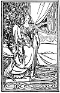
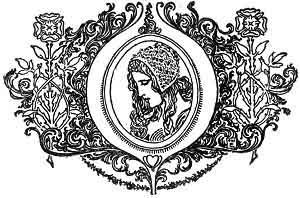

  
[Intangible Textual Heritage](../../../index)  [Sagas &
Legends](../../index)  [England](../index)  [Index](index) 
[Previous](boeb05)  [Next](boeb07) 

------------------------------------------------------------------------

p. 59

 [  
Click to enlarge](img/05900.jpg)

 

# Fair Rosamond

WHEN as King Henry rulde this land,  
  The second of that name,  
Besides the queene, he dearly lovde  
  A faire and comely dame.

Most peerlesse was her beautye founde,  
  Her favour, and her face;  
A sweeter creature in this worlde  
  Could never prince embrace.

Her crisped lockes like threads of golde,  
  Appeard to each man's sight;  
Her sparkling eyes, like Orient pearles,  
  Did cast a heavenlye light.

p. 60

The blood within her crystal cheekes  
  Did such a colour drive,  
As though the lillye and the rose  
  For mastership did strive.

Yea Rosamonde, fair Rosamonde,  
  Her name was called so,  
To whom our queene, Dame Ellinor,  
  Was known a deadlye foe.

The king therefore, for her defence  
  Against the furious queene,  
At Woodstocke builded such a bower,  
  The like was never seene.

Most curiously that bower was built,  
  Of stone and timber strong;  
An hundered and fifty doors  
  Did to this bower belong:

And they so cunninglye contriv'd,  
  With turnings round about,  
That none but with a clue of thread  
  Could enter in or out.

p. 61

And for his love and ladyes sake,  
  That was so faire and brighte,  
The keeping of this bower he gave  
  Unto a valiant knighte.

But fortune, that doth often frowne  
  Where she before did smile,  
The kinges delighte and ladyes joy  
  Full soon shee did beguile:

For why, the kinges ungracious sonne,  
  Whom he did high advance,  
Against his father raised warres  
  Within the realme of France.

But yet before our comelye king  
  The English land forsooke,  
Of Rosamond, his lady faire,  
  His farewelle thus he tooke:

My Rosamonde, my only Rose,  
  That pleasest best mine eye,  
The fairest flower in all the worlde  
  To feed my fantasye,--

p. 62

"The flower of mine affected heart,  
  Whose sweetness doth excelle,  
My royal Rose, a thousand times  
  I bid thee nowe farwelle!

For I must leave my fairest flower,  
  My sweetest Rose, a space,  
And cross the seas to famous France.,  
  Proud rebelles to abase.

But yet, my Rose, be sure thou shalt  
  My coming shortlye see,  
And in my heart, when hence I am,  
  Ile beare my Rose with mee."

When Rosamond, that ladye brighte,  
  Did heare the king saye soe,  
The sorrowe of her grieved heart  
  Her outward lookes did showe.

And from her cleare and crystall eyes  
  The teares gusht out apace,  
Which, like the silver-pearled dewe,  
  Ranne downe her comely face.

p. 63

Her lippes, erst like the corall redde,  
  Did waxe both wan and pale,  
And for the sorrow she conceivde  
  Her vitall spirits faile.

And falling downe all in a swoone  
  Before King Henryes face,  
Full oft he in his princelye armes  
  Her bodye did embrace.

And twentye times, with watery eyes,  
  He kist her tender cheeke,  
Untill he had revivde againe  
  Her senses milde and meeke.

"Why grieves my Rose, my sweetest Rose?"  
  The king did often say:  
"Because," quoth shee, "to bloodye warres  
  My lord must part awaye.

"But since your Grace on forrayne coastes,  
  Amonge your foes unkinde,  
Must goe to hazard life and limbe,  
  Why should I staye behinde?

p. 64

"Nay, rather let me, like a page,  
  Your sworde and target beare;  
That on my breast the blowes may lighte,  
  Which would offend you there.

"Or lett mee, in your royal tent,  
  Prepare your bed at nighte,  
And with sweete baths refresh your grace,  
  At your returne from fighte.

"So I your presence may enjoye  
  No toil I will refuse;  
But wanting you, my life is death:  
  Nay, death Ild rather chuse."

"Content thy self, my dearest love,  
  Thy rest at home shall bee,  
In Englandes sweet and pleasant isle;  
  For travell fits not thee.

"Faire ladies brooke not bloodye warres;  
  Soft peace their sexe delightes;  
Not rugged campes, but courtlye bowers;  
  Gay feastes, not cruell fightes.

p. 65

"My Rose shall safely here abide,  
  With musicke passe the daye,  
Whilst I amonge the piercing pikes  
  My foes seeke far awaye.

"My Rose shall shine in pearle and golde,  
  Whilst Ime in armour dighte;  
Gay galliards here my love shall dance,  
  Whilst I my foes goe fighte.

"And you, Sir Thomas, whom I truste  
  To bee my loves defence,  
Be carefull of my gallant Rose  
  When I am parted hence."

And therewithall he fetcht a sigh,  
  As though his heart would breake;  
And Rosamonde, for very griefe,  
  Not one plaine word could speake.

And at their parting well they mighte  
  In heart be grieved sore:  
After that daye, faire Rosamonde  
  The king did see no more.

p. 66

For when his Grace had past the seas,  
  And into France was gone,  
With envious heart, Queene Ellinor  
  To Woodstocke came anone.

And forth she calls this trustye knighte  
  In an unhappy houre,  
Who, with his clue of twined-thread,  
  Came from this famous bower.

And when that they had wounded him,  
  The queene this thread did gette,  
And wente where Ladye Rosamonde  
  Was like an angell sette.

But when the queene with stedfast eye  
  Beheld her beauteous face,  
She was amazed in her minde  
  At her exceeding grace.

Cast off from thee those robes," she said,  
  "That riche and costlye bee;  
And drinke thou up this deadlye draught  
  Which I have brought to thee."

 

 [  
Click to enlarge](img/06600.jpg)

 

p. 67

Then presentlye upon her knees  
  Sweet Rosamonde did falle;  
And pardon of the queene she crav'd  
  For her offences all.

"Take pitty on my youthfull yeares,"  
  Faire Rosamonde did crye;  
"And lett mee not with poison stronge  
  Enforcèd bee to dye.

"I will renounce my sinfull life,  
  And in some cloyster bide;  
Or else be banisht, if you please,  
  To range the world soe wide.

"And for the fault which I have done,  
  Though I was forc'd theretoe,  
Preserve my life, and punish mee  
  As you thinke meet to doe."

And with these words, her lillie handes  
  She wrunge full often there;  
And downe along her lovely face  
  Did trickle many a teare.

p. 68

But nothing could this furious queene  
  Therewith appeased bee;  
The cup of deadlye poyson stronge,  
  As she knelt on her knee,

She gave this comelye dame to drinke;  
  Who tooke it in her hand,  
And from her bended knee arose,  
  And on her feet did stand,

And casting up her eyes to heaven,  
  Shee did for mercye calle;  
And drinking up the poison stronge,  
  Her life she lost withalle.

And when that death through everye limbe  
  Had showde its greatest spite,  
Her chiefest foes did plain confesse  
  Shee was a glorious wight.

Her body then they did entomb,  
  When life was fled away,  
At Godstowe, neare to Oxford towne,  
  As may be seene this day.

------------------------------------------------------------------------

[Next: Phillida and Corydon](boeb07)
