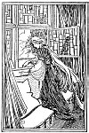
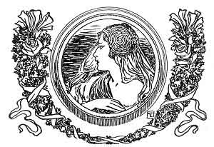
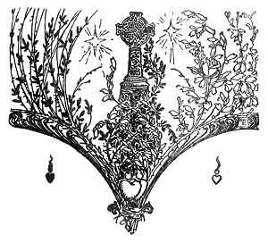

  
[Intangible Textual Heritage](../../../index.md)  [Sagas &
Legends](../../index)  [England](../index)  [Index](index.md) 
[Previous](boeb07)  [Next](boeb09.md) 

------------------------------------------------------------------------

p. 71

 [  
Click to enlarge](img/07100.jpg.md)

 

# Fair Margaret and Sweet William

As it fell out on a long summer's day,  
  Two lovers they sat on a hill;  
They sat together that long summer's day,  
  And could not talk their fill.

"I see no harm by you, Margarèt,  
  And you see none by mee;  
Before to-morrow at eight o' the clock  
  A rich wedding you shall see."

Fair Margaret sat in her bower-windòw,  
  Combing her yellow hair;  
There she spyed sweet William and his bride,  
  As they were a riding near.

p. 72

Then down she layd her ivory combe,  
  And braided her hair in twain:  
She went alive out of her bower,  
  But ne'er came alive in't again.

When day was gone, and night was come,  
  And all men fast asleep,  
Then came the spirit of Fair Marg'ret,  
  And stood at William's feet.

"Are you awake, sweet William?" shee said,  
  "Or, sweet William, are you asleep?  
God give you joy of your gay bride-bed,  
  And me of my winding sheet."

When day was come, and night was gone,  
  And all men wak'd from sleep,  
Sweet William to his lady sayd,  
  "My dear, I have cause to weep.

"I dreamt a dream, my dear ladyè,  
  Such dreames are never good:  
I dreamt my bower was full of red 'wine,'  
  And my bride-bed full of blood."

p. 73

"Such dreams, such dreams, my honoured sir,  
  They never do prove good;  
To dream thy bower was full of red 'wine,'  
  And thy bride-bed full of blood."

He called up his merry men all,  
  By one, by two, and by three;  
Saying, "I'll away to fair Marg'ret's bower,  
  By the leave of my ladiè."

And when he came to fair Marg'ret's bower,  
  He knocked at the ring;  
And who so ready as her seven brethrèn  
  To let sweet William in.

Then he turned up the covering-sheet;  
  "Pray let me see the dead;  
Methinks she looks all pale and wan.  
  She hath lost her cherry red.

"I'll do more for thee, Margarèt,  
  Than any of thy kin:  
For I will kiss thy pale wan lips,  
  Though a smile I cannot win."

p. 74

With that bespake the seven brethrèn,  
  Making most piteous mone,  
"You may go kiss your jolly brown bride,  
  And let our sister alone."

"If I do kiss my jolly brown bride,  
  I do but what is right;  
I ne'er made a vow to yonder poor corpse,  
  By day, nor yet by night.

"Deal on, deal on, my merry men all,  
  Deal on your cake and your wine:  
For whatever is dealt at her funeral to-day,  
  Shall be dealt to-morrow at mine."

Fair Margaret dyed to-day, to-day,  
  Sweet William dyed the morrow:  
Fair Margaret dyed for pure true love,  
  Sweet William dyed for sorrow.

Margaret was buryed in the lower chancèl,  
  And William in the higher:  
Out of her brest there sprang a rose,  
  And out of his a briar.

p. 75

They grew till they grew unto the church top,  
  And then they could grow no higher;  
And there they tyed in a true lover's knot,  
  Which made all the people admire.

Then came the clerk of the parish,  
  As you the truth shall hear,  
And by misfortune cut them down,  
  Or they had now been there.

 

 

------------------------------------------------------------------------

[Next: Annan Water](boeb09.md)
