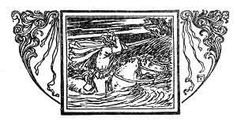
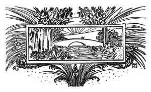

  
[Intangible Textual Heritage](../../../index.md)  [Sagas &
Legends](../../index)  [England](../index)  [Index](index.md) 
[Previous](boeb08)  [Next](boeb10.md) 

------------------------------------------------------------------------

p. 76

 

# Annan Water

"ANNAN Water's wading deep,  
  And my love Annie's wondrous bonny;  
I will keep my tryst to-night,  
  And win the heart o' lovely Annie."

He's loupen on his bonny grey,  
  He rade the right gate and the ready',  
For a' the storm he wadna stay,  
  For seeking o' his bonny lady.

And he has ridden o'er field and fell,  
  Through muir and moss, and stones and mire;  
His spurs o' steel were sair to bide,  
  And frae her four feet flew the fire.

p. 77

"My bonny grey, noo play your part!  
  Gin ye be the steed that wins my dearie,  
Wi' corn and hay ye'se be fed for aye,  
  And never spur sail mak' you wearie."

The grey was a mare, and a right gude mare:  
  But when she wan the Annan Water,  
She couldna hae found the ford that night  
  Had a thousand merks been wadded at her.

"O boatman, boatman, put off your boat,  
  Put off your boat for gouden money!"  
But for a' the goud in fair Scotland,  
  He dared na tak' him through to Annie.

"O I was sworn sae late yestreen,  
  Not by a single aith, but mony.  
I'll cross the drumly stream to-night,  
  Or never could I face my honey."

The side was stey, and the bottom deep,  
  Frae bank to brae the water pouring;  
The bonny grey mare she swat for fear,  
  For she heard the water-kelpy roaring.

p. 78

He spurred her forth into the flood,  
  I wot she swam both strong and steady;  
But the stream was broad, her strength did fail,  
  And he never saw his bonny lady.

O wae betide the frush saugh wand!  
  And wae betide the bush of brier!  
That bent and brake into his hand,  
  When strength of man and horse did tire.

And wae betide ye, Annan Water!  
  This night ye are a drumly river;  
But over thee we'll build a brig,  
  That ye nae mair true love may sever.

 

 

------------------------------------------------------------------------

[Next: The Bailiff's Daughter of Islington](boeb10.md)
