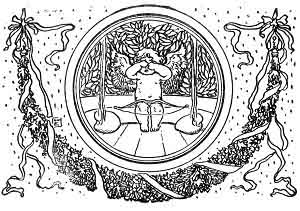

  
[Intangible Textual Heritage](../../../index.md)  [Sagas &
Legends](../../index)  [England](../index)  [Index](index.md) 
[Previous](boeb10)  [Next](boeb12.md) 

------------------------------------------------------------------------

p. 82

 

# Barbara Allen's Cruelty

ALL in the merry month of May,  
  When green buds they were swelling,  
Young Jemmy Grove on his death-bed lay  
  For love o' Barbara Allen.

He sent his man unto her then,  
  To the town where she was dwelling:  
"O haste and come to my master dear,  
  If your name be Barbara Allen."

Slowly, slowly rase she up,  
  And she cam' where he was lying;  
And when she drew the curtain by,  
  Says, "Young man, I think you're dying."

p. 83

"O it's I am sick, and very, very sick,  
  And it's a' for Barbara Allen."  
"O the better for me ye'se never be,  
  Tho' your heart's blude were a-spilling!

"O dinna ye min', young man," she says,  
  "When the red wine ye were filling,  
That ye made the healths gae round and round  
  And ye slighted Barbara Allen?"

He turn'd his face unto the wa',  
  And death was wi' him dealing:  
"Adieu, adieu, my dear friends a';  
  Be kind to Barbara Allen."

As she was walking o'er the fields,  
  She heard the dead-bell knelling;  
And every jow the dead-bell gave,  
  It cried, "Woe to Barbara Allen!"

"O mother, mother, mak' my bed,  
  To lay me down in sorrow.  
My love has died for me to-day,  
  I'll die for him to-morrow."

------------------------------------------------------------------------

[Next: The Douglas Tragedy](boeb12.md)
