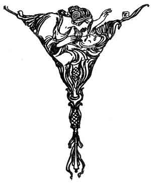

  
[Intangible Textual Heritage](../../../index)  [Sagas &
Legends](../../index)  [England](../index)  [Index](index) 
[Previous](boeb12)  [Next](boeb14) 

------------------------------------------------------------------------

p. 89

 

# Young Waters

ABOUT Yule, when the wind blew cool;  
  And the round tables began,  
A' there is come to our king's court  
  Mony a well-favoured man.

The queen looked o'er the castle wa',  
  Beheld baith dale and down,  
And then she saw young Waters  
  Come riding to the town.

His footmen they did rin before,  
  His horsemen rade behind;  
Ane mantle of the burning gowd  
  Did keep him frae the wind.

p. 90

Gowden graith'd [1](#fn_0) his horse before,  
  And siller shod behind;  
The horse young Waters rade upon  
  Was fleeter than the wind.

Out then spake a wily lord,  
  Unto the queen said he:  
"O tell me wha's the fairest face  
  Rides in the company?"

"I've seen lord, and I've seen laird,  
  And knights of high degree,  
But a fairer face than young Waters  
  Mine eyen did never see."

Out then spake the jealous king  
  And an angry man was he:  
"O if he had been twice as fair,  
  You might have excepted me."

"You're neither laird nor lord," she says,  
  "But the king that wears the crown;  
There is not a knight in fair Scotland,  
  But to thee maun bow down."

p. 91

For a' that she could do or say,  
  Appeased he wad nae be;  
But for the words which she had said,  
  Young Waters he maun dee.

They hae ta'en young Waters,  
  And put fetters to his feet;  
They hae ta'en young Waters,  
  And thrown him in dungeon deep.

"Aft I have ridden thro' Stirling town,  
  In the wind but and the weet;  
But I ne'er rade thro' Stirling town  
  Wi' fetters at my feet.

"Aft have I ridden thro' Stirling town,  
  In the wind but and the rain;  
But I ne'er rade thro' Stirling town  
  Ne'er to return again."

They hae ta'en to the heading-hill  
  His young son in his cradle;  
And they hae ta'en to the heading-hill  
  His horse but and his saddle.

p. 92

They hae ta'en to the heading-hill  
His lady fair to see;  
And for the words the queen had spoke  
Young Waters he did dee.

 

------------------------------------------------------------------------

### Footnotes

[90:1](boeb13.htm#fr_0) *Graitih'd*, girthed.

------------------------------------------------------------------------

[Next: Flodden Field](boeb14)
