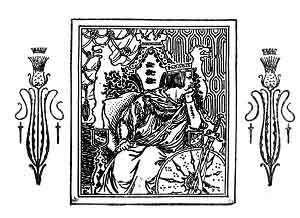
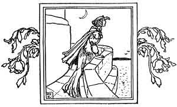

  
[Intangible Textual Heritage](../../../index.md)  [Sagas &
Legends](../../index)  [England](../index)  [Index](index.md) 
[Previous](boeb13)  [Next](boeb15.md) 

------------------------------------------------------------------------

p. 93

 

# Flodden Field

KING JAMIE hath made a vow,  
  Keepe it well if he may:  
That he will be at lovely London  
  Upon Saint James his day.

Upon Saint James his day at noone,  
  At faire London will I be,  
And all the lords in merrie Scotland,  
  They shall dine there with me.

"March out, march out, my merry men,  
  Of hie or low degree;  
I'le weare the crowne in London towne,  
  And that you soon shall be."

p. 94

Then bespake good Queene Margaret,  
  The teares fell from her eye:  
"Leave off these warres, most noble King,  
  Keepe your fidelitie.

"The water runnes swift, and wondrous deepe,  
  From bottome unto the brimme;  
My brother Henry hath men good enough;  
  England is hard to winne."

"Away" quoth he "with this silly foole!  
  In prison fast let her lie:  
For she is come of the English bloud,  
  And for these words she shall dye."

With that bespake Lord Thomas Howard,  
  The Queenes chamberlaine that day:  
If that you put Queene Margaret to death,  
  Scotland shall rue it alway."

Then in a rage King Jamie did say,  
  "Away with this foolish mome;  
He shall be hanged, and the other be burned,  
  So soone as I come home."

 

 [  
Click to enlarge](img/09400.jpg.md)

 

p. 95

At Flodden Field the Scots came in,  
  Which made our English men faine;  
At Bramstone Greene this battaile was seene,  
  There was King Jamie slaine.

His bodie never could be found,  
  When he was over throwne,  
And he that wore faire Scotland's crowne  
  That day could not be knowne.

Then presently the Scot did flie,  
  Their cannons they left behind;  
Their ensignes gay were won all away,  
  Our souldiers did beate them blinde.

To tell you plaine, twelve thousand were slaine,  
  That to the fight did stand,  
And many prisoners tooke that day,  
  The best in all Scotland.

That day made many \[a\] fatherlesse child,  
  And many a widow poore,  
And many a Scottish gay lady  
  Sate weeping in her bower.

p. 96

Jack with a feather was lapt all in leather,  
  His boastings were all in vaine;  
He had such a chance, with a new morrice-dance  
  He never went home againe.

\_\_\_\_\_\_\_\_\_\_\_\_\_\_\_

This was written to adapt the ballad to the seventeenth century.

Now heaven we laude that never more  
  Such biding shall come to hand;  
Our King, by othe, is King of both  
  England and faire Scotland.

 

 

------------------------------------------------------------------------

[Next: Helen of Kirkconnell](boeb15.md)
