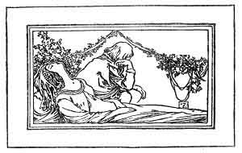
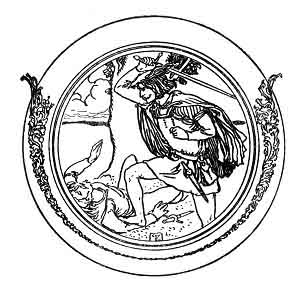

  
[Intangible Textual Heritage](../../../index.md)  [Sagas &
Legends](../../index)  [England](../index)  [Index](index.md) 
[Previous](boeb14)  [Next](boeb16.md) 

------------------------------------------------------------------------

p. 97

 

# Helen of Kirkconnell

I WAD I were where Helen lies;  
Night and day on me she cries;  
O that I were where Helen lies,  
  On fair Kirkconnell lea!

Curst be the heart that thought the thought,  
And curst the hand that fired the shot,  
When in my arms burd Helen dropt,  
  And died to succour me!

O think na but my heart was sair  
When my Love dropt and spak nae mair!  
I laid her down wi' meikle care,  
  On fair Kirkconnell lea.

p. 98

As I went down the water side,  
Nane but my foe to be my guide,  
Nane but my foe to be my guide,  
  On fair Kirkconnell lea.

I lighted down my sword to draw,  
I hackéd him in pieces sma',  
I hackéd him in pieces sma',  
  For her sake that died for me.

O Helen fair, beyond compare!  
I'll make a garland of thy hair,  
Shall bind my heart for evermair,  
  Until the day I dee!

O that I were where Helen lies  
Night and day on me she cries;  
Out of my bed she bids me rise,  
  Says, "Haste, and come to me!"

O Helen fair! O Helen chaste!  
If I were with thee, I were blest,  
Where thou lies low and takes thy rest,  
  On fair Kirkconnell lea.

p. 99

I wad my grave were growing green,  
A winding-sheet drawn ower my een,  
And I in Helen's arms lying,  
  On fair Kirkconnell lea.

I wad I were where Helen lies!  
Night and day on me she cries,  
And I am weary of the skies,  
  Since my Love died for me.

 

 

------------------------------------------------------------------------

[Next: Robin Hood and Allen-a-Dale](boeb16.md)
