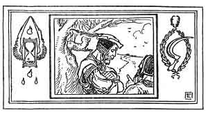
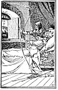
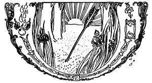

  
[Intangible Textual Heritage](../../../index)  [Sagas &
Legends](../../index)  [England](../index)  [Index](index) 
[Previous](boeb17)  [Next](boeb19) 

------------------------------------------------------------------------

p. 119

 

# Robin Hood's Death and Burial

WHEN Robin Hood and Little John  
    *Down a down, a down, a down*,  
  Went o'er yon bank of broom,  
Said Robin Hood to Little John,  
  "We have shot for many a pound:  
  *Hey down, a down, a down*.

"But I am not able to shoot one shot more,  
  My arrows will not flee;  
But I have a cousin lives down below,  
  Please God, she will bleed me."

Now Robin is to fair Kirkley gone,  
  As fast as he can win; p. 120  
But before he came there, as we do hear,  
  He was taken very ill.

And when that he came to fair Kirkley-hall,  
  He knocked all at the ring,  
But none was so ready as his cousin herself  
  For to let bold Robin in.

"Will you please to sit down, cousin Robin," she said,  
  "And drink some beer with me?  
"No, I will neither eat nor drink,  
  Till I am blooded by thee."

"Well, I have a room, cousin Robin," she said,  
  "Which you did never see;  
And if you please to walk therein,  
  You blooded by me shall be."

She took him by the lily-white hand,  
  And led him to a private room;  
And there she blooded bold Robin Hood,  
  Whilst one drop of blood would run.

p. 120

She blooded him in the vein of the arm,  
  And locked him up in the room;  
There did he bleed all the live-long day,  
  Until the next day at noon.

He then bethought him of a casement door,  
  Thinking for to begone;  
He was so weak he could not leap,  
  Nor he could not get down.

He then bethought him of his bugle-horn,  
  Which hung low down to his knee,  
He set his horn unto his mouth,  
  And blew out weak blasts three.

Then Little John, when hearing him,  
  As he sat under the tree,  
I fear my master is near dead,  
  He blows so wearily."

Then Little John to Fair Kirkley is gone,  
  As fast as he can dree;  
But when he came to Kirkley-hall,  
  He broke locks two or three;

p. 122

Until he came bold Robin to,  
  Then he fell on his knee;  
"A boon, a boon," cries Little John,  
  "Master, I beg of thee."

"What is that boon," quoth Robin Hood,  
  "Little John, thou begst of me?"  
"It is to burn fair Kirkley-hall,  
  And all their nunnery."

"Now nay, now nay," quoth Robin Hood,  
  "That boon I'll not grant thee;  
I never hurt woman in all my life,  
  Nor man in woman's company.

"I never hurt fair maid in all my time,  
  Nor at my end shall it be;  
But give me my bent bow in my hand,  
  And a broad arrow I'll let flee;  
And where this arrow is taken up,  
  There shall my grave diggèd be.

 

 [  
Click to enlarge](img/12200.jpg)

 

"Lay me a green sod under my head,  
  And another under my feet; p. 122  
And lay my bent bow by my side,  
  Which was my music sweet;  
And make my grave of gravel and green,  
  Which is most right and meet.

"Let me have length and breadth enough,  
  With a green sod under my head;  
That they may say when I am dead,  
  Here lies bold Robin Hood."

These words they readily promised him,  
  Which did bold Robin please;  
And there they buried bold Robin Hood,  
  Near to the fair Kirklèys.

 

 

------------------------------------------------------------------------

[Next: The Twa Corbies](boeb19)
