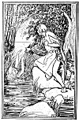

  
[Intangible Textual Heritage](../../../index.md)  [Sagas &
Legends](../../index)  [England](../index)  [Index](index.md) 
[Previous](boeb22)  [Next](boeb24.md) 

------------------------------------------------------------------------

p. 151

 [  
Click to enlarge](img/15100.jpg.md)

 

# The Mermaid

To yon fause stream that, near the sea,  
  Hides mony an elf and plum,  
And rives wi' fearful din the stanes,  
  A witless knicht did come.

The day shines clear--far in he's gane  
  Whar shells are silver bright,  
Fishes war loupin' a' aroun',  
  And sparklin' to the light.

Whan, as he laved, sounds cam sae sweet  
  Frae ilka rock an' tree;  
The brief was out, 'twas him it doomed  
  The mermaid's face to see.

p. 152

Frae 'neath a rock, sune, sune she rose,  
  And stately on she swam,  
Stopped i' the midst, and becked and sang  
  To him to stretch his han'.

Gowden glist the yellow links  
  That round her neck she'd twine;  
Her een war o' the skyie blue,  
  Her lips did mock the wine;

The smile upon her bonnie cheek  
  Was sweeter than the bee;  
Her voice excelled the birdie's sang  
  Upon the birchen tree.

Sae couthie, couthie did she look,  
  And meikle had she fleeched;  
Out shot his hand--alas! alas!  
  Fast in the swirl he screeched.

The mermaid leuch, her brief was gane,  
  And kelpie's blast was blawin',  
Fu' low she duked, ne'er raise again,  
  For deep, deep was the fawin'.

p. 153

Aboon the stream his wraith was seen,  
  Warlochs tirled lang at gloamin';  
That e'en was coarse, the blast blew hoarse,  
  Ere lang the waves war foamin'.

 

 

------------------------------------------------------------------------

[Next: The Battle of Otterburn](boeb24.md)
