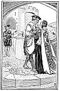
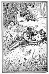
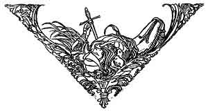

  
[Intangible Textual Heritage](../../../index.md)  [Sagas &
Legends](../../index)  [England](../index)  [Index](index.md) 
[Previous](boeb23)  [Next](boeb25.md) 

------------------------------------------------------------------------

p. 154

 

 [  
Click to enlarge](img/15401.jpg.md)

# The Battle of Otterburn

### THE FIRST FYTTE

IT fell about the Lammas tide,  
  When husbands winn their hay,  
The doughty Douglas bound him to ride  
  Into England to take a prey.

The Earl of Fife, withouten strife,  
  He bound him over Solway;  
The great would ever together ride  
  That race they may rue for aye.

Over Ottercap hill they came in,  
  And so down by Rotheley crag,  
Upon Green Leighton they lighted down,  
  Styrande many a stag;

p. 155

And boldly brente Northumberland,  
  And harried many a town;  
They did our Englishmen great wrong  
  To battle that were not bown.

Then spake a berne upon the bent,  
  Of comfort that was not cold,  
And said, "We have brente Northumberland,  
  We have all wealth in holde.

"Now we have harried all Bamborough shire  
  All the wealth in the world have we;  
I rede we ride to Newcastle,  
  So still and stalworthlye."

Upon the morrow, when it was day,  
  The standards shone full bright;  
To the Newcastle they took the way,  
  And thither they came full right.

Sir Henry Percy lay at the Newcastle,  
  I tell you, withouten dread;  
He has been a March-man all his days,  
  And kept Berwick upon Tweed.

p. 156

To the Newcastle when they came,  
  The Scots they cried on hyght:  
"Sir Harry Percy, an thou bist within,  
  Come to the field and fight:

"For we have brente Northumberland,  
  Thy heritage good and right;  
And syne my lodging I have take,  
  With my brand dubbed many a knight."

Sir Harry Percy came to the walls,  
  The Scottish host for to see:  
"And thou hast brente Northumberland,  
  Full sore it rueth me.

"If thou hast harried all Bamborough shire,  
  Thou hast done me great envy;  
For the trespàss thou hast me done,  
  The one of us shall die."

"Where shall I bide thee?" said the Douglas;  
  "Or where wilt thou come to me?  
"At Otterburn in the high way,  
  There mayst thou well lodged be.

p. 157

The roe full reckless there she runs,  
  To make thee game and glee;  
The falcon and the pheasant both,  
  Among the holtes on hee.

"There mayst thou have thy wealth at will,  
  Well lodged there mayst thou be;  
It shall not be long ere I come thee till,"  
  Said Sir Harry Percyè.

There shall I bide thee," said the Douglas,  
  "By the faith of my bodỳ."  
"Thither shall I come," said Sir Harry Percỳ,  
  "My troth I plight to thee."

A pipe of wine he gave them over the walls,  
  For sooth, as I you say;  
There he made the Douglas drink,  
  And all his host that day.

The Douglas turned him homeward again,  
  For sooth withouten nay;  
He took his lodging at Otterburn  
  Upon a Wednèsday;

p. 158

And there he pyght his standard down.  
  His getting more and less;  
And syne he warned his men to go  
  And get their geldings gress.

A Scottish knight hoved upon the bent,  
  A watch I dare well say;  
So was he ware on the noble Percỳ  
  In the dawning of the day.

He pricked to his pavilion door,  
  As fast as he might ronne;  
"Awaken, Douglas!" cried the knight,  
  "For His love that sits in throne.

"Awaken, Douglas!" cried the knight,  
  "For thou mayst waken with wynne;  
Yonder have I spied the proud Percỳ,  
  And seven standàrds with him."

Nay, by my troth," the Douglas said,  
  "It is but a feignèd tale;  
He durst not look on my broad bannèr,  
  For all Englànd so hayle

p. 159

"Was I not yesterday at the Newcastle,  
  That stands so fair on Tyne?  
For all the men the Percy had,  
  He could not garre me once to dyne."

He stepped out at his pavilion door,  
  To look, and it were less;  
"Array you, lordyngs, one and all,  
  For here begins no peace.

"The Earl of Menteith, thou art my eme,  
  The forward I give to thee;  
The Earl of Huntley cawte and keen,  
  He shall with thee be.

"The Lord of Buchan, in armour bright,  
  On the other hand he shall be;  
Lord Johnstone, and Lord Maxwell,  
  They two shall be with me.

"Swynton fair field upon your pride  
  To battle make you bowen;  
Sir Davy Scot, Sir Walter Steward,  
  Sir John of Agerstone."

p. 160

### THE SECOND FYTTE

The Percy came before his host,  
  Which ever was a gentle knight,  
Upon the Douglas loud did he cry,  
  "I will hold that I have hight;

"For thou hast brente Northumberland,  
  And done me great envỳ;  
For this trespàss thou hast me done  
  The one of us shall die."

The Douglas answered him again,  
  With great words up on hee,  
And said, "I have twenty against thy one,  
  Behold, and thou mayst see."

With that the Percy was grievèd sore,  
  For sooth as I you say;  
He lighted down upon his foot,  
  And shot his horse clean away

p. 161

Every man saw that he did so,  
  That ryall was ever in rout;  
Every man shot his horse him fro,  
  And light him round about.

Thus Sir Harry Percy took the field,  
  For sooth as I you say,  
Jesu Christ in heaven on high,  
  Did help him well that day.

But nine thousand, there was no more,  
  If chronicle will not layne;  
Forty thousand Scots and four  
  That day fought them again,

But when the battle began to join,  
  In haste there came a knight,  
Then letters fair forth hath he ta'en,  
  And thus he said full right:

"My lord, your father he greets you well,  
  With many a noble knight;  
He desires you to bide,  
  That he may see this fight.

p. 162

"The baron of Grastock is come out of the west,  
  With him a noble company;  
All they lodge at your father's this night,  
  And the battle fain would they see."

For Jesu's love," said Sir Harry Percỳ,  
  "That died for you and me,  
Wend to my lord, my father, again,  
  And say thou saw me not with ee;

"My troth is plight to yon Scottish knight,  
  It needs me not to layne,  
That I should bide him upon this bent,  
  And I have his troth again;

"And if that I wend off this ground,  
  For sooth unfoughten away,  
He would me call but a coward knight,  
  In his land another day.

"Yet had I lever to be rynde and rent,  
  By Mary that mykel may,  
Than ever my manhood should be reproved  
  With a Scot another day.

p. 163

"Wherefore shoot, archers, for my sake,  
  And let sharp arrows flee;  
Minstrels, play up for your warison,  
  And well quit it shall be.

"Every man think on his true love,  
  And mark him to the Trinitỳ;  
For to God I make mine a-vow  
  This day will I not flee."

The bloody heart in the Douglas' arms,  
  His standard stood on high,  
That every man might full well know;  
  Beside stood starrès three.

The white Liòn on the English part,  
  For sooth as I you sayne,  
The luces and the crescents both  
  The Scots fought them again.

Upon Saint Andrew loud did they cry,  
  And thrice they shout on hyght,  
And syne marked them on our Englishmen,  
  As I have told you right.

p. 164

Saint George the bright, our Lady's knight,  
  To name they were full fain,  
Our Englishmen they cried on hyght,  
  And thrice they shout again.

With that sharp arrows began to flee,  
  I tell you in certain;  
Men of arms began to join;  
  Many a doughty man was there slain.

The Percy and the Douglas met,  
  That either of them was fain;  
They schapped together, while that they sweat,  
  With swords of fine Collayne;

Till the blood from their basenets ran  
  As the roke doth in the rain.  
"Yield thee to me," said the Douglas,  
  "Or else thou shalt be slain;

"For I see by thy bright basenet,  
  Thou art some man of might;  
And so I do by thy burnished brand,  
  Thou art an earl, or else a knight."

p. 165

"By my good faith," said the noble Percỳ,  
  "Now hast thou rede full right;  
Yet will I never yield me to thee,  
  While I may stand and fight."

They swapped together, while that they sweat,  
  With swordès sharp and long;  
Each on other so fast they beat,  
  Till their helms came in pieces down.

The Percy was a man of strength,  
  I tell you in this stound  
He smote the Douglas at the sword's length,  
  That he felled him to the ground.

The sword was sharp, and sore did byte,  
  I tell you in certàin;  
To the heart he did him smite,  
  Thus was the Douglas slain.

The standards stood still on each side;  
  With many a grievous groan,  
There they fought the day, and all the night,  
  And many a doughty man was slone.

p. 166

There was no freyke that there would fly,  
  But stiffly in stour did stand,  
Echone hewing on other while they might dry,  
  With many a baleful brand.

There was slain upon the Scottes side,  
  For sooth and certainlỳ,  
Sir James of Douglas there was slain,  
  That day that he did die.

The Earl of Menteith he was slain.  
  Grysely groaned upon the ground;  
Sir Davy Scot, Sir Walter Steward,  
  Sir John of Agerstone.

Sir Charles Murray in that place,  
  That never a foot would fly;  
Sir Hugh Maxwèll, a lord he was,  
  With the Douglas did he die.

There was slain upon the Scottes side,  
  For sooth as I you say,  
Of four and forty thousand Scots,  
  Went but eighteen away.

p. 167

 

 [  
Click to enlarge](img/16700.jpg.md)

 

There was slain upon the English side,  
  For sooth and certainlỳ,  
A gentle knight, Sir John Fitzhugh,  
  It was the more pitỳ.

Sir James Harebotell there was slain,  
  For him their hearts were sore  
The gentle Lovel there was slain,  
  That the Percy's standard bore.

There was slain upon the English side,  
  For sooth as I you say,  
Of nine thousand Englishmen,  
  Five hundred came away;

The others were slaynè in the field,  
  Christ keep their souls from woe,  
Seeing there were so few friends  
  Against so many a foe!

Then on the morn they made them biers  
  Of birch and hazel gray;  
Many a widow with weeping tears  
  Their makes they fetch away.

p. 168

This fray began at Otterburn,  
  Between the night and the day;  
There the Douglas lost his life,  
  And the Percy was led away.

Then was there a Scottish prisoner ta'en,  
  Sir Hugh Montgomery was his name,  
For sooth as I you say,  
  He borrowed the Percy home again.

Now let us all for the Percy pray,  
  To Jesu most of might,  
To bring his soul to the bliss of heaven,  
  For he was a gentle knight.

 

------------------------------------------------------------------------

[Next: The Lament of the Border Widow](boeb25.md)
