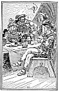
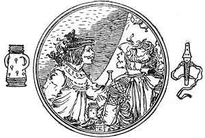

  
[Intangible Textual Heritage](../../../index.md)  [Sagas &
Legends](../../index)  [England](../index)  [Index](index.md) 
[Previous](boeb25)  [Next](boeb27.md) 

------------------------------------------------------------------------

p. 171

 [  
Click to enlarge](img/17100.jpg.md)

 

# The Banks o' Yarrow

LATE at e'en, drinking the wine,  
  And ere they paid the lawing,  
They set a combat them between,  
  To fight it in the dawing.

"What though ye be my sister's lord,  
  We'll cross our swords to-morrow."  
"What though my wife your sister be,  
  I'll meet ye then on Yarrow."

"O stay at hame, my ain gude lord!  
  O stay, my ain dear marrow!  
My cruel brither will you betray  
  On the dowie banks o' Yarrow."

p. 172

"O fare ye weel, my lady dear!  
  And put aside your sorrow;  
For if I gae, I'll sune return  
  Frae the bonny banks o' Yarrow."

She kiss'd his cheek, she kaim'd his hair,  
  As oft she'd done before, O;  
She belted him wi' his gude brand,  
  And he's awa' to Yarrow.

When he gaed up the Tennies bank,  
  As he gaed mony a morrow,  
Nine armed men lay in a den,  
  On the dowie braes o' Yarrow.

"O come ye here to hunt or hawk  
  The bonny Forest thorough?  
Or come ye here to wield your brand  
  Upon the banks o' Yarrow?"

"I come not here to hunt or hawk,  
  As oft I've dune before, O,  
But I come here to wield my brand  
  Upon the banks o' Yarrow.

p. 173

"If ye attack me nine to ane,  
  Then may God send ye sorrow!--  
Yet will I fight while stand I may,  
  On the bonny banks o' Yarrow."

Two has he hurt, and three has slain,  
  On the bloody braes o' Yarrow;  
But the stubborn knight crept in behind,  
  And pierced his body thorough.

"Gae hame, gae hame, you brither John,  
  And tell your sister sorrow,--  
To come and lift her leafu' lord  
  On the dowie banks o' Yarrow."

Her brither John gaed ower yon hill,  
  As oft he'd dune before, O;  
There he met his sister dear,  
  Cam' rinnin' fast to Yarrow.

"I dreamt a dream last night," she says,  
  "I wish it binna sorrow;  
I dreamt I pu'd the heather green  
  Wi' my true love on Yarrow."

p. 174

"I'll read your dream, sister," he says,  
  "I'll read it into sorrow;  
Ye're bidden go take up your love,  
  He's sleeping sound on Yarrow."

She's torn the ribbons frae her head  
  That were baith braid and narrow;  
She's kilted up her lang claithing,  
  And she's awa' to Yarrow.

She's ta'en him in her arms twa,  
  And gi'en him kisses thorough;  
She sought to bind his mony wounds,  
  But he lay dead on Yarrow.

"O haud your tongue," her father says,  
  "And let be a' your sorrow;  
I'll wed you to a better lord  
  Than him ye lost on Yarrow."

"O haud your tongue, father," she says,  
  "Far warse ye mak' my sorrow;  
A better lord could never be  
  Than him that lies on Yarrow."

p. 175

She kiss'd his lips, she kaim'd his hair,  
  As aft she had dune before, O;  
And there wi' grief her heart did break,  
  Upon the banks o' Yarrow.

 

------------------------------------------------------------------------

[Next: Hugh of Lincoln](boeb27.md)
