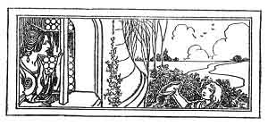
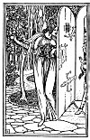
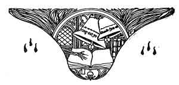

  
[Intangible Textual Heritage](../../../index)  [Sagas &
Legends](../../index)  [England](../index)  [Index](index) 
[Previous](boeb26)  [Next](boeb28) 

------------------------------------------------------------------------

p. 176

 

# Hugh of Lincoln

### SHOWING THE CRUELTY OF A JEW'S DAUGHTER

FOUR and twenty bonny boys  
  Were playing at the ba',  
And up it stands him sweet Sir Hugh,  
  The flower among them a'.

He kicked the ba' there wi' his foot,  
  And keppit it wi' his knee,  
Till even in at the Jew's window  
  He gart the bonny ba' flee.

"Cast out the ba' to me, fair maid,  
  Cast out the ba' to me."  
"Never a bit," says the Jew's daughter,  
  Till ye come up to me."

p. 177

 

 [  
Click to enlarge](img/17700.jpg)

 

"Come up, sweet Hugh, come up, dear Hugh,  
  Come up and get the ba'."  
"I winna come, I mayna come,  
  Without my bonny boys a'."

She's ta'en her to the Jew's garden,  
  Where the grass grew lang and green,  
She's pu'd an apple red and white,  
  To wyle the bonny boy in.

She's wyled him in through ae chamber,  
  She's wyled him in through twa,  
She's wyled him into the third chamber,  
  And that was the warst o' a'.

She's tied the little boy, hands and feet,  
  She's pierced him wi' a knife,  
She's caught his heart's blood in a golden cup,  
  And twinn'd him o' his life.

She row'd him in a cake o' lead,  
  Bade him lie still and sleep,  
She cast him in a deep draw-well  
  Was fifty fathom deep.

p. 178

When bells were rung, and mass was sung,  
  And every bairn went hame,  
Then ilka lady had her young son,  
  But Lady Helen had nane.

She row'd her mantle her about,  
  And sair, sair 'gan she weep;  
And she ran unto the Jew's house,  
  When they were all asleep.

"My bonny Sir Hugh, my pretty Sir Hugh,  
  I pray thee to me speak!"  
"Lady Helen, come to the deep draw-well  
  'Gin ye your son wad seek."

Lady Helen ran to the deep draw-well,  
  And knelt upon her knee:  
"My bonny Sir Hugh, an ye be here,  
  I pray thee speak to me!"

"The lead is wondrous heavy, mither,  
  The well is wondrous deep;  
A keen penknife sticks in my heart,  
  It is hard for me to speak.

p. 179

"Gae hame, gae hame, my mither dear,  
  Fetch me my winding-sheet;  
And at the back o' merry Lincoln,  
  It's there we twa sall meet."

Now Lady Helen she's gane hame,  
  Made him a winding-sheet;  
And at the back o' merry Lincoln,  
  The dead corpse did her meet.

And a' the bells o' merry Lincoln  
  Without men's hands were rung;  
And a' the books o' merry Lincoln  
  Were read without men's tongue:  
Never was such a burial  
  Sin' Adam's days begun.

 

 

 

------------------------------------------------------------------------

[Next: Sir Patrick Spens](boeb28)
