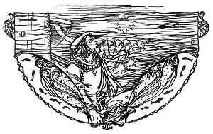
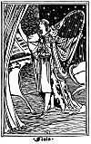

  
[Intangible Textual Heritage](../../../index.md)  [Sagas &
Legends](../../index)  [England](../index)  [Index](index.md) 
[Previous](boeb27.md) 

------------------------------------------------------------------------

p. 180

 

# Sir Patrick Spens

THE king sits in Dunfermline town,  
  Drinking the blude-red wine;  
"O whare will I get a skeely skipper,  
  To sail this new ship of mine?"

O up and spak' an eldern knight,  
  Sat at the king's right knee,  
"Sir Patrick Spens is the best sailòr,  
  That ever sailed the sea."

Our king has written a braid letter,  
  And seated it with his hand,  
And sent it to Sir Patrick Spens,  
  Was walking on the strand.

 

 [  
Click to enlarge](img/18001.jpg.md)

 

p. 181

"To Noroway, to Noroway,  
  To Noroway o'er the faem;  
The king's daughter of Noroway  
  'Tis thou maun bring her hame."

The first word that Sir Patrick read,  
  Sae loud loud laughèd he;  
The neist word that Sir Patrick read,  
  The tear blinded his ee.

"O wha is this has done this deed,  
  And tauld the king o' me,  
To send us out at this time of the year,  
  To sail upon the sea?

"Be it wind, be it weet, be it hail, be it sleet,  
  Our ship must sail the faem;  
The king's daughter of Noroway,  
  'Tis we must fetch her hame."

They hoysed their sails an Moneday morn,  
  Wi' a' the speed they may;  
They hae landed in Noroway,  
  Upon a Wednèsday.

p. 182

They hadna been a week, a week,  
  In Noroway, but twae,  
When that the lords o' Noroway  
  Began aloud to say:

"Ye Scottishmen spend a' our king's goud,  
  And a' our queen's fee."  
"Ye lie, ye lie, ye liars loud!  
  Fu' loud I hear ye lie;

"For I brought as much white monie,  
  As gane my men and me,  
And I brought a half-fou of gude red goud,  
  Out o'er the sea wi' me.

"Make ready, make ready, my merry men a',  
  Our gude ship sails the morn."  
"Now, ever alake, my master dear,  
  I fear a deadly storm!

"I saw the new moon, late yestreen,  
  Wi' the old moon in her arm;  
And, if we gang to sea, mastèr,  
  I fear we'll come to harm."

p. 183

They hadna sailed a league, a league,  
  A league but barely three,  
When the lift grew dark, and the wind blew loud  
  And gurly grew the sea.

The ankers brak, and the topmasts lap,  
  It was sic a deadly storm;  
And the waves cam o'er the broken ship,  
  Till a' her sides were torn.

"O where will I get a gude sailòr,  
  To take my helm in hand,  
Till I get up to the tall top-mast,  
  To see if I can spy land?"

"O here am I, a sailor gude,  
  To take the helm in hand,  
Till you go up to the tall top-mast;  
  But I fear you'll ne'er spy land."

He hadna gane a step, a step,  
  A step but barely ane,  
When a bout flew out of our goodly ship,  
  And the salt sea it cam in.

p. 184

"Gae, fetch a web of the silken claith,  
  Another o' the twine,  
And wap them into our ship's side,  
  And let nae the sea come in."

They fetched a web o' the silken claith,  
  Another o' the twine,  
And they wapped them round that gude ship's side,  
  But still the sea cam in.

O laith, laith, were our gude Scots lords  
  To weet their cork-heeled shoon!  
But lang or a' the play was played,  
  They wat their hats aboon.

And mony was the feather bed,  
  That flattered on the faem;  
And mony was the gude lord's son,  
  That never mair cam hame.

The ladies wrang their fingers white,  
  The maidens tore their hair,  
A' for the sake of their true loves  
  For them they'll see nae mair.

p. 185

O lang, lang, may the ladies sit,  
  Wi' their fans into their hand,  
Before they see Sir Patrick Spens  
  Come sailing to the strand!

And lang, lang, may the maidens sit,  
  With their goud kaims in their hair  
A' waiting for their ain dear loves,  
  For them they'll see nae mair!

O forty miles off Aberdeen,  
  'Tis fifty fathoms deep,  
And there lies gude Sir Patrick Spens  
  Wi' the Scots lords at his feet.

 

 [  
Click to enlarge](img/finis.jpg.md)
