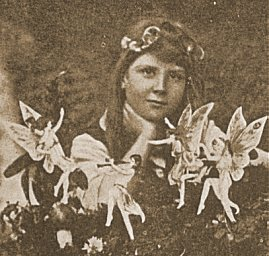

  
[Intangible Textual Heritage](../../../index)  [Legends &
Sagas](../../index)  [England](../index)  [Celtic
Fairies](../../celt/index.htm#fairies) 

------------------------------------------------------------------------

<table width="75%">
<colgroup>
<col style="width: 50%" />
<col style="width: 50%" />
</colgroup>
<tbody>
<tr class="odd">
<td width="50%" data-valign="CENTER"></td>
<td width="50%" data-valign="CENTER"><h1 id="the-coming-of-the-fairies" data-align="CENTER">The Coming of the Fairies</h1>
<h2 id="by-arthur-conan-doyle" data-align="CENTER">by Arthur Conan Doyle</h2>
<h4 id="section" data-align="CENTER">[1922]</h4></td>
</tr>
</tbody>
</table>

------------------------------------------------------------------------

[Contents](#contents)    [Start Reading](cof00)

------------------------------------------------------------------------

Arthur Conan Doyle, the creator of Sherlock Holmes, in his later years
became attracted to spiritualism and occult topics. This was after the
death of his son Raymond during World War I. While researching the topic
of fairies, some photographs from a working-class family in rural
Yorkshire were brought to Doyle's attention by a Theosophist friend.
These photographs appeared to show diminutive fairies cavorting in the
presence of humans, specifically two teenage girls, Elsie and Frances.
They had taken the photographs by themselves, and there were no overt
signs that the negatives had been tampered with. Doyle championed the
photographs, and in the process destroyed his reputation; which is
probably why this book, out of all of the Doyle corpus, has not been put
into etext until now. The Coming of the Fairies was possibly a bigger
disappointment for Doyle fans than when he killed off Sherlock Holmes.

These photographs, which caused a sensation at the time, are easily
recognizable as blatant fakes by modern eyes, sensitized to seeing much
more photorealistic computer-generated elves and fairies. The fairies
are statically posed, and are neatly coiffed and dressed in period
clothing, hardly what one would expect from wild nature-elementals. They
are just too flat-looking and high contrast to be anything other than
cardboard cutouts positioned in the scene, and could be constructed by
adolescent girls with artistic leanings. And indeed, many years later
the pair did admit that they had faked the photos.

However, even a skeptic will have to admit that just because these
photos are fake, it does not logically imply there are no such beings.
Just because some UFO photos are fake, doesn't mean that there are no
UFOs! But 'extraordinary claims demand extraordinary proof'. While we
may not have extraordinary proof of fairies, there is more to the
phenomena than meets the eye. Enough data that *some* explanation must
be attempted. Doyle barely scratches the surface of the massive
literature on fairies here; for a comprehensive survey, for instance,
refer to Evan-Wentz' [The Fairy Faith in Celtic
Countries](../../celt/ffcc/index). The real reason that this charming
little book is of interest today is historical, and of course, because
of the author.

------------------------------------------------------------------------

 [Title Page](cof00)  
[Preface](cof01)  
[Contents](cof02)  
[Illustrations](cof03)  
[Chapter I. How The Matter Arose](cof04)  
[Chapter II. The First Published Account--''Strand'' Christmas Number,
1920](cof05)  
[Chapter III. Reception of the First Photographs](cof06)  
[Chapter IV. The Second Series](cof07)  
[Chapter V. Observations of a Clairvoyant in the Cottingley Glen, August
1921](cof08)  
[Chapter VI. Independent Evidence for Fairies](cof09)  
[Chapter VII. Some Subsequent Cases](cof10)  
[Chapter VIII. The Theosophic View of Fairies](cof11)  
