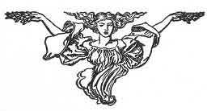

  
[Intangible Textual Heritage](../../../index.md)  [Sagas &
Legends](../../index)  [England](../index)  [Index](index.md) 
[Previous](crt00)  [Next](crt02.md) 

------------------------------------------------------------------------

p. v

 

# Foreword

In a book which was written by me aforetime, and which was set forth in
print, I therein told much of the history of King Arthur; of how he
manifested his royalty in the achievement of that wonderful magic sword
which he drew forth out of the anvil; of how he established his royally;
of how he found a splendid sword yclept Excalibur in a miraculously
wonderful manner; of how he won the most beautiful lady in the world for
his queen; and of how he established the famous Round Table of noble
worthy knights, the like of whose prowess the world hath never seen, and
will not be likely ever to behold again.

Also I told in that book the adventures of certain worthy knights and
likewise how the magician Merlin was betrayed to his undoing by a
sorceress hight Vivien.

Now, if you look any joy in reading that book, I have great hope that
that which follows may be every whit as pleasing to you; for I shall
hereinafter have to do with the adventures of certain other worthies
with whom you may have already become acquainted through my book and
otherwise; and likewise of the adventures of certain other worthies, of
whom you have not yet been told by me.

p. vi

More especially, I believe, you will find entertainment in what I shall
have to tell you of the adventures of that great knight who was
altogether the most noble of spirit, and the most beautiful, and the
bravest of heart, of any knight who ever lived--excepting only his own
son, Galahad, who was the crowning glory of his house and of his name
and of the reign of King Arthur.

However, if Sir Launcelot of the Lake failed now and then in his
behavior, who is there in the world shall say, "I never fell into
error"? And if he more than once offended, who is there shall have
hardihood to say, "I never committed offence"?

Yea, that which maketh Launcelot so singularly dear to all the world, is
that he was not different from other men, but like other men, both in
his virtues and his shortcomings; only that he was more strong and more
brave and more untiring than those of us who are his brethren, both in
our endeavors and in our failures.

 

 

p. vii

------------------------------------------------------------------------

[Next: Contents](crt02.md)
