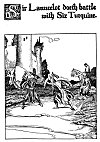

  
[Intangible Textual Heritage](../../../index.md)  [Sagas &
Legends](../../index)  [England](../index)  [Index](index.md) 
[Previous](crt08)  [Next](crt10.md) 

------------------------------------------------------------------------

p. 44

[  
Click to enlarge](img/04400.jpg.md)  
Sir Launcelot doeth battle with Sir Turquine.  

p. 45

 

### Chapter Fourth

How Sir Launcelot Sought Sir Lionel and How a Young Damsel Brought Him
to the Greatest Battle that Ever He Had in All His Life.

So Sir Launcelot rode through the forest, and whilst he rode the day
began to break. About sunrise he came out into an open clearing where
certain charcoal-burners were plying their trade:

To these rude fellows he appeared out of the dark forest like some
bright and shining vision; and they made him welcome and offered

|                                                |
|------------------------------------------------|
| *Sir Launcelot breaks his fast in the forest*. |

him to eat of their food, and he dismounted and sat down with them and
brake his fast with them. And when he had satisfied his hunger, he gave
them grammercy for their entertainment, and took horse and rode away.

He made forward until about the middle of the morning, what time he came
suddenly upon that place where, two days before, he had fallen asleep
beneath the blooming apple-tree. Here he drew rein and

|                                                              |
|--------------------------------------------------------------|
| *Sir Launcelot cometh again to the place of the apple-tree*. |

looked about him for a considerable while; for he thought that haply he
might find some trace of Sir Lionel thereabouts. But there was no trace
of him, and Sir Launcelot wist not what had become of him.

Now whilst Sir Launcelot was still there, not knowing what to do to find
Sir Lionel, there passed that way a damsel riding upon a white palfrey.
Unto her Sir Launcelot made salutation, and she made salutation to him
and asked him what cheer. "Maiden," said Sir Launcelot,

|                                                    |
|----------------------------------------------------|
| *Sir Launcelot perceives a damsel upon a palfrey*. |

"the cheer that I have is not very good, seeing that I have lost my
companion-at-arms and know not where he is." Then he said: "Did you
haply meet anywhere with a knight with the figure of a red gryphon upon
his shield?" whereunto the damsel answered: "Nay, I saw nonesuch." Then
Sir Launcelot said: "Tell me, fair damsel, dost thou know of any
adventure hereabouts that I may undertake? For, as thou seest, I am
errant, and in search of such."

p. 46

Upon this the damsel fell a-laughing: "Yea, Sir Knight," said she, "I
know of an adventure not far away, but it is an adventure that no knight
yet that ever I heard tell of hath accomplished. I can take thee to that
adventure if thou hast a desire to pursue it."

"Why should I not pursue it," said Sir Launcelot, "seeing that I am here
for that very cause--to pursue adventure?"

"Well," said the damsel, "then come with me, Sir Knight, I will take
thee to an adventure that shall satisfy thee."

So Sir Launcelot and that damsel rode away from that place together; he
upon his great war-horse and she upon her ambling palfrey beside him.
And the sun shone down upon them, very pleasant and warm, and all who

|                                                   |
|---------------------------------------------------|
| *The damsel leads Sir Launcelot to an adventure*. |

passed them turned to look after them; for the maiden was very fair and
slender, and Sir Launcelot was of so noble and stately a mien that few
could behold him even from a distance without looking twice or three
times upon him. And as they travelled in that way together they fell
into converse, and the damsel said to Sir Launcelot: "Sir, thou
appearest to be a very good knight, and of such a I sort as may well
undertake any adventure with great hope of success. Now I prithee to
tell me thy name and what knight thou art."

"Fair maiden," said Sir Launcelot, "as for telling you my name, that I
will gladly do. I am called Sir Launcelot of the Lake, and I am a knight
of King Arthur's court and of his Round Table."

At this the damsel was very greatly astonished and filled with
admiration.

|                                                    |
|----------------------------------------------------|
| *Sir Launcelot and the maiden discourse together*. |

"Hah!" quoth she, "it is a great pleasure to me to fall in with you, Sir
Launcelot, for all the world now bespeaketh your fame. Little did I ever
think to behold your person, much less speak with you, and ride in this
way with you. Now I will tell you what this adventure is on which we are
set; it is this--there is, some small distance from this, a castle of a
knight hight Sir Turquine, who hath in his prison a great many knights
of King Arthur's court, and several knights of his Round Table. These
knights he keepeth there in great dole and misery, for it is said that
their groans may be heard by the passers along the high-road below the
castle. This Sir Turquine is held to be the greatest knight in the world
(unless it be thou) for he hath never yet been overcome in battle,
whether a-horseback or a-foot. But, indeed, I think it to be altogether
likely that thou wilt overcome him."

"Fair damsel," quoth Sir Launcelot, "I too have hope that I shall hold
mine own with him, when I meet him, and to that I shall do my best
endeavor. Yet this and all other matters are entirely in the hands of
God."

Then the damsel said, "If you should overcome this Sir Turquine, I know

p. 47

of still another adventure which, if you do not undertake it, I know of
no one else who may undertake to bring it to a successful issue."

Quoth Sir Launcelot, "I am glad to hear of that or of any other
adventure, for I take great joy in such adventuring. Now, tell me, what
is this other adventure?"

"Sir," said the damsel, "a long distance to the west of this there is a
knight who hath a castle in the woods and he is the evilest disposed
knight that ever I heard tell of. For he lurks continually in the
outskirts of the woods, whence he rushes forth at times upon those who
pass

|                                                               |
|---------------------------------------------------------------|
| *The maiden tells Sir Launcelot of the savage forest knight.* |

by. Especially he is an enemy to all ladies of that country, for he hath
taken many of them prisoners to his castle and hath held them in the
dungeon thereof for ransom; and sometimes he hath held them for a long
while. Now I am fain that thou undertake that adventure for my sake."

"Well," said Sir Launcelot, "I believe it would be a good thing for any
knight to do to rid the world of such an evil-disposed knight as that,
so if I have the good fortune to overcome this Sir Turquine, I give my
knightly word that I will undertake this adventure for thy sake, if so
be thou wilt go with me for to show me the way to his castle."

"That I will do with all gladness," said the damsel, "for it is great
pride for any lady to ride with you upon such an adventure."

Thus they talked, and all was arranged betwixt them. And thus they rode
very pleasantly through that valley for the distance of two leagues or a
little more, until they came to that place where the road crossed the
smooth stream of water afore told of; and there was the castle of Sir
Turquine as afore told of; and there was the thorn-bush and the basin
hanging upon the thorn-bush as afore told of. Then the maiden said: "Sir
Launcelot, beat upon that basin and so thou shalt summon Sir Turquine to
battle with thee."

So Sir Launcelot rode to that basin where it hung and he smote upon

|                                        |
|----------------------------------------|
| *Sir Launcelot smites upon the basin*. |

it very violently with the butt of his spear. And he smote upon that
basin again and again until he smote the bottom from out it; but at that
time immediately no one came.

Then, after a while, he was ware of one who came riding toward him, and
he beheld that he who came riding was a knight very huge of frame, and
long and strong of limb. And he beheld that the knight was clad entirely
in black, and that the horse upon which he rode and all the furniture of
the horse was black. And he beheld that this knight drave before him
another horse, and that across the saddle of that other horse there lay
an armed knight, bound hand and foot; and Sir Launcelot wist that the
sable knight who came riding was that Sir Turquine whom he sought.

p. 48

So Sir Turquine came very rapidly along the highway toward where Sir
Launcelot sat, driving that other horse and the captive knight before
him

|                                                  |
|--------------------------------------------------|
| *The sable knight bringeth Sir Gaheris captive*. |

all the while. And as they came nearer and nearer Sir Launcelot thought
that he should know who the wounded knight was; and when they came right
close, so that he could see the markings of the shield of that captive
knight, he wist that it was Sir Gaheris, the brother of Sir Gawaine, and
the nephew of King Arthur, whom Sir Turquine brought thither in that
wise.

At this Sir Launcelot was very wroth; for he could not abide seeing a
fellow-knight of the Round Table treated with such disregard as that
which Sir Gaheris suffered at the hands of Sir Turquine; wherefore Sir
Launcelot rode to meet Sir Turquine, and he cried out: "Sir Knight! put
that wounded man down from his horse, and let him rest for a while, and
we two will prove our strength, the one against the other! For it is a
shame for thee to treat a noble knight of the Round Table with such
despite as thou art treating that knight."

"Sir," said Sir Turquine, "as I treat that knight, so treat I all
knights of the Round Table-and so will I treat thee if thou be of the
Round Table."

"Well," said Sir Launcelot, "as for that, I am indeed of the Round
Table, and I have come hither for no other reason than for to do battle
with thee."

"Sir Knight," said Sir Turquine, "thou speakest very boldly; now I pray
thee to tell me what knight thou art and what is thy name."

"Messire," said Sir Launcelot, "I have no fear to do that. I am called
Sir Launcelot of the Lake, and I am a knight of King Arthur's, who made
me knight with his own hand."

"Ha!" said Sir Turquine, "that is very good news to me, for of all
knights in the world thou art the one I most desire to meet, for I have
looked for thee for a long while with intent to do battle with thee. For
it was thou who didst slay my brother Sir Caradus at Dolorous Gard, who
was held to be the best knight in all the world. Wherefore, because of
this, I have the greatest despite against thee of any man in the world,
and it was because of that despite that I waged particular battle
against all the knights of King Arthur's court. And in despite of thee I
now hold five score and eight knights, who are thy fellows, in the
dismallest dungeon of my castle. Also I have to tell thee that among
those knights is thine own brother, Sir Ector, and thy kinsman, Sir
Lionel. For I overthrew Sir Ector and Sir Lionel only a day or two ago,
and now they lie almost naked in the lower parts of that castle yonder.
I will put down this knight as thou biddst me, and when I have done
battle with thee I hope to tie thee on his saddle-horn in his place."

p. 49

So Sir Turquine loosed the cords that bound Sir Gaheris and set him from
off the horse's back, and Sir Gaheris, who was sorely wounded and very
weak, sat him down upon a slab of stone near-by.

Then Sir Launcelot and Sir Turquine made themselves ready at all points,
and each took such stand as seemed to him to be best; and

|                                                      |
|------------------------------------------------------|
| *Sir Launcelot and Sir Turquine do battle together*. |

when each was ready for the assault, each set spurs to his horse and
rushed the one against the other with such terrible violence that they
smote together like a clap of thunder.

So fierce was that onset that each horse fell back upon the ground and
only by great skill and address did the knight who rode him void his
saddle, so as to save himself from a fall. And in that meeting the horse
of Sir Turquine was killed outright and the back of Sir Launcelot's
horse was broken and he could not rise, but lay like dead upon the
ground.

Then each knight drew his sword and set his shield before him and they
came together with such wrath that it appeared as though their fierce
eyes shot sparks of fire through the occulariums of their helmets. So
they met and struck; and they struck many scores of times, and their
blows were so violent that neither shield nor armor could withstand the
strokes they gave. For their shields were cleft and many pieces of armor
were hewn from their limbs, so that the ground was littered with them.
And each knight gave the other so many grim wounds that the ground
presently was all sprinkled with red where they stood.

Now that time the day had waxed very hot, for it was come high noontide,
so presently Sir Turquine cried out: "Stay thee, Sir Launcelot, for I
have a boon to ask!" At this Sir Launcelot stayed his hand and said:
"What is it thou hast to ask, Sir Knight?" Sir Turquine said: "Messire,
I am athirst--let me drink." And Sir Launcelot said: "Go and drink."

So Sir Turquine went to that river and entered into that water, which
was presently stained with red all about him. And he stooped where he
stood and drank his fill, and presently came forth again altogether
refreshed.

Therewith he took up his sword once more and rushed at Sir Launcelot and
smote with double strength, so that Sir Launcelot bent before him and
had much ado to defend himself from these blows.

Then by and by Sir Launcelot waxed faint upon his part and was athirst,
and he cried out: "I crave of thee a boon, Sir Knight!" "What wouldst
thou have?" said Sir Turquine. "Sir Knight," said Sir Launcelot, "bide
while I drink, for I am athirst." "Nay," said Sir Turquine, "thou shalt
not drink until thou quenchest thy thirst in Paradise." "Ha!" cried Sir
Launcelot, "thou art a foul churl and no true knight. For when thou wert

p. 50

athirst, I let thee drink; and now that I am athirst, thou deniest me to
quench my thirst."

Therewith he was filled with such anger that he was like one gone wode;
wherefore he flung aside his shield and took his sword in both hands and
rushed upon Sir Turquine and smote him again and again; and the blows he
gave were so fierce that Sir Turquine waxed somewhat bewildered and bore
aback, and held his shield low for faintness.

Then when Sir Launcelot beheld that Sir Turquine was faint in that wise,
he rushed upon him and catched him by the beaver of his helmet and
pulled

|                                          |
|------------------------------------------|
| *Sir Launcelot overcometh Sir Turquine*. |

him down upon his knees. And Sir Launcelot rushed Sir Turquine's helmet
from off his head. And he lifted his sword and smote Sir Turquine's head
from off his shoulders, so that it rolled down upon the ground.

Then for a while Sir Launcelot stood there panting for to catch his
breath after that sore battle, for he was nearly stifled with the heat
and fury thereof. Then he went down into the water, and he staggered
like a drunken man as he went, and the water ran all red at his coming.
And Sir Launcelot stooped and slaked his thirst, which was very furious
and hot.

Thereafter he came up out of the water again, all dripping, and he went
to where the damsel was and he said to her: "Damsel, lo, I have overcome
Sir Turquine; now I am ready to go with thee upon that other adventure,
as I promised thee I would."

At this the damsel was astonished beyond measure, wherefore she cried:
"Sir, thou art sorely hurt, and in need of rest for two or three days,
and maybe a long time more, until thy wounds are healed."

"Nay," said Sir Launcelot, "no need to wait; I will go with thee now."

Then Sir Launcelot went to Sir Gaheris--for Sir Gaheris had been sitting
for all that while upon that slab of stone. Sir Launcelot said to Sir
Gaheris: "Fair Lord, be not angry if I take your horse, for I must
presently go with this damsel, and you see mine own horse hath broke his
back."

"Sir Knight," said Sir Gaheris, "this day you have saved both me and my
horse, wherefore it is altogether fitting that my horse or anything that
is mine should be yours to do with as you please. So I pray you take my
horse, only tell me your name and what knight you are; for I swear by my
sword that I never saw any knight in all the world do battle so
wonderfully as you have done to-day."

"Sir," said Sir Launcelot, "I am called Sir Launcelot of the Lake, and I

p. 51

am a knight of King Arthur's. So it is altogether fitting that I should
do such service unto you as this, seeing that you are the

|                                                     |
|-----------------------------------------------------|
| *Sir Launcelot makes himself known to Sir Gaheris*. |

brother of that dear knight, Sir Gawaine. For if I should not do this
battle that I have done for your sake, I should yet do it for the sake
of my lord, King Arthur, who is your uncle and Sir Gawaine's uncle."

Now when Sir Gaheris heard who Sir Launcelot was, he made great
exclamation of amazement--"Ha, Sir Launcelot!" he cried, "and is it
thou! Often have I heard of thee and of thy prowess at arms! I have
desired to meet thee more than any knight in the world; but never did I
think to meet thee in such a case as this." Therewith Sir Gaheris arose,
and went to Sir Launcelot, and Sir Launcelot came to him and they met
and embraced and kissed one another upon the face; and from that time
forth they were as brethren together.

Then Sir Launcelot said to Sir Gaheris: "I pray you, Lord, for to go up
unto yonder castle, and bring succor to those unfortunates who lie
therein. For I think you will find there many fellow-knights of the
Round Table. And I believe that you will find therein my brother, Sir
Ector, and my cousin, Sir Lionel. And if you find any other of my
kindred I pray you to set them free and to do what you can for to
comfort them

|                                                               |
|---------------------------------------------------------------|
| *Sir Launcelot bids Sir Gaheris to free the castle captives*. |

and to put them at their ease. And if there is any treasure in that
castle, I bid you give it unto those knights who are prisoners there,
for to compensate them for the pains they have endured.
[Moreover](errata.htm#0.md), I pray you tell Sir Ector and Sir Lionel not
to follow after me, but to return to court and wait for me there, for I
have two adventures to undertake and I must essay them alone."

Then Sir Gaheris was very much astonished, and he cried out upon Sir
Launcelot: "Sir! Sir! Surely you will not go forth upon another
adventure at this time, seeing that you are so sorely wounded."

But Sir Launcelot said: "Yea, I shall go now; for I do not think that my
wounds are so deep that I shall not be able to do my devoirs when my
time cometh to do them."

At this Sir Gaheris was amazed beyond measure, for Sir Launcelot was
very sorely wounded, and his armor was much broken in that battle,
wherefore Sir Gaheris had never beheld a person who was so steadfast of
purpose as to do battle in such a case.

So Sir Launcelot mounted Sir Gaheris' horse and rode away

|                                          |
|------------------------------------------|
| *Sir Launcelot departs with the damsel*. |

with that young damsel, and Sir Gaheris went to the castle as Sir
Launcelot had bidden him to do.

In that castle he found five score and eight prisoners in dreadful case,

p. 52

for some who were there had been there for a long time, so that the hair
of them had grown down upon their shoulders, and their beards had grown
down upon their breasts. And some had been there but a short time, as

|                                          |
|------------------------------------------|
| *Sir Gaheris frees the castle captives*. |

was the case of Sir Lionel and Sir Ector. But all were in a miserable
sorry plight; and all of those sad prisoners but two were knights of
King Arthur's court, and eight of them were knights of the Round Table.
All these crowded around Sir Gaheris, for they saw that he was wounded
and they deemed that it was he had set them free, wherefore they gave
him thanks beyond measure.

"Not so," said Sir Gaheris, "it was not I who set you free; it was Sir
Launcelot of the Lake. He overcame Sir Turquine in such a battle as I
never before beheld. For I saw that battle with mine own eyes, being at
a little distance seated upon a stone slab and wounded as you see. And I
make my oath that I never beheld so fierce and manful a combat in all of
my life. But now your troubles are over and done, and Sir Launcelot
greets you all with words of good cheer and bids me tell you to take all
ease and comfort that you can in being free, and in especial he bids me
greet you, Sir Ector, and you, Sir Lionel, and to tell you that you are
to follow him no farther, but to return to court and bide there until he
cometh; for he goeth upon an adventure which he must undertake by
himself."

"Not so," said Sir Lionel, "I will follow after him, and find him." And

|                                                                    |
|--------------------------------------------------------------------|
| *Sir Lionel and Sir Ector and Sir Kay follow alter Sir Launcelot*. |

so said Sir Ector likewise, that he would go and find Sir Launcelot.
Then Sir Kay the Seneschal said that he would ride with those two; so
the three took horse and rode away together to find Sir Launcelot.

As for those others, they ransacked throughout the castle of Sir
Turquine, and they found twelve treasure-chests full of treasure, both
of silver and of gold, together with many precious jewels; and they
found many bales of cloth of silk and of cloth of gold. So, as Sir
Launcelot had bid them do so, they divided the treasure among
themselves, setting aside a part for Sir Ector and a part for Sir Lionel
and a part for Sir Kay. Then, whereas before they had been mournful, now
they were joyful at having been made so rich with those precious things.

Thus happily ended that great battle with Sir Turquine which was very
likely the fiercest and most dolorous fight that ever Sir Launcelot had
in all of his life. For, unless it was Sir Tristram, he never found any
other knight so big as Sir Turquine except Sir Galahad, who was his own
son.

 

And now it shall be told how Sir Launcelot fared upon that adventure
which he had promised the young damsel to undertake.

------------------------------------------------------------------------

[Next: Chapter Fifth](crt10.md)
