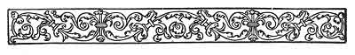
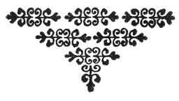

  
[Intangible Textual Heritage](../../../index.md)  [Sagas &
Legends](../../index)  [England](../index)  [Index](index.md) 
[Previous](crt13)  [Next](crt15.md) 

------------------------------------------------------------------------

p. 97

 

### CONCLUSION

Here endeth the story of Sir Launcelot. That which followeth is the
story of Sir Tristram of Lyonesse, who was knit with Sir Launcelot into
such close ties of friendship that if they had been brothers of the same
blood, with the same father and mother, they could not have loved one
another more than they did.

For indeed it would not be possible to tell any history of Sir Launcelot
of the Lake without telling that of Sir Tristram of Lyonesse as well,
for as the web of a fair fabric is woven in with the woof thereof, so
were the lives of Sir Launcelot and Sir Tristram woven closely together.

Wherefore you shall now hear tell of the goodly adventures of Sir
Tristram of Lyonesse; and God grant that you may have the same joy in
reading thereof that I shall have in telling of them to you.

 

------------------------------------------------------------------------

[Next: Prologue](crt15.md)
