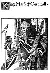

  
[Intangible Textual Heritage](../../../index.md)  [Sagas &
Legends](../../index)  [England](../index)  [Index](index.md) 
[Previous](crt16)  [Next](crt18.md) 

------------------------------------------------------------------------

p. 114

[  
Click to enlarge](img/11400.jpg.md)  
King Mark of Cornwall.  

p. 115

 

### Chapter Second

How Sir Tristram was made knight by the King of Cornwall, and how he
fought a battle with a famous champion.

NOW first of all it is to be here said that at that time there was great
trouble come to King Mark of Cornwall (who, as aforesaid, was uncle to
Sir Tristram) and the trouble was this:

The King of Cornwall and the King of Ireland had great debate concerning
an island that lay in the sea betwixt Cornwall and Ireland.

|                                                  |
|--------------------------------------------------|
| *The King of Ireland claims truage of Cornwall*. |

For though that island was held by Cornwall, yet the King of Ireland
laid claim to it and demanded that the King of Cornwall should pay him
truage for the same. This King Mark refused to do, and there was great
contention betwixt Cornwall and Ireland, so that each country made ready
for war.

But the King of Ireland said: "Let there not be war betwixt Ireland and
Cornwall concerning this disagreement, but let us settle this affair in
some other way. Let us each choose a champion and let those two
champions decide the rights of this case by a combat at arms. For so the
truth shall be made manifest."

Now you are to know that at that time the knights of Cornwall were held
in great disregard by all courts of chivalry; for there was not in those
days any knight of repute in all the court of Cornwall. Wherefore King
Mark knew not where he should find him a champion to meet that challenge
from the King of Ireland. Yet he must needs meet it, for he was ashamed
to refuse such a challenge as that, and so to acknowledge that Cornwall
had no knight-champion to defend it. So he said it should be as the King
of Ireland would have it, and that if the King of Ireland would choose a
champion, he also would do the same.

Thereupon the King of Ireland chose for his champion Sir Marhaus of
Ireland, who was one of the greatest knights in the world. For in the
Book of King Arthur (which I wrote aforetime) you may

|                                                             |
|-------------------------------------------------------------|
| *The King of Ireland chooses Sir Marhaus for his champion*. |

there read in the story of Sir Pellias how great and puissant a champion
Sir Marhaus was, and how he overthrew Sir Gawaine and others with the
greatest ease. Wherefore at that time he was believed by many to be the
greatest knight in the world (it

p. 116

being before the days of Sir Launcelot of the Lake), and even in the
days of Sir Launcelot it was doubted whether he or Sir Launcelot were
the greater champion.

So King Mark could not find any knight in Cornwall to stand against, Sir
Marhaus. Nor could he easily find any knight outside of Cornwall to do
battle with him. For Sir Marhaus, being a knight of the Round Table, no
other knight of the Round Table would fight against him--and there were
no other knights so great as that famous brotherhood of the Table Round.

Accordingly, King Mark knew not where to turn to find him a champion to
do battle in his behalf.

In this strait, King Mark sent a letter by a messenger to Lyonesse,
asking if there was any knight at Lyonesse who would stand his champion
against Sir Marhaus, and he offered great reward if such a champion
would undertake his cause against Ireland.

Now when young Tristram heard this letter of his uncle King Mark, he
straightway went to his father and said: "Sire, some whiles ago you

|                                          |
|------------------------------------------|
| *Tristram asks leave to go to Cornwall*. |

desired that I should become a knight. Now I would that you would let me
go to Cornwall upon this occasion. For when I come there I will beseech
my uncle King Mark to make me a knight, and then I will go out against
Sir Marhaus. For I have a great mind to undertake this adventure in
behalf of King Mark, and to stand his champion against Sir Marhaus. For
though Sir Marhaus is so great a knight and so famous a hero, yet if I
should have the good fortune to overcome him in battle, there would,
certes, be great glory to our house through my knighthood."

Then King Meliadus looked upon Tristram and loved him very dearly, and
he said: "Tristram, thou hast assuredly a very great heart to undertake
this adventure, which no one else will essay. So I bid thee go, in God's
name, if so be thy heart bids thee to go. For maybe God will lend the
strength necessary to carry this adventure through to a successful
issue."

So that very day Tristram departed from Lyonesse for Cornwall, taking
with him only Gouvernail as his companion. So, by ship, he reached
Cornwall, and the castle of Tintagel, where King Mark was then holding
court.

And it was at the sloping of the afternoon when he so came, and at that
time King Mark was sitting in hall with many of his knights and lords
about him. And the King was brooding in great trouble of spirit. Unto
him came an attendant, saying: "Lord, there are two strangers who stand
without, and crave to be admitted to your presence. One of them hath

p. 117

great dignity and sobriety of demeanor, and the other, who is a youth,
is of so noble and stately an appearance that I do not believe his like
is to be found in the entire world."

To this the King said, "Show them in."

So those two were immediately admitted into the hall and came and stood
before King Mark; and the one of them was Gouvernail and the other was
young Tristram. So Tristram stood forth before Gouvernail

|                                             |
|---------------------------------------------|
| *Tristram and Gouvernail come to Cornwall*. |

and Gouvernail bore the harp of Tristram, and the harp was of gold and
shone most brightly and beautifully. Then King Mark looked upon
Tristram, and marvelled at his size and beauty; for Tristram stood above
any man in that place, so that he looked like a hero amongst them. His
brow was as white as milk and his lips were red like to coral and his
hair was as red as gold and as plentiful as the mane of a young lion,
and his neck was thick and sturdy and straight like to a round pillar of
white-stone, and he was clad in garments of blue silk embroidered very
cunningly with threads of gold and set with a countless multitude of
gems of divers colors. So because of all this he glistened with a
singular radiance of richness and beauty.

So King Mark marvelled at the haughtiness of Tristram's appearance, and
he felt his heart drawn toward Tristram with love and admiration. Then,
after a little, he spoke, saying: "Fair youth, who are you, and whence
come you, and what is it you would have of me?"

"Lord," said Tristram, "my name is Tristram, and I come from the country
of Lyonesse, where your own sister was one time Queen. Touching the
purpose of my coming hither, it is this: having heard that

|                                                     |
|-----------------------------------------------------|
| *Tristram offers himself as champion for Cornwall*. |

you are in need of a champion to contend for your rights against the
champion of Ireland, I come hither to say that if you will make me a
knight with your own hand, I will take it upon me to stand your champion
and to meet Sir Marhaus of Ireland upon your behalf."

Then King Mark was filled with wonder at the courage of Tristram, and he
said: "Fair youth, are you not aware that Sir Marhaus of Ireland is a
knight well set in years and of such great and accredited deeds of arms
that it is supposed that, excepting Sir Launcelot of the Lake, there is
not his peer in any court of chivalry in all of the world? How then can
you, who are altogether new to the use of arms, hope to stand against so
renowned a champion as he?"

"Lord," quoth Tristram, "I am well aware of what sort of knight Sir
Marhaus is, and I am very well aware of the great danger of this
undertaking. Yet if one who covets knighthood shall fear to face a
danger,

p. 118

what virtue would there then be in the chivalry of knighthood? So,
Messire, I put my trust in God, His mercies, and I have great hope that
He will lend me both courage and strength in my time of need."

Then King Mark began to take great joy, for he said to himself: "Maybe
this youth shall indeed bring me forth in safety out of these dangers
that menace my honor." So he said: "Tristram, I do believe that you will
stand a very excellent chance of success in this undertaking, wherefore
it shall be as you desire; I will make you a knight, and besides that I
will fit you with armor and accoutrements in all ways becoming to the
estate of a knight-royal. Likewise I will provide you a Flemish horse of
the best strain, so that you shall be both furnished and horsed as well
as any knight in the world hath ever been."

So that night Tristram watched his armor in the chapel of the castle,
and the next day he was made knight with all the circumstances

|                                  |
|----------------------------------|
| *Tristram is made knight-royal*. |

appertaining to a ceremony of such solemnity as that. And upon the
afternoon of the day upon which he was thus made knight, King Mark
purveyed a ship in all ways befitting the occasion, and in the ship
Tristram and Gouvernail set sail for that island where Sir Marhaus was
known to be abiding at that time.

 

Now upon the second day of their voyaging and about the middle of the
day they came to a land which they knew must be the place which they
were seeking, and there the sailors made a safe harbor. As soon as they
were at anchor a gangway was set from the ship to the shore and Sir
Tristram and Gouvernail drave their horses across the gangway and so to
the dry land.

Thereafter they rode forward for a considerable distance, until about
the first slanting of the afternoon they perceived in the distance three
very fair ships drawn up close to the shore. And then they were aware of
a knight, clad in full armor and seated upon a noble horse under the
shadow of those ships, and they wist that that must be he whom Sir
Tristram sought.

Then Gouvernail spake to Sir Tristram, saying: "Sir, that knight resting
yonder beneath the shelter of the ships must be Sir Marhaus."

"Yea," said Sir Tristram, "that is assuredly he." So he gazed very
steadily at the knight for a long while, and by and by he said:
"Gouvernail,

|                                                |
|------------------------------------------------|
| *Sir Tristram goes forth to meet Sir Marhaus*. |

yonder seems to me to be a very great and haughty knight for a knight so
young as I am to have to do with in his first battle; yet if God will
lend me His strong aid in this affair, I shall assuredly win me great
credit at his hands." Then after another short while he said: "Now go,
Gouvernail, and leave me alone in this

p. 119

affair, for I do not choose for anyone to be by when I have to do with
yonder knight. For either I shall overcome him in this combat or else I
will lay down my life at this place. For the case is thus, Gouvernail;
if Sir Marhaus should overcome me and if I should yield me to him as
vanquished, then mine uncle must pay truage to the King of Ireland for
the land of Cornwall; but if I died without yielding me to mine enemy,
then he must yet do battle with another champion at another time, if my
uncle the King can find such an one to do battle in his behalf. So I am
determined either to win this battle or to die therein."

Now when Gouvernail heard this, he fell a-weeping in great measure; and
he cried out: "Sir, let not this battle be of that sort!" To him Sir
Tristram said very steadfastly: "Say no more, Gouvernail, but go as I
bid thee." Whereupon Gouvernail turned and went away, as he was bidden
to do, weeping very bitterly as he went.

Now by this Sir Marhaus had caught sight of Sir Tristram where he stood
in that field, and so presently he came riding thitherward to meet Sir
Tristram. When he had come nigh, Sir Marhaus said: "Who

|                                      |
|--------------------------------------|
| *Sir Tristram proclaims his degree*. |

art thou, Sir Knight?" Unto these Sir Tristram made reply: "Sir, I am
Sir Tristram of Lyonesse, son of King Meliadus of that land, and nephew
of King Mark of Cornwall. I am come to do battle upon behalf of the King
of Cornwall, to release him from the demands of truage made by the King
of Ireland." Quoth Sir Marhaus: "Messire, are you a knight of approval
and of battles?" "Nay," said Sir Tristram, "I have only been created
knight these three days."

"Alas!" said Sir Marhaus, "I am very sorry for thee and for thy noble
courage that hath brought thee hither to this place. Thou art not fit to
have to do with me, for I am one who hath fought in more than twice
twenty battles, each one of which was, I believe, greater than this is
like to be. Also I have matched me with the very best knights in the
world, and have never yet been overcome. So I advise thee, because of
thy extreme youth, to return to King Mark and bid him send me another
champion in thy stead, who shall be better seasoned than thou art."

"Sir," said Sir Tristram, "I give thee gramercy for thy advice. But I
may tell thee that I was made knight for no other purpose than to do
battle with thee; so I may not return without having fulfilled mine
adventure. Moreover, because of thy great renown and thy courage and
prowess, I feel all the more desirous to have to do with thee; for if I
should die at thy hand, then there will be no shame to me, but if I
should win this battle from thee, then I shall have very great renown in
the courts of chivalry."

p. 120

"Well," said Sir Marhaus, "it is not likely that thou shalt die at my
hand. For because of thy youth I will not have it that this battle shall
be so desperate as that." "Say not so," said Sir Tristram, "for either I
shall die at thy hand, or else I shall overcome thee in this battle, for
I make my vow to God that I will not yield myself to thee so long as
there is life within my body."

"Alas!" said Sir Marhaus, "that is certes a great pity. But as thou hast
foreordained it, so it must needs be." Therewith he saluted Sir Tristram
and drew rein and rode aside to a little distance where he straightway
made ready for that battle. Nor was Sir Tristram behind him in making
preparation, albeit he was filled with doubts as to the outcome of that
undertaking.

Then when they were in all ways prepared, each gave shout and drave
spurs into his horse and rushed toward the other with such fury that it

|                            |
|----------------------------|
| *Sir Tristram is wounded*. |

was terrible to behold. And each smote the other with his spear in the
centre of his shield, and in that encounter Sir Marhaus smote through
Sir Tristram's shield and gave Sir Tristram a great wound in his side.
Then Sir Tristram felt the blood gush out of that wound in such
abundance that it filled his iron boots, so that they were sodden
therewith, and he thought he had got his death-wound. But in spite of
that grievous bitter stroke, he held his seat and was not overthrown.
Then so soon as he had recovered himself he voided his horse and drew
his sword and set his shield before him; and when Sir Marhaus saw his
preparations, he likewise voided his horse and made ready for battle
upon foot. So straightway they came together with terrible fury, lashing
at each other with such fearful strength and evil will that it was
dreadful to behold. And each gave the other many grievous strokes, so
that whole pieces of armor were hewn off from their bodies; and each
gave the other many deep wounds, so that that part of the armor that
still hung to them became red as though it were painted with red.
Likewise the ground was all besprinkled red where they stood, yet
neither gave any thought to quitting that battle in which they were
engaged.

Now for a while Sir Tristram feared because of the wound which he had at
first received that he would die in that battle, but by and by he
perceived that he was stouter than Sir Marhaus and better winded;
wherefore great hope came to him and uplifted him with redoubled
strength. Then presently Sir Marhaus fell back a little and when Sir
Tristram perceived that he ran in upon him and smote him several times,
such direful strokes that Sir Marhaus could not holdup his shield
against that assault. Then Sir Tristram perceived that Sir Marhaus was
no longer able to bold up his shield,

p. 121

and therewith he smote him a great blow with his sword upon the helmet,
So direful was that blow that the sword of Sir Tristram pierced very
deep through the helm of Sir Marhaus and into the

|                                                 |
|-------------------------------------------------|
| S*ir Tristram gives Sir Marhaus a death-wound*. |

brain-pan. And Sir Tristram's sword stuck fast in the helm and the
brain-pan of Sir Marhaus so that Sir Tristram could not pull it out
again. Then Sir Marhaus, half a-swoon, fell down upon his knees, and
therewith a part of the edge of the blade brake off from Sir Tristram's
sword, and remained in the wound that he had given to Sir Marhaus.

Then Sir Marhaus was aware that he had got his death-wound, wherefore a
certain strength came to him so that he rose to his feet staggering like
a drunken man. And at first he began going about in a circle

|                                 |
|---------------------------------|
| *Sir Marhaus leaves the field*. |

and crying most dolorously. Then as he wist all that had happed he threw
away his sword and his shield, and made away from that place, staggering
and stumbling like one who had gone blind; for he was all bewildered
with that mortal wound, and wist not very well what he was doing or
whither he was going. Then Sir Tristram would have made after him to
stop him, but he could not do so because he himself was so sorely
wounded and so weak from the loss of blood. Yet he called after Sir
Marhaus: "Stay, stay, Sir Knight! Let us finish this battle now we are
about it!" But to this Sir Marhaus made no answer, but went on down to
his ships, staggering and stumbling like a blind man as aforesaid, for
the sore wound which he had received still lent him a false strength of
body so that he was able to go his way. Then those who were aboard the
ships, beholding him thus coming staggering toward them, came down and
met him and lifted him up and bore him away to his own ship. Thereafter,
as soon as might be they hoisted sail and lifted anchor and took their
way from that place.

Then by and by came Gouvernail and several others of Sir Tristram's
party to where Sir Tristram was; and there they found him leaning upon
his sword and groaning very sorely because of the great wound in his
side. So presently they perceived that he could not walk, wherefore they
lifted him up upon his own shield and bore him thence to that ship that
had brought him thither.

And when they had come to the ship they laid him down upon a couch and
stripped him of his armor to search his wounds. Then they beheld what a
great wound it was that Sir Marhaus had given him in the side,

and they lifted up their voices in sorrow, for they all believed that he
would die.

So they set sail, and in two days brought him back to King Mark, where

p. 122

he sat at Tintagel in Cornwall. And when King Mark saw how pale and wan
and weak Sir Tristram was, he wept and grieved very sorely for sorrow

|                                     |
|-------------------------------------|
| *Sir Tristram returns to Cornwall*. |

of that sight, for he too thought that Sir Tristram was certainly about
to die.

But Sir Tristram smiled upon King Mark, and he said: "Lord, have I done
well for thy sake?" And King Mark said, "Yea," and fell to weeping
again.

"Then," quoth Tristram, "it is time for me to tell thee who I am who

|                                                |
|------------------------------------------------|
| *Sir Tristram proclaims himself to King Mark*. |

have saved thy kingdom from the shame of having to pay truage to
Ireland, and that I am thine own sister's son. For my father is King
Meliadus of Lyonesse, and my mother was the Lady Elizabeth, who was
thine own sister till God took her soul to Paradise to dwell there with
His angels."

But when King Mark heard this he went forth from that place and into his
own chamber. And when he had come there he fell down upon his knees and
cried out aloud: "Alas, alas, that this should be! Rather, God, would I
lose my entire kingdom than that my sister's son should come to his
death in this wise!"

 

Now it remaineth to say of Sir Marhaus that those who were with him
brought him back to Ireland and that there in a little while he died of
the wound that Sir Tristram had given him upon the head. But ere he
died, and whilst they were dressing that hurt, the Queen of Ireland, who
was sister to Sir Marhaus, discovered the broken piece of the blade
still in that grim wound. This she drew forth and set aside, and hid
very carefully, saying to herself: "If ever I meet that knight to whose
sword this piece of blade fitteth, then it will be an evil day for him."

 

Thus I have told you all the circumstances of that great battle betwixt
Sir Tristram of Lyonesse and Sir Marhaus of Ireland. And now you shall
hear how it befell Sir Tristram thereafter; so harken to what followeth.

 

 

------------------------------------------------------------------------

[Next: Chapter Third](crt18.md)
