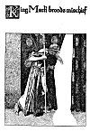
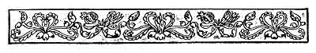
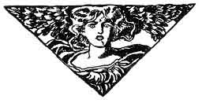

  
[Intangible Textual Heritage](../../../index.md)  [Sagas &
Legends](../../index)  [England](../index)  [Index](index.md) 
[Previous](crt30)  [Next](crt32.md) 

------------------------------------------------------------------------

p. 252

[  
Click to enlarge](img/25200.jpg.md)  
King Mark broods mischief  

p. 253

 

### Chapter Four

How Sir Tristram and the Lady Belle Isoult returned to Cornwall and how
they ended their days together.

And now remaineth to be told the rest of these adventures of Sir
Tristram as briefly as may be.

For indeed I thought not, when I began this history, to tell you as much
concerning him as I have done. But as I have entered into this history I
have come so strongly to perceive how noble and true and loyal was the
knighthood of Sir Tristram, that I could not forbear telling you of many
things that I had not purposed to speak of.

Yet, as I have said before this, there are a great many adventures that
I have not spoken of in this book. For I have told only those things
that were necessary for to make you understand how it fared with him in
his life.

So now shall be told those last things that concerned him.

 

Now two days after those things aforesaid had come to pass, Sir
Launcelot returned unto Tintagel from that quest which he had been upon,
and so soon as he came thither he made inquiry of King Mark concerning

|                                     |
|-------------------------------------|
| *Sir Launcelot reproves King Mark*. |

the welfare of that madman of the forest whom he had left in the care of
King Mark. But when he heard that that madman was Sir Tristram, he was
astonished beyond all measure; but when he heard how Sir Tristram had
been served by King Mark and by the people of the castle under the lead
of Sir Andred, he was filled with a great and violent indignation. So he
arose and stood before King Mark and said: "Lord King, I have heard much
ill said of thee and shameful things concerning thy unknightliness in
several courts of chivalry where I have been; and now I know that those
things were true; for I have heard from the lips of many people here,
how thou didst betray Sir Tristram into bringing the Lady Belle Isoult
unto thee; and I have heard from many how thou dost ever do ill and
wickedly by him, seeking to take from him both his honor and his life.
And yet Sir Tristram hath always been thy true and faithful knight, and
hath served thee in all ways thou hast demanded of him. I know that thou
hast jealousy for Sir Tristram in thy heart and that thou hast ever
imputed wickedness and sin unto him. Yet all the

p. 254

world knoweth that Sir Tristram is a true knight and altogether innocent
of any evil. For all the evil which thou hast imputed to him hath no
existence saving only in thine own evil heart. Now I give thee and all
thy people to know that had ill befallen Sir Tristram at your hands I
should have held you accountable therefor and should have punished you
in such a way that you would not soon have forgotten it. But of that
there is no need, for Sir Tristram himself hath punished you in full
measure without any aid from me. So now I will go away from this place
and will never come hither again; nor will I acknowledge you should I
meet you in court or in field."

So saying, Sir Launcelot turned and went away from that place very
proudly and haughtily, leaving them all abashed at his rebuke.

 

So that day Sir Launcelot went forward through the forest until he

|                                                                      |
|----------------------------------------------------------------------|
| *Sir Launcelot findeth Sir Tristram and Belle Isoult in the forest*. |

reached that castle whereunto Sir Tristram had taken the Lady Belle
Isoult, and there he was received by Sir Tristram with all joy and
honor. And Sir Launcelot abided at that place for two days, with great
pleasure to himself and to Sir Tristram and to Belle Isoult.

At the end of that time Sir Launcelot said to Sir Tristram: "Messire, it
is not well that you and this dear lady should abide here so nigh to
Tintagel. For, certes, King Mark will some time work some grievous ill
upon you. So I beseech you to come with me unto my castle of Joyous
Gard. There this lady shall reign queen paramount and we shall be her
very faithful servants to do her pleasure in all ways. That castle is a
very beautiful place, and there she may dwell in peace and safety and
tranquillity all the days of her life if she chooses to do so."

Now that saying of Sir Launcelot's seemed good to Sir Tristram and to

|                                |
|--------------------------------|
| *They depart for Joyous Gard*. |

Belle Isoult; wherefore in three days all they and their court made
ready to depart. And they did depart from that castle in the forest unto
Joyous Gard, where they were received with great honor and rejoicing.

So the Lady Belle Isoult abided for three years at Joyous Gard, dwelling
there as queen paramount in all truth and innocence of life; and Sir
Launcelot and Sir Tristram were her champions and all their courts were
her servants. And during those three years there were many famous
joustings held at Joyous Gard, and several bel-adventures were performed
both by Sir Launcelot and Sir Tristram in her honor.

And indeed I believe that this was the happiest time of all the Lady
Belle Isoult's life, for she lived there in peace and love and
tranquillity and she suffered neither grief nor misfortune in all that
time.

p. 255

Then one day there came King Arthur to Joyous Gard, and he was received
with such joy and celebration as that place had never before beheld. A
great feast was set in his honor, and after the feast King

|                                     |
|-------------------------------------|
| *King Arthur comes to Joyous Gard*. |

Arthur and Sir Tristram and Belle Isoult withdrew to one side and sat
together in. converse.

Then after a while King Arthur said, "Lady, may I ask you a question?"
And at that Lady Belle Isoult lifted up her eyes and looked very
strangely upon the King, and after a while she said, "Ask thy question,
Lord King, and I will answer it if I can." "Lady," said King Arthur,
"answer me this question: is it better to dwell in honor with sadness or
in dishonor with joy?"

Then Belle Isoult began to pant with great agitation, and by and by she
said, "Lord, why ask you me that?" King Arthur said: "Because, lady, I
think your heart hath sometimes asked you the selfsame question." Then
the Lady Belle Isoult clasped her hands together and cried out: "Yea,
yea, my heart hath often asked me that question, but I would not answer
it." King Arthur said: "Neither shalt thou answer me, for I am but a
weak and erring man as thou art a woman. But answer thou that question
to God, dear lady, and then thou shalt answer it in truth."

Therewith King Arthur fell to talking of other things with Sir Tristram,
but the lady could not join them in talk, but sat thenceforth in
silence, finding it hard to breathe because of the oppression of tears
that lay upon her bosom.

And Belle Isoult said no more concerning that question that King Arthur
had asked. But three days after that time she came to Sir Tristram and
said: "Dear lord, I have bethought me much of what King Arthur said, and
this hath come of it, that I must return again unto Cornwall."

Then Sir Tristram turned away his face so that she might not see it, and
he said, "Methought it would come to that." And then in a little he went
away from that place, leaving her standing there.

So it came about that peace was made betwixt Sir Tristram and King Mark,
and Belle Isoult and King Mark, and King Arthur was the peacemaker.

Thereafter Sir Tristram and his court and the Lady Belle Isoult returned
unto Cornwall, and there they dwelt for some time in seeming peace. But
in that time the Lady Belle Isoult would never see King

|                                  |
|----------------------------------|
| *Belle Isoult scorns King Mark*. |

Mark nor exchange a word with him, but lived entirely apart from him and
in her own life in a part of the castle; and at that King Mark was
struck with such bitterness of despair that he was like to a demon in
torment. For he saw, as it were, a treasure very

p. 256

near and yet afar, for he could not come unto it. And the more he
suffered that torment, the more he hated Sir Tristram, for in his
suffering it appeared to him that Sir Tristram was the cause of that
suffering.

So it came about that King Mark set spies to watch Sir Tristram, for in
his evil heart he suspected Sir Tristram of treason, and he hoped that
his spies might discover Sir Tristram in some act for which he might be
punished. So those spies watched Sir Tristram both night and day, but
they could find nothing that he did that was amiss.

Now one day Belle Isoult felt such a longing for Sir Tristram that she
could not refrain from sending a note to him beseeching him for to come
to her so that they might see one another again; and though Sir Tristram
misdoubted what he did, yet he went as she desired, even if it should
mean the peril of death to him.

Then came those spies to King Mark and told him that Sir Tristram was
gone to the bower of the Lady Belle Isoult, and that she had bidden him
to come thither.

At that the vitals of King Mark were twisted with such an agony of
hatred and despair that he bent him double and cried out, "Woe! Woe! I
suffer torments!"

Therewith he arose and went very quickly to that part of the castle
where the Lady Belle Isoult inhabited; and he went very softly up by a

|                                                 |
|-------------------------------------------------|
| *King Mark spies upon Sir Tristram and Isoult*. |

back way and through a passage to where was a door with curtains hanging
before it; and when he had come there he parted the curtains and peeped
within. And he beheld that the Lady Belle Isoult and Sir Tristram sat at
a game of chess, and he beheld that they played not at the game but that
they sat talking together very sadly; and he beheld that Dame Bragwaine
sat in a deep window to one side--for Belle Isoult did not wish it to be
said that she and Sir Tristram sat alone.

All this King Mark saw and trembled with a torment of jealousy. So by
and by he left that place and went very quietly back into that
passageway whence he had come. And when he had come there he perceived a
great glaive upon a pole two ells long. This he took into his hand and
returned unto that curtained doorway again.

Then being in all ways prepared he parted the curtains silently and
stepped very quickly and without noise into the room. And the back of
Sir Tristram was toward him.

Then King Mark lifted the glaive on high and he struck; and Sir Tristram
sank without a sound.

Yea, I believe that that good knight knew naught of what had happened

p. 257

until he awoke in Paradise to find himself in that realm of happiness
and peace.

Then Belle Isoult arose, overturning the table of chessmen as she did
so, but she made no outcry nor sound of any sort. But she stood looking
down at Sir Tristram for a little space, and then she kneeled

|                                          |
|------------------------------------------|
| *Of the passing of Tristram and Isoult*. |

down beside his body and touched the face thereof as though to make sure
that it was dead. Therewith, as though being assured, she fell down with
her body upon his; and King Mark stood there looking down upon them.

All this had passed so quickly that Dame Bragwaine hardly knew what had
befallen; but now, upon an instant, she suddenly fell to shrieking so
piercingly that the whole castle rang with the sound thereof.

Now there were in the outer room several of the knights of the court of
Sir Tristram who had come thither with him as witnesses that he
performed no treason to the King. These, when Dame Bragwaine shrieked in
that wise, came running into the room and therewith beheld what had
happened. Then all they stood aghast at that sight.

But there was in the court of Sir Tristram a very young, gallant knight
hight Sir Alexander. This knight came to where King Mark stood looking
down upon his handiwork as though entranced with what he

|                                  |
|----------------------------------|
| *Sir Alexander slays King Mark*. |

had done. Then Sir Alexander said to King Mark, "Is this thy work?" And
King Mark raised his eyes very heavily and looked at Sir Alexander and
he answered, "Ay!" Then Sir Alexander cried out, "Thou hast lived too
long!" And therewith drawing his misericordia, he catched King Mark by
the left wrist and lifted his arm. And Sir Alexander drave the dagger
into the side of King Mark, and King Mark groaned and sank down upon the
ground, and in a little while died where he lay.

Then those knights went to where the Lady Belle Isoult lay and lifted
her up; but, lo! the soul had left her, and she was dead. For I believe
that it was not possible for one of those loving souls to leave its body
with out the other quitting its body also, so that they might meet
together in Paradise. For there never were two souls in all the history
of chivalry that clave to one another so tenderly as did the souls of
Tristram and Isoult.

 

So endeth this story of Sir Tristram, with only this to say, that they
two were buried with the graves close together, and that it is said by
many who have written of them that there grew a rose-tree up from Sir
Tristram's grave, and down upon the grave of Belle Isoult; and it is
said that this rose-tree was a miracle, for that upon his grave there
grew red roses,

p. 258

and upon her grave there grew pure white roses. For her soul was white
like to thrice-carded wool, and so his soul was red with all that was of
courage or knightly pride.

And I pray that God may rest the souls of those two as I pray He may
rest the souls of all of us who must some time go the way that those two
and so many others have travelled before us. Amen.

 

 

------------------------------------------------------------------------

[Next: Introduction](crt32.md)
