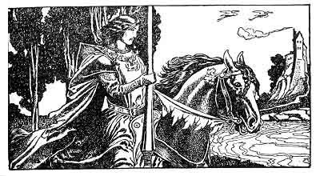

  
[Intangible Textual Heritage](../../../index)  [Sagas &
Legends](../../index)  [England](../index) 

------------------------------------------------------------------------

<table width="75%">
<colgroup>
<col style="width: 50%" />
<col style="width: 50%" />
</colgroup>
<tbody>
<tr class="odd">
<td width="50%" data-valign="CENTER"></td>
<td width="50%" data-valign="CENTER"><h1 id="the-story-of-the-champions-of-the-round-table" data-align="CENTER">The Story of the Champions of the Round Table</h1>
<h2 id="written-and-illustrated-by-howard-pyle" data-align="CENTER">Written and Illustrated by Howard Pyle</h2>
<h4 id="section" data-align="CENTER">[1905]</h4></td>
</tr>
</tbody>
</table>

------------------------------------------------------------------------

[Contents](#contents)    [Start Reading](crt00)

------------------------------------------------------------------------

This is Howard Pyle's retelling of the legends of three of the most
illustrious knights of the Round Table, Sir Lancelot, Sir Tristram and
Sir Percival. This etext preserves all of the lavish drawings, also by
Pyle, which go a long way towards establishing the atmosphere of the
narrative.

------------------------------------------------------------------------

[Title Page](crt00)  
[Foreword](crt01)  
[Contents](crt02)  
[List of Illustrations](crt03)  
[Prologue](crt04)  

### Part I. The Story of Launcelot

[Introduction](crt05)  
[Chapter First](crt06)  
[Chapter Second](crt07)  
[Chapter Third](crt08)  
[Chapter Fourth](crt09)  
[Chapter Fifth](crt10)  
[Chapter Sixth](crt11)  
[Chapter Seventh](crt12)  
[Chapter Eighth](crt13)  
[Conclusion](crt14)  

### The Book of Sir Tristram

[Prologue](crt15)  

### Part I. The Story of Sir Tristram and the Lady Belle Isoult

[Chapter First](crt16)  
[Chapter Second](crt17)  
[Chapter Third](crt18)  
[Chapter Fourth](crt19)  
[Chapter Fifth](crt20)  
[Chapter Sixth](crt21)  
[Chapter Seventh](crt22)  

### Part II. The Story of Sir Tristram and Sir Lamorack

[Introduction](crt23)  
[Chapter First](crt24)  
[Chapter Second](crt25)  
[Chapter Third](crt26)  

### Part III. The Madness of Sir Tristram

[Introduction](crt27)  
[Chapter First](crt28)  
[Chapter Second](crt29)  
[Chapter Third](crt30)  
[Chapter Four](crt31)  

### The Book of Sir Percival

[Introduction](crt32)  
[Prologue](crt33)  
[Chapter First](crt34)  
[Chapter Second](crt35)  
[Chapter Third](crt36)  
[Chapter Fourth](crt37)  
[Chapter Fifth](crt38)  

 

[Conclusion](crt39)  
