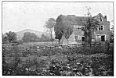
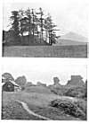

  
[Intangible Textual Heritage](../../../index.md)  [Legends &
Sagas](../../index)  [England](../index)  [Index](index.md) 
[Previous](ebt03)  [Next](ebt05.md) 

------------------------------------------------------------------------

 

[  
Click to enlarge](img/pl01.jpg.md)  
PLATE I. PRIMARY PEAK  

Titterstone Clee Hill and Park Hall, Bitterley.

[  
Click to enlarge](img/pl02.jpg.md)  
PLATE II. MOUNDS  

<table>
<colgroup>
<col style="width: 100%" />
</colgroup>
<tbody>
<tr class="odd">
<td>1. Tre-Fedw, Pandy. Skirrid in Distance. 
2. Didley.</td>
</tr>
</tbody>
</table>

 

------------------------------------------------------------------------

[Next: Introduction](ebt05.md)
