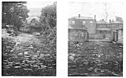
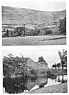

  
[Intangible Textual Heritage](../../../index)  [Legends &
Sagas](../../index)  [England](../index)  [Index](index) 
[Previous](ebt13)  [Next](ebt15) 

------------------------------------------------------------------------

### SIGHTING STONES.

Mark stones may be on one side of the track, as are the whitewashed
stones which mark a coastguard's cliff walk to-day. But there also
appear to have been sighting points of stone exactly on the ley, so
constructed as to indicate its direction.

p. 18

The Four Stones near Harpton, New Radnor, are four upright boulders (see
[Frontispiece](ebt00.htm#img_front)) in an irregular quadrangle, and no
one has explained their purpose.

I took sighting lines over successive pairs of stones, five lines being
possible, and although the work on the map is not yet completed, I can
definitely say that the "Four Stones" are directing posts which point
out at least two leys, proved by passing through other good points. The
first goes to the highest point in Deerfold Forest (The Camp, 940 ft.)
in one direction, and in the other through The Folly and on the main
road at Llanvihangel-nant-Melan, over Bryn-y-Maen Hill, here appearing
to strike another "four stones," and through Llansaintfraed in Elvel
Church to some peak beyond.

The second ley starts from Bach Hill (one of the highest parts of the
Radnor Forest); through the Four Stones, dead on main road through
Walton village, dead on main road past Eccles Green, through Upperton
Farm and Kenchester Church, and dead on the present road which is the
S.W. boundary of the Roman station of Magna; then going over the Wye
through Breinton Church.

Bitterley Churchyard Cross has a circular hole through its shaft at a
convenient height for sighting. Mr. J. C. Mackay kindly had the exact
direction of this taken for me by sighting compass. It is 28½° E. of
Magnetic N., and this on the map exactly strikes Abdon Burf (or Barf),
the high point (1,790 ft.) of the Brown Clee. Southwards the line runs
through Stoke Prior and Hope-under-Dinmore Churches, is confirmed in
other ways, and goes over the Wye at Belmont House.

Bitterley Cross is of 14th century date; it must be the successor of a
sighting stone which in some way pointed the direction of the ley, and
it suggests that sighting along a ley had not-quite died out by the 14th
century.

These two proved instances of sighting stones, together with the cases
of stone rows on Dartmoor, and sighting columns on Sutton Walls, will
give the clue to the hitherto unknown purpose of many important ancient
stone monuments.

It is probable that the flat face of a mark stone, as in Wergin's Stone
([Plate X](ebt19.htm#img_pl10).), pointed out a ley. There is a Dial
Post near Tewkesbury which, with the Dial Carreg near Cwm-yoy, seems to
denote the above purpose, and the last stone is an upright shaft of
rectilinear shape like the supposed cross at Capel-y-fin ([Plate
X](ebt19.htm#img_pl10).).

 

[  
Click to enlarge](img/pl07.jpg)  
PLATE VII. CAUSEWAYS.  

<table>
<colgroup>
<col style="width: 100%" />
</colgroup>
<tbody>
<tr class="odd">
<td>1. Over Olchon Brook, Longtown. 
2. To Centre of Pond, Ingestow, Ross.</td>
</tr>
</tbody>
</table>

[  
Click to enlarge](img/pl08.jpg)  
PLATE VIII. LEYS DISPLAYED.  

<table>
<colgroup>
<col style="width: 100%" />
</colgroup>
<tbody>
<tr class="odd">
<td>1. Track Climbing Ridge, Llanthony Abbey. 
2. Straight Wye-side Causeway, Bartonsham, Hereford.</td>
</tr>
</tbody>
</table>

 

------------------------------------------------------------------------

[Next: Trees](ebt15)
