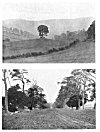
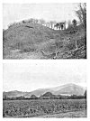

  
[Intangible Textual Heritage](../../../index.md)  [Legends &
Sagas](../../index)  [England](../index)  [Index](index.md) 
[Previous](ebt25)  [Next](ebt27.md) 

------------------------------------------------------------------------

### THE LEY-MEN.

The fact of the ley, with its highly skilled technical methods, being
established, it must also be a fact that such work required skilled men,
carefully trained. Men of knowledge they would be, and therefore men of
power over the common people. And now comes surmise. Did they make their
craft a mystery to others as ages rolled by. Were they a learned and
priestly class, not admitted until completing

 

[  
Click to enlarge](img/pl13.jpg.md)  
XIII. TREES.  

<table>
<colgroup>
<col style="width: 100%" />
</colgroup>
<tbody>
<tr class="odd">
<td>1. A One-tree Hill, Llanvihangel-nant-Melan. 
2. Scotch-Fir (or Scots Pine) Avenue, Monnington (See Plate VII.).</td>
</tr>
</tbody>
</table>

[  
Click to enlarge](img/pl14.jpg.md)  
PLATE XIV. CAMPS.  

<table>
<colgroup>
<col style="width: 100%" />
</colgroup>
<tbody>
<tr class="odd">
<td>1. One of the Four Mounds, Sutton Walls. 
2. Herefordshire Beacon.</td>
</tr>
</tbody>
</table>

 

p. 31

a long training--as Cæsar describes the Druids. Or did they--as Diodorus
and Strabo says of Druids--become also bards and soothsayers. Did they,
as the ley decayed, degenerate into the witches of the middle ages.
Folk-lore provides the witches with the power of riding through the air
on a broomstick, the power of overlooking, that of the evil eye. They
(in imagination) flew over the Broomy Hills and the Brom-leys. It may be
that the ancient sighting methods were condemned as sorcery by the early
Christian missionaries.

Were they the laity or lay-men of Beowulf?

In later days our first English poet was one Layamon, and in his time
were men called Ley-cester, Leye, and Ley-land.

In the Oxford Dictionary is given the obsolete word cole as meaning in
the 16th century a false magician, a juggler, and cole-prophet (or
cold-prophet) with a similar meaning, and there is a cole-staff or
cowl-staff also mentioned, which, although then meaning a carrying
stick, was--I surmise--originally the working sighting staff of the
cole-man, who was the magician of the ley. The word still survives in
colporter, a walking seller of books, who carries his wares slung over
his shoulder on a stick.

We have in our district Coldman's Hill, Coldstone Common, Coles Tump
(Orcop), and Coles Mountain (Presteign). In other parts of England are
Coley, Colbury, Colebatch, Colestock, Coleshill, Coleford, Coleham,
Colchester, and Coleridge, which last has an alternate name Coldridge,
confirming other instances of the intrusion of the d. I surmise Cold
Harbour (Kentchurch) to have been Cole Harbour.

Colmanswell in Ireland possesses to-day a "sacred" well, and this name,
together with our own ancient Colewelle in Herefordshire, now altered to
Colwall, is probably nearer the original root meaning than is the case
of the three Coldwells at Holmer, Kingston, and English Bicknor.

A Bishop's name Colman is mentioned in the Anglo-Saxon Chronicle, and
Cole is also a common surname to-day.

There are other names for a ley-man indicated in the two Derbyshire
place names, Totmans Low and Laidmans Low, the Low being a sighting
mound.

------------------------------------------------------------------------

[Next: Hints to Ley Hunters](ebt27.md)
