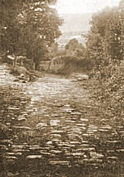

  
[Intangible Textual Heritage](../../../index)  [Legends &
Sagas](../../index)  [England](../index) 

------------------------------------------------------------------------

<table width="75%">
<colgroup>
<col style="width: 50%" />
<col style="width: 50%" />
</colgroup>
<tbody>
<tr class="odd">
<td width="50%" data-valign="CENTER"></td>
<td width="50%" data-valign="CENTER"><h1 id="early-british-trackways-moats-mounds-camps-and-sites" data-align="CENTER">Early British Trackways, Moats, Mounds, Camps and Sites</h1>
<h2 id="by-alfred-watkins" data-align="CENTER">by Alfred Watkins</h2>
<h4 id="section" data-align="CENTER">[1922]</h4></td>
</tr>
</tbody>
</table>

------------------------------------------------------------------------

[Contents](#contents)    [Start Reading](ebt00)

------------------------------------------------------------------------

This was the first book about ley lines. Ley lines are alignments on the
landscape of natural and artificial features, some of which follow
perfectly straight tracks for miles. First discovered in Britain by the
author of this book, Alfred Watkins, a photographer and inventor, ley
lines were pursued eagerly by organized clubs in the period between the
world wars. Interest in leys died out after the 1930s, but was revived
in the 1960s, after the publication of a popular book on the subject,
[The View Over
Atlantis](https://www.amazon.com/exec/obidos/ASIN/050027312X/internetsacredte),
by John Michell. Latter-day ley-hunters took the concept much further
than Watkins and the earlier enthusiasts. Dowsing, flying saucer paths,
crop circles, biodynamic farming, and *feng shui* have all been
associated with ley lines. Collections of ley lines have been said to
conceal hidden messages, reveal the location of esoteric items, or
contain star maps. The existence of ley lines is now one of the accepted
tenets of New Age belief. This topic is collectively called 'Earth
Mysteries'. However, they aren't just limited to this planet: leys have
even supposedly been charted in the Cydonia region of Mars in the
vicinity of the 'Face of Mars'.

Watkins never attributed any supernatural significance to leys; he
believed that they were simply pathways that had been used for trade or
ceremonial purposes, very ancient in origin, possibly dating back to the
Neolithic, certainly pre-Roman. His obsession with leys was a natural
outgrowth of his interest in landscape photography and love of the
British countryside. He was an intensely rational person with an active
intellect, and I think he would be a bit disappointed with some of the
fringe aspects of ley lines today.

Originally just the existence of ley lines was considered speculative by
academic archeologists and topographers. Since Watkins, there have been
similar alignments discovered in far-flung locations, including the
Atacama desert of Chile, the Southwestern United States, and other
places; all of these can be directly traced to human activity, and
associated with ceremonial and astronomical activities. So this probably
makes the concept of similar alignments by Neolithic Britons more
acceptable to traditional academics, once all the mystical connotations
are subtracted.

Watkins wrote several other books on this topic, including The Old
Straight Track \[1925\], and The Ley Hunter's Manual \[1927\]. These
books go into much greater detail but essentially cover the same set of
points in this, his first book on leys. All of Watkins' books are long
out of print, although used copies can usually be obtained easily (if
not cheaply).

*--John Bruno Hare, June 17th, 2004.*

------------------------------------------------------------------------

 [Title Page](ebt00)  
[Table of Contents](ebt01)  
[Table of Illustrations](ebt02)  
[Foreword to the Average Reader](ebt03)  
[Introduction](ebt04)  
[Introduction](ebt05)  
[Proof](ebt06)  
[The Ley](ebt07)  
[Antiquity of the Ley](ebt08)  
[Individuality of a Ley](ebt09)  
[Mounds](ebt10)  
[Earth Cuttings](ebt11)  
[Water Sighting Points](ebt12)  
[Mark Stones](ebt13)  
[Sighting Stones](ebt14)  
[Trees](ebt15)  
[Camps](ebt16)  
[Churches](ebt17)  
[Castles](ebt18)  
[Traders' Roads](ebt19)  
[Hereford Trackways](ebt20)  
[Traditional Wells](ebt21)  
[Previous Data](ebt22)  
[Roman Roads](ebt23)  
[Place Names](ebt24)  
[Discovery By Place Name](ebt25)  
[The Ley-Men](ebt26)  
[Hints to Ley Hunters](ebt27)  
[A Few Leys](ebt28)  
[Endword](ebt29)  
[Index](ebt30)  
[Acknowledgments](ebt31)  
[Advertisements from original](ebt32)  
[Maps](ebt33)  
