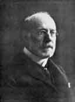

  
[Intangible Textual Heritage](../../../index)  [Legends and
Sagas](../../index)  [English Folklore](../index)  [Index](index) 
[Next](efft01) 

------------------------------------------------------------------------

# English Fairy and Other Folk Tales

##### Selected and Edited, with an Introduction by

## Edwin Sidney Hartland

###### \[b. 1848 d. 1927\]

##### Illustrations by

#### C E Brock

#### London:

###### Walter Scott, 24 Warwick Lane,

###### Paternoster Row.

#### \[1890\]

###### Scanned and redacted by Phillip Brown. Additional proofing and formatting \[April 2003\] at Intangible Textual Heritage by J. B. Hare. This text is in the public domain. These files may be used for any non-commercial purpose, provided this notice of attribution is left intact.

 [  
Click to enlarge](img/hartland.jpg)  
Edwin Sidney Hartland

------------------------------------------------------------------------

[Next: Jack the Giant Killer](efft01)
