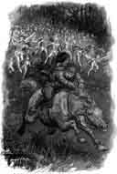

  
[Intangible Textual Heritage](../../../index)  [Legends and
Sagas](../../index)  [English Folklore](../index)  [Index](index) 
[Previous](efft30)  [Next](efft32) 

------------------------------------------------------------------------

# A MYTH OF MIDRIDGE

 [  
Click to enlarge](img/08.jpg)  
"DARTED OFF AS QUICK AS LIGHTNING."

Or, a Story anent a witless Wight's Adventures with the Midridge Fairies
in the Bishoprick of Durham; now more than two Centuries ago.  [1](#fn_37)

TALKING about fairies the other day to a nearly octogenarian female
neighbour, I asked, Had she ever seen one in her youthful days? Her
answer was in the negative; "but," quoth she, "I've heard my grandmother
tell a story, that Midridge (near Auckland) was a great place for
fairies when she was a child, and for many long years after that." A
rather lofty hill, only a short distance from the village, was their
chief place of resort, and around it they used to dance, not by dozens,
but by hundreds, when the gloaming began to show itself of the summer
nights. Occasionally a villager used to visit the scene of their gambols
in order to catch if it were but a passing glance of the tiny folks,
dressed in their vestments of green, as delicate as the thread of the
gossamer; for well knew the lass so favoured that ere the current year
had disappeared she would have become the happy wife of the object of
her only love; and also, as well ken'd the lucky lad, that he too would
get a weel tochered lassie, long afore his brow became wrinkled with
age, or the snow-white blossoms had begun to bud forth upon his pate.
Woe to those, however, who dared to come by twos or by threes, with
inquisitive and curious eye, within the bounds of their domain; for if
caught, or only the eye of a fairy fell upon them, ill was sure to
betide them through life. Still more awful, however, was the result if
any were so rash as to address them, either in plain prose or rustic
rhyme. The last instance of their being spoken to is thus still handed
down by tradition:--'Twas on a beautifully clear evening in the month of
August, when the last sheaf had crowned the last stack in their master's
hagyard, and after calling the "harvest home," the daytale men and
household servants were enjoying themselves over massive pewter quarts
foaming over with strong beer, that the subject of the evening's
conversation at last turned upon the fairies of the neighbouring hill,
and each related his oft-told tale which he had learned by rote from the
lips of some parish grandame. At last the senior of the mirthful party
proposed to a youthful mate of his, who had dared to doubt even the
existence of such creatures, that he durst not go to the hill, mounted
on his master's best paifrey, and call aloud, at the full extent of his
voice, the following rhymes:

"Rise little Lads,  
Wi' your iron gads,  
And set the Lad o' Midridge hame."

Tam o' Shanter-like, elated with the contents of the pewter vessels, he
nothing either feared or doubted, and off went the lad to the fairy
hill; so, being arrived at the base, he was nothing loath to extend his
voice to its utmost powers in giving utterance to the above invitatory
verses. Scarcely had the last words escaped his lips ere he was nearly
surrounded by many hundreds of the little folks, who are ever ready to
revenge, with the infliction of the most dreadful Punishment, every
attempt at insult. The most robust of the fairies, who I take to have
been Oberon, their king, wielding an enormous javelin, thus, also in
rhymes equally rough, rude, and rustic, addressed the witless wight:--

"Sillie Willy, mount thy filly;  
And if it isn't weel corn'd and fed,  
I'll hae thee afore thou gets hanie to thy Midridge bed."

Well was it for Willy that his home was not far distant, and that part
light was still remaining in the sky. Horrified beyond measure, he
struck his spurs into the sides of his beast, who, equally alarmed,
darted off as quick as lightning towards the mansion of its owner.
Luckily it was one of those houses of olden time, which would admit of
an equestrian and his horse within its portals without danger; lucky,
also, was it that at the moment they arrived the door was standing wide
open: so, considering the house a safer sanctuary from the belligerous
fairies than the stable, he galloped direct into the hail, to the no
small amazement of all beholders, when the door was instantly closed
upon his pursuing foes! As soon as Willy was able to draw his breath,
and had in part overcome the effects of his fear, he related to his
comrades a full and particular account of his adventures with the
fairies; but from that time forward, never more could any one, either
for love or money, prevail upon Willy to give the fairies of the bill an
invitation to take an evening walk with him as far as the village of
Midridge!

To conclude, when the fairies had departed, and it was considered safe
to unbar the door, to give egress to Willy and his filly, it was found,
to the amazement of all beholders, that the identical iron javelin of
the fairy king had pierced through the thick oaken door, which for
service as well as safety was strongly plated with iron, where it still
stuck, and actually required the strength of the stoutest fellow in the
company, with the aid of a smith's great fore-hammer, to drive it forth.
This singular relic of fairyland was preserved for many generations,
till passing eventually into the hands of one who cared for none of
these things, it was lost, to the no small regret of all lovers of
legendary lore!

------------------------------------------------------------------------

### Footnotes

[1](efft31.htm#fr_37) *Choice Notes: Folk-
Lore*, p. 131.

------------------------------------------------------------------------

[Next: The Green Children](efft32)
