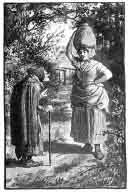

  
[Intangible Textual Heritage](../../../index)  [Legends and
Sagas](../../index)  [English Folklore](../index)  [Index](index) 
[Previous](efft53)  [Next](efft55) 

------------------------------------------------------------------------

# THE BAG OF FLOUR. [1](#fn_62)

 [  
Click to enlarge](img/12.jpg)  
"'WHAT'S THAT YOU'VE GOT ON YOUR HEAD?' SAID THE WITCH."

THERE was a woman who lived near Cheadle, who went to the mill one day
to get a bag of flour for baking, and as she came back she met an old
witch. "Good day," said the witch. "Good day," said the woman again.
"What's that you've got on your head?" said the witch. "It's flour I'm
taking home for my baking," said the woman. "It isn't flour, it's
manure," said the witch. "It's sound flour!" said the woman; "I've
fetched it straight from the mill, and I'm going to bake with it as soon
as ever I get home." "It's nothing at all but a bag of manure," said the
witch, and off she went.

Now the woman knew very well that it was flour she had in her bag, but
this made her feel so uncomfortable, that as soon as the witch was out
of sight, she put down the bag off her head and opened it and looked in.
And there, sure enough, it was not flour at all, nothing but manure!
Well she thought, as she had carried it so far, she might as well carry
it all the way, so she took it up again, and went home and set it down
by the pig-sty. In the evening her husband came home.

"Whatever have you put that bag of flour down by the pig-sty for?" he
said, as soon as he came into the house. "Oh," said she, "that's not
flour, that's only a bag of manure." "Nonsense!" said he, "what are you
talking of? I tell you it's flour. Why, it's sheeding \[spilling\] all
over the place!" So they went to look, and there actually it was flour
again the same as at first; and they took it into the house, and very
glad the woman was to get it back. And that was the only thing the witch
was ever known to turn \[transform\] back again. She turnee a many
things but never a one ack again but that.

------------------------------------------------------------------------

### Footnotes

[1](efft54.htm#fr_62) Miss C. S. Burne,
*Shropshire Folk-Lore*, p. 159.

------------------------------------------------------------------------

[Next: Kentsham Bell](efft55)
